# 反Docker Desktop更新检查

* **作者：** Nicolas·Lemon
* **修改：** Nicolas·Lemon
* **创建日期：** 2021.12.18
* **修改日期：** 2022.06.29


## 前言后语

* **注意：**当前仅仅只针对**Windows**下的**Docker Desktop**
* Docker-Desktop动不动就自动检查更新，烦不胜烦，经过笔者搜寻网上各种资料，找到一种通过反编译其服务动态链接库**Docker.ApiServices.dll**的方法，但里面的步骤又不是完全一模一样的，故有此文档
* 目前出于测试阶段，因此先需要备份其**Docker.ApiServices.dll**，防止出现问题后改不回来了
* 会根据**自用版本**迭代更新该文档


## 方法来源

**参考地址：** https://github.com/RektInator/kill-docker-auto-update

**工具地址：** https://github.com/dnSpy/dnSpy/

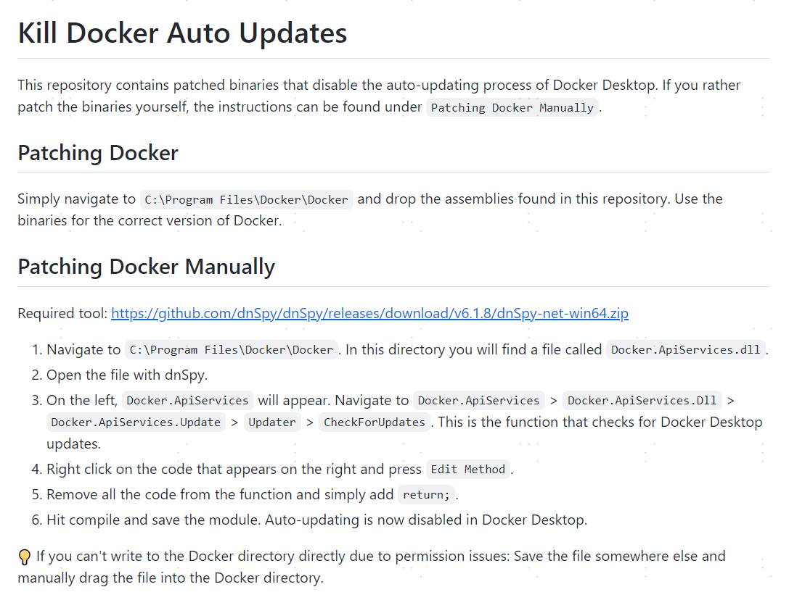


## 个性修改

### 更改安装目录

此处**只**针对**初次安装** **Docker Desktop** 时，不想让**Docker Desktop**默认安装在**C盘**中，这里**并不算**禁止检查更新里的步骤

```shell
mklink /j "C:\ProgramData\Docker" "D:\Program Files (x86)\Docker\ProgramData\Docker"
mklink /j "C:\ProgramData\DockerDesktop" "D:\Program Files (x86)\Docker\ProgramData\DockerDesktop"
mklink /j "C:\Program Files\Docker" "D:\Program Files (x86)\Docker\Program Files\Docker"
mklink /j "C:\Users\NicolasLemon\AppData\Local\Docker" "D:\Program Files (x86)\Docker\AppData\Local\Docker"
```

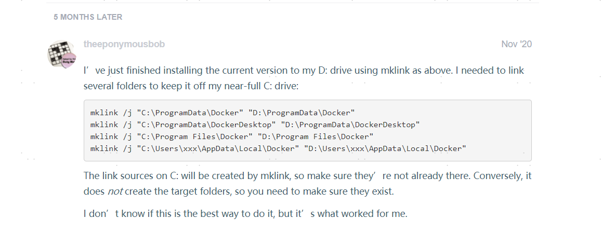

### 通用步骤

1. 找到**Docker.ApiServices.dll**，将其拷贝一份出来，当作**备份**

   如果没有更改过**Docker DeskTop**的安装目录的话，**Docker Desk**的默认安装目录是**C:\Program Files\Docker\Docker**

   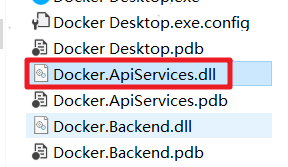

2. 用**dnSpy**打开**Docker.ApiServices.dll**文件

   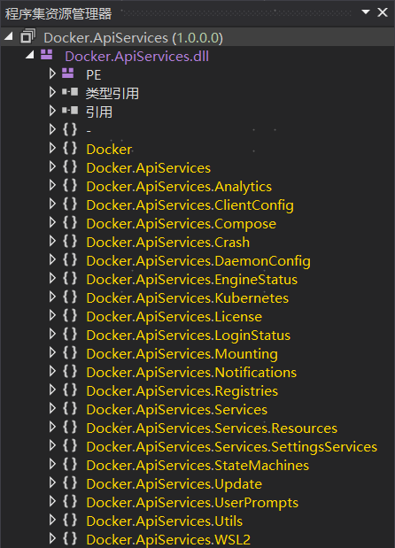

3. 依次按顺序展开分支 **Docker.ApiServices** > **Docker.ApiServices.Dll** > **Docker.ApiServices.Update** > **Updater**

   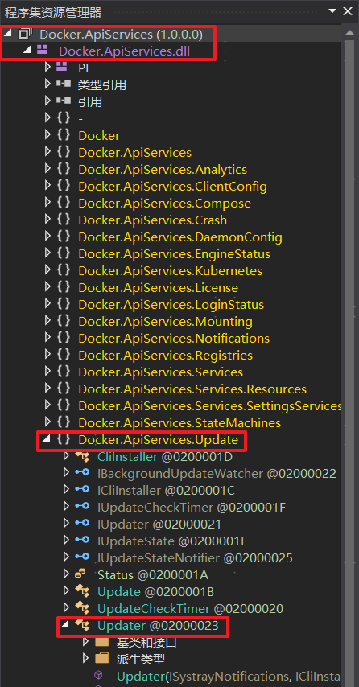

### 分版本

#### Version4.3.1 (72247)

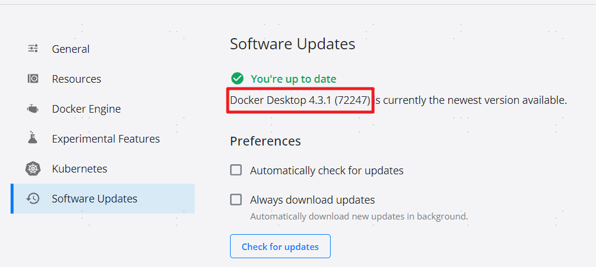

1. 找到并打开 **CheckUpdateAsync(...)** 方法

   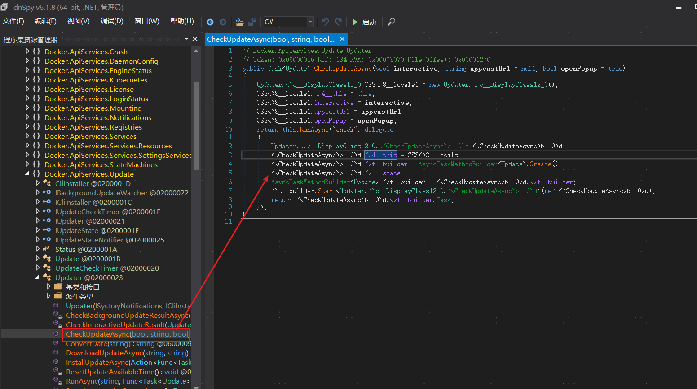

2. 在代码部分**右键**，选择**编辑方法**

   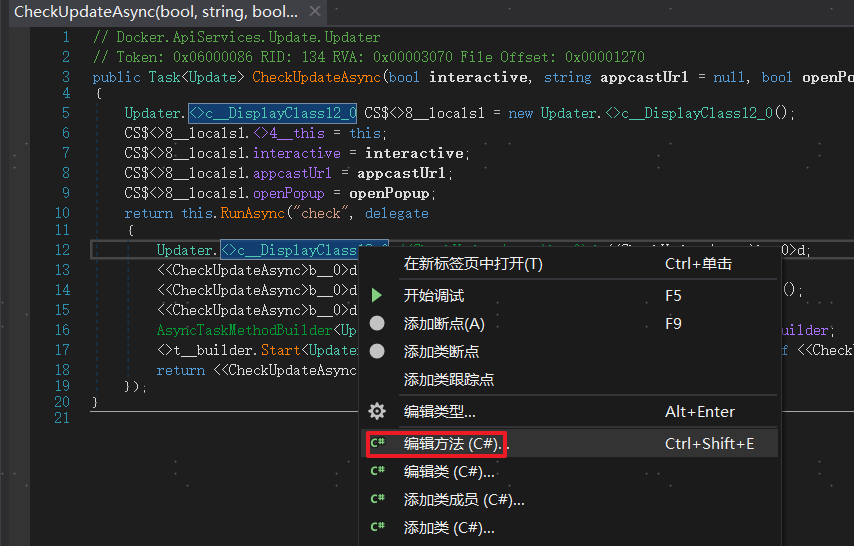

3. 删除里面的代码，让其返回为**空**，并将其定义为**异步执行**，然后点击**编译**保存代码

   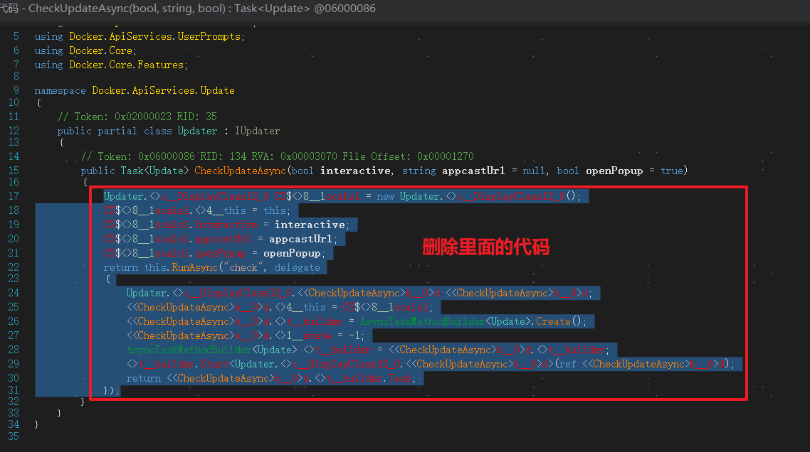

   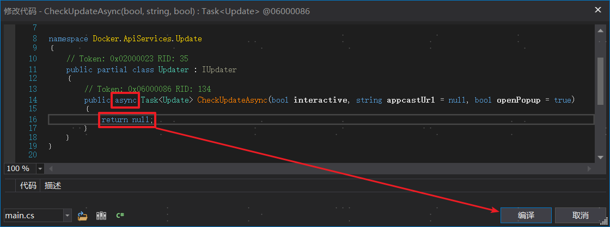

   按照**方法来源**里的方法说明，到这其实也就结束了，保存**模块**后退出就行了

   **但，** 不放心的我，又改了几个地方。

4. 将 **Docker.ApiServices.Update.UpdateCheckTimer** > **Start()** 方法中的代码清空

   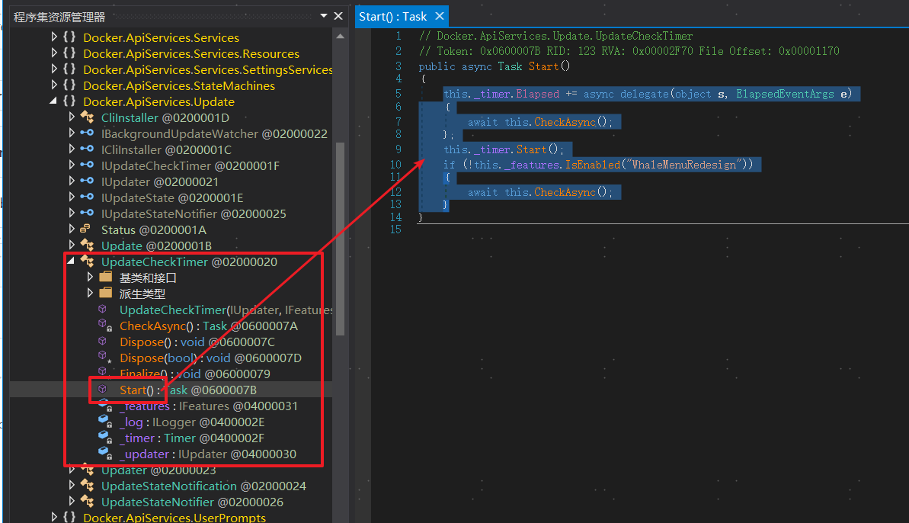

5. 保存**模块**

   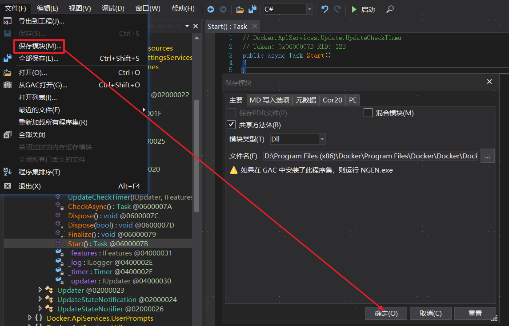

**大功告成**，再怎么去点检查更新，也没反应了

有可能在启动的时候，会报一个提示，无视它就好了

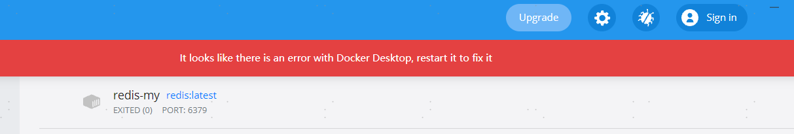