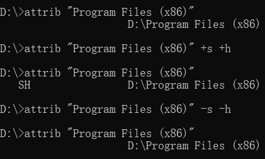

**Command-Notes**

- **作者：** Nicolas·Lemon
- **修改：** Nicolas·Lemon
- **创建日期：** 2022.11.17
- **修改日期：** 2022.11.17

# windows

## attrib命令

**设置文件基本属性**

```shell
# 查看
attrib ${file_path}|${file}

# 添加 [s system] [h hide] [a archive] [r read]
attrib ${file_path}|${file} [+s][+h][+a][+r]

# 移除 [s system] [h hide] [a archive] [r read]
attrib ${file_path}|${file} [-s][-h][-a][-r]
```



## icacls命令

**Windows文件权限设置**

[icacls: Windows命令行授权文件访问权限](https://blog.csdn.net/sgs595595/article/details/78088503)

```shell
# 添加[拒绝删除]权限
icacls ${file} /deny everyone:(DE)
icacls ${file_path} /deny everyone:(OI)(CI)(DE,DC) /T

# 清除[拒绝删除]权限
icacls ${file_path} /remove everyone /T
```

## 创建文件夹链接

```shell
mklink /j "C:\Users\NicolasLemon\Desktop\a" "D:\a"
```

## 去除桌面快捷方式小箭头

`aa.bat`

```shell
reg add "HKEY_LOCAL_MACHINE\SOFTWARE\Microsoft\Windows\CurrentVersion\Explorer\Shell Icons" /v 29 /d "%systemroot%\system32\imageres.dll,197" /t reg_sz /f
taskkill /f /im explorer.exe
attrib -s -r -h "%userprofile%\AppData\Local\iconcache.db"
del "%userprofile%\AppData\Local\iconcache.db" /f /q
start explorer
pause
```

## 设置查看方式为列表

`设置查看方式为列表.vbs`

```shell
Dim Shell
Set Shell = CreateObject("Shell.Application")

For Each window In Shell.Windows()
   If LCase(Right(window.FullName,13)) = "\explorer.exe" Then
      window.Document.CurrentViewMode = 3
      '设置查看方式为列表
      Exit For
   End If
Next
```

# linux

# macOS

# ffmpeg命令

**视频音频处理**

## 转换视频格式

```shell
ffmpeg -i 1.ts -vcodec copy -acodec copy 1.mp4
```

## 剪裁视频

```shell
# -ss：开始时间，-t：持续时间
# 从10′30″开始剪裁20s的视频
ffmpeg -ss 00:10:30 -t 00:00:20 -i 1.mp4 -vcodec copy -acodec copy output.mp4
```

## mp4格式无损合并

1. 先将 mp4 转到 ts 流
   
   ```shell
   ffmpeg -i 1.mp4 -vcodec copy -acodec copy -vbsf h264_mp4toannexb 1.ts
   ffmpeg -i 2.mp4 -vcodec copy -acodec copy -vbsf h264_mp4toannexb 2.ts
   ```

2. 再合并 ts 并转换成 mp4
   
   ```shell
   ffmpeg -i "concat:1.ts|2.ts" -vcodec copy -acodec copy output.mp4
   ```
   
   或者
   
   ```shell
   # file_list.txt：
   #    file '1.ts'
   #    file '2.ts'
   #    file '3.ts'
   ffmpeg -f concat -i file_list.txt -vcodec copy -acodec copy output.mp4
   ```

## 竖屏调整为横屏

1. 90°旋转视频（视频尺寸不变）
   
   ```shell
   ffmpeg -i 0.mp4 -metadata:s:v rotate="90" -codec copy 0_90.mp4
   ```

2. 调整视频尺寸（切换横纵分辨率）
   
   ```shell
   ffmpeg -i 0_90.mp4 -vf scale=1280:720 1.mp4 -hide_banner
   # 如果希望将纵横比从16:9更改为4:3
   ffmpeg -i video_640x480.mp4 -vf scale=640:480,setdar=4:3
   ```

## m4a格式转成mp3格式

```shell
ffmpeg -i a.m4a -acodec libmp3lame -ab 256k a.mp3
```

## 内嵌srt字幕

```shell
# 针对 mp4 视频
ffmpeg -i infile.mp4 -i infile.srt -c copy -c:s mov_text outfile.mp4
# 针对 mkv 视频
ffmpeg -i infile.mkv -i infile.srt -c copy -c:s srt outfile.mkv
```
