**常用开发环境配置**

* **作者：** Nicolas·Lemon
* **修改：** Nicolas·Lemon
* **创建时间：** 2021.09.16
* **修改时间：** 2022.04.11
* 默认Linux系统是 **CentOS 7**
* 默认Windows系统是 **Windows 10 x64**

# JDK

* 推荐版本：jdk1.8.0_201（jdk_8u201）

## Linux

* 权限不够就 **su root** 或 **sudo su root** 切换到root账号下

### 安装

1. 查看系统是否自带JDK然后卸载（Linux系统自带Open JDK）
   
   * 检查JDK版本（作者是已经安装好了，所以不必纠结此版本号就是1.8.0_201）
     
     ```shell
     java -version
     ```
     
     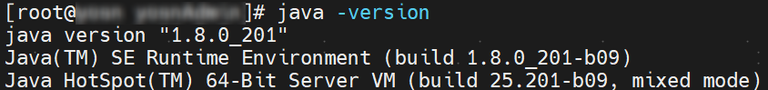
   
   * 检测JDK安装包
     
     ```shell
     rpm -qa | grep java
     ```
   
   * 卸载Open JDK（删除上步找到的文件）
     
     ```shell
     rpm -e --nodeps xxxxx
     ```
     
     或者使用
     
     ```shell
     yum remove *openjdk*
     ```
   
   * 检查是否卸载完毕
     
     ```shell
     rpm -qa | grep java
     ```

2. 在 **/usr** 下新建java目录
   
   * 新建文件夹
     
     ```shell
     mkdir /usr/java
     ```
   
   * 设置文件夹权限
     
     ```shell
     chmod 777 -R /usr/java
     ```

3. 将压缩包上传到 **/usr/java** 下，并解压
   
   * 进入 **/usr/java** 目录
     
     ```shell
     cd /usr/java
     ```
   
   * 解压缩文件
     
     ```shell
     tar -zxvf jdk-8u201-linux-x64.tar.gz
     ```
   
   * 删除压缩包
     
     ```shell
     rm -rf jdk-8u201-linux-x64.tar.gz
     ```

### 环境配置

1. 将jdk环境添加到配置文件 **/etc/profile** 中
   
   * 编辑配置文件 **/etc/profile**
     
     ```shell
     vim /etc/profile
     ```
   
   * 在末尾添加JDK环境变量
     
     ```shell
     # JDK
     export JAVA_HOME=/usr/java/jdk1.8.0_201
     export PATH=$JAVA_HOME/bin:$PATH
     export CLASSPATH=.:$JAVA_HOME/lib/dt.jar:$JAVA_HOME/lib/tools.jar
     ```
     
     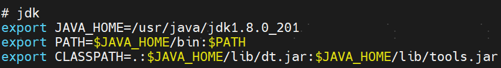

2. 使配置文件 **/etc/profile** 重新生效
   
   ```shell
   source /etc/profile
   ```

3. 检查jdk环境是否配置好
   
   ```shell
   java -version
   ```
   
   

## Windows

### 安装

1. 直接运行安装包安装
   
   * 安装JDK，修改安装目录为
     
     ```shell
     D:\Program Files (x86)\Java\jdk1.8.0_201
     ```
   
   * 安装JRE，修改安装目录为
     
     ```shell
     D:\Program Files (x86)\Java\jre1.8.0_201
     ```
   
   * **注：**JDK和JRE**不能安装**在相同的路径，按照上述配置即可
     
     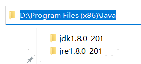

### 环境配置

1. 新建系统变量 **JAVA_HOME**
   
   * 变量名：JAVA_HOME
   
   * 变量值：D:\Program Files (x86)\Java\jdk1.8.0_201
     
     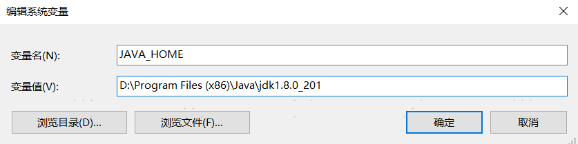

2. 新建系统变量 **CLASSPATH**
   
   * 变量名：CLASSPATH
   
   * 变量值：.;%JAVA_HOME%\lib\dt.jar;%JAVA_HOME%\lib\tools.jar
     
     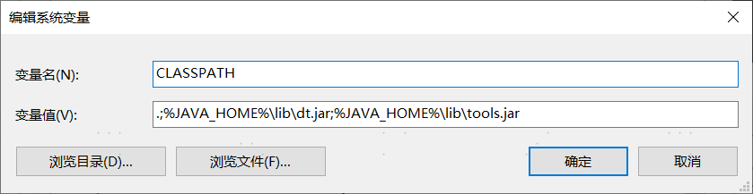

3. 编辑系统变量 **Path**
   
   * 添加：%JAVA_HOME%\bin
   
   * 添加：%JAVA_HOME%\jre\bin
     
     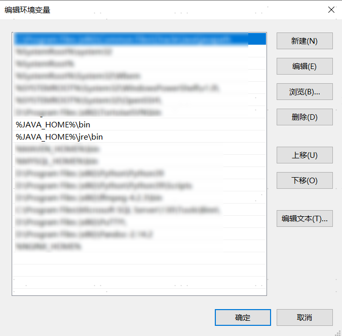

4. 运行CMD测试Java环境是否配置成功
   
   * **注：** 三个命令都成功了，才表示jdk环境配置成功
     
     ```shell
     java
     ```
     
     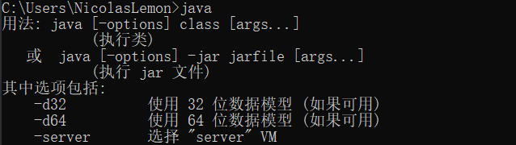
     
     ```shell
     java -version
     ```
     
     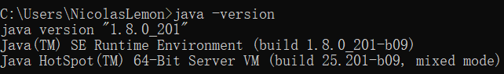
     
     ```shell
     javac
     ```
     
     

# MySQL

* 推荐版本：mysql_5.7.29

## Linux

* 权限不够就 **su root** 或 **sudo su root** 切换到root账号下

### 安装

1. 检查系统是否有自带MySQL
   
   ```shell
   rpm -qa | grep mysql
   # 如果有如下样子
   # mysql-libs-5.2.54-1.el6_0.1.x86_64  
   # 然后删除
   rpm -e --nodeps mysql-libs-5.2.54-1.el6_0.1.x86_64
   ```

2. 检查系统是否有MariaDB
   
   ```shell
   rpm -qa | grep mariadb 
   # 如果有如下样子
   # mariadb-libs-5.5.64-1.el7.x86_64
   # 进行卸载：  
   rpm -e --nodeps mariadb-libs-5.5.64-1.el7.x86_64
   ```

3. 上传mysql_5.7.29_linux压缩包到 **/usr/upload** 下，并解压到 **/usr/local/** 下
   
   ```shell
   # 如果没有upload文件夹就先新建一个
   mkdir /usr/upload
   # 设置upload文件夹权限，不然上传不了文件
   chmod 777 -R /usr/upload
   tar -zxvf /usr/upload/mysql-5.7.29-linux-x86_64.tar.gz -C /usr/local
   # 重命名解压后的文件夹
   mv /usr/local/mysql-5.7.29-linux-glibc2.12-x86_64 mysql
   ```

4. 创建data文件夹
   
   ```shell
   cd /usr/local/mysql
   mkdir -p data
   ```

5. 创建用户组
   
   ```shell
   groups mysql
   # 如果有如下，就不用再创建了
   # mysql : mysql
   ```
   
   ```shell
   # 创建mysql用户组
   groupadd mysql
   useradd -r -s /sbin/nologin -g mysql mysql -d /usr/local/mysql
   ```

6. 创建**my.cnf**配置文件，并将文件拷贝到 **/etc/** 下，如提示是否覆盖：y
   
   ```shell
   vim my.cnf
   ```
   
   ```text
   [client]
   default-character-set=utf8
   socket=/usr/local/mysql/data/mysql.sock
   
   [mysql]
   default-character-set=utf8
   socket=/usr/local/mysql/data/mysql.sock
   
   [mysqld]
   character-set-server=utf8
   explicit_defaults_for_timestamp=true
   basedir=/usr/local/mysql
   datadir=/usr/local/mysql/data
   port=3306
   socket=/usr/local/mysql/data/mysql.sock
   log-error=/usr/local/mysql/data/mysqld.log
   pid-file=/usr/local/mysql/data/mysqld.pid
   ```
   
   ```shell
   cp my.cnf /etc/my.cnf
   ```

7. 给MySQL用户进行赋权（**一定要赋权要不后面会出现很多错误**）
   
   ```shell
   cd /usr/local/mysql
   chown -R mysql .
   chgrp -R mysql .
   chown -R mysql:mysql /usr/local/mysql/data
   ```

8. 初始化MySQL
   
   ```shell
   cd /usr/local/mysql/bin
   ./mysqld --initialize --user=mysql --basedir=/usr/local/mysql --datadir=/usr/local/mysql/data
   ```
   
   > 若在**Ubuntu**系统下，可能会报错
   > 
   > 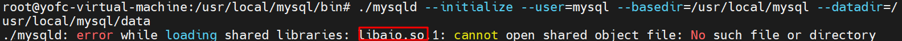
   > 
   > 则可以使用apt-get命令安装一下
   > 
   > ```shell
   > apt-get install libaio1
   > ```
   > 
   > 如果在下面的某些步骤中输入"**mysql**"，会提示**xxxxx.so**文件不存在的话，可搜索本地的**xxxxx.so**文件，然后创建相应的软连接即可
   > 
   > ```shell
   > find / -name xxxxx.so
   > ln -s /xxx/xxx/xxxxx.so /usr/lib/xxxxx.so
   > ```
   
   如果没啥问题，这里会生成初始密码，可能不会显示在公屏上所以需要查看 **/usr/local/mysql/data/mysqld.log**
   
   ```shell
   less /usr/local/mysql/data/mysqld.log
   ```
   
   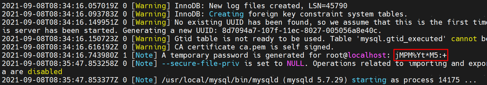
   
   记下此处的临时密码，等会初次登录数据库时会用到

9. 生成MySQL密匙对
   
   ```shell
   cd /usr/local/mysql/bin
   ./mysql_ssl_rsa_setup --datadir=/usr/local/mysql/data/mysql
   ```
   
   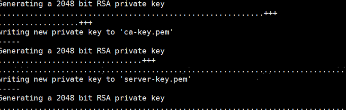

10. 拷贝到 **support-files** 文件夹下
    
    ```shell
    cd /usr/local/mysql/support-files
    cp mysql.server /etc/init.d/mysql
    ```

11. 测试启动MySQL服务
    
    ```shell
    cd /etc/init.d
    ./mysql start
    ./mysql stop
    ```
    
    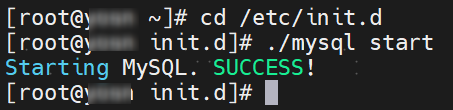

12. 创建软链接
    
    ```shell
    ln -s /usr/local/mysql/bin/mysql /usr/bin
    # 以后就可以这样启动或者关闭mysql服务了
    service mysql start
    service mysql stop
    ```

### 配置

1. 利用临时密码登录MySQL数据库
   
   ```shell
   # 如果没开启mysql服务，则先开启服务
   service mysql start
   mysql -uroot -p临时密码
   ```
   
   如遇到下面显示的错误：
   
   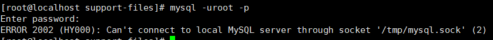
   
   则可尝试：
   
   ```shell
   mysql -uroot -h 127.0.0.1 -p临时密码
   ```
   
   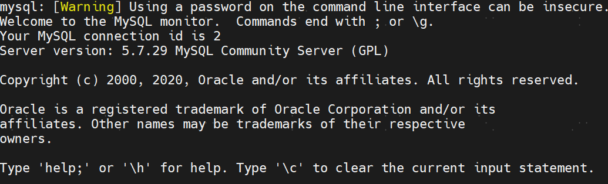

2. 修改密码并刷新权限
   
   ```sql
   # MySQL运行界面下
   set password=password('密码');
   grant all privileges on *.* to root@'%' identified by '密码';
   flush privileges;
   exit;
   ```
   
   重启mysql服务
   
   ```shell
   service mysql restart
   ```

3. 开启远程链接和开机启动
   
   ```shell
   cp /usr/local/mysql/support-files/mysql.server /etc/rc.d/init.d/mysqld
   chmod +x /etc/init.d/mysqld
   chkconfig --add mysqld
   ```

4. 查看服务列表
   
   ```shell
   chkconfig --list
   ```
   
   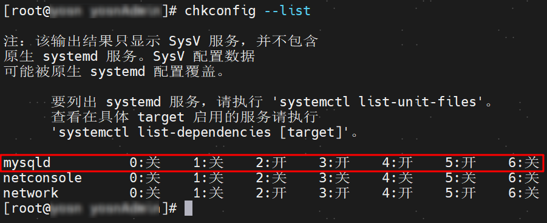
   
   如图所示看到3、4、5的状态为**开**或者为**on**则表示成功
   
   如果3、4、5的状态是**关**或者**off**则需要打开
   
   ```shell
   chkconfig --level 345 mysqld on
   ```

5. 查看配置是否生效
   
   ```shell
   # 重启Linux系统
   reboot
   netstat -na | grep 3306
   ```
   
   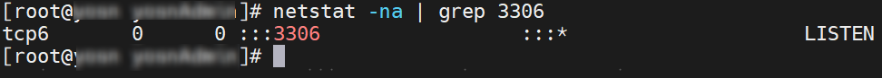

6. 查看字符集编码
   
   ```shell
   mysql -uroot -p密码
   ```
   
   
   
   ```sql
   show variables like "%char%";
   ```
   
   确保字符集都是utf-8编码的
   
   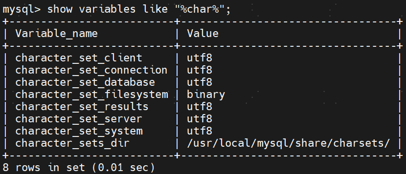

### 使用

#### 导入MySQL文件

如果是**没创建该数据库**的话，那就用**方法一**吧

1. **方法一**
   
   登录MySQL数据库，创建相应的数据库
   
   ```shell
   mysql -uroot -p密码
   ```
   
   ```sql
   create database `数据库名` character set utf8 collate utf8_general_ci;
   use 数据库名;
   source /usr/upload/数据库名.sql;
   ```

2. **方法二**
   
   ```shell
   mysql -uroot -p密码 数据库名 < /usr/upload/数据库名.sql
   ```

#### 导出MySQL文件

```shell
cd /usr/local/mysql/bin
./mysqldump -uroot -p密码 数据库名 > /usr/upload/数据库名.sql
```

## Windows

### 安装

将mysql_5.7.29_windows压缩包解压到 **D:\Program Files (x86)** 下

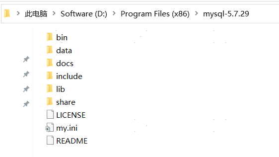

### 环境配置

1. 新建系统变量 **MYSQL_HOME**
   
   * 变量名：MYSQL_HOME
   
   * 变量值：D:\Program Files (x86)\mysql-5.7.29
     
     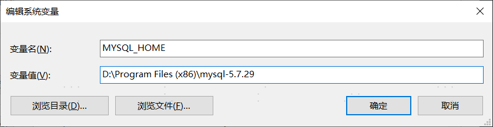

2. 编辑系统变量 **Path**
   
   * 新建：%MYSQL_HOME%\bin
     
     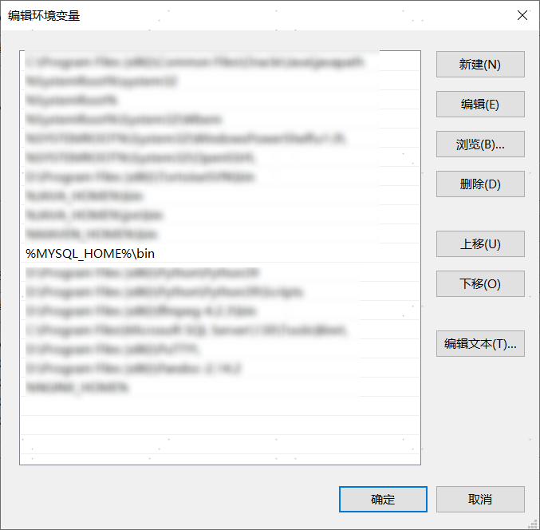

3. 运行CMD测试MySQL环境变量是否配置成功
   
   ```shell
   mysql
   # 若提示：
   # ERROR 2003 (HY000): Can't connect to MySQL server on 'localhost' (10061)
   # 则表示环境变量配置成功
   ```

### MySQL配置

1. 在MySQL根目录下新建并编辑 **my.ini**
   
   ```text
   [mysql]
   default-character-set=utf8
   
   [mysqld]
   character-set-server=utf8
   default-storage-engine=INNODB
   ```
   
   

2. 初始化MySQL
   
   管理员运行CMD
   
   ```shell
   mysqld --initialize-insecure
   ```
   
   如果出现没有出现报错信息，则证明data目录初始化没有问题，此时再查看MySQL根目录下已经有data目录生成

3. 注册MySQL服务
   
   管理员运行CMD
   
   ```shell
   mysqld -install
   ```
   
   

4. 启动MySQL服务
   
   管理员运行CMD
   
   ```shell
   net start mysql
   ```
   
   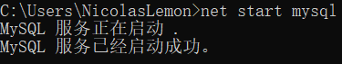

5. 修改默认账户密码
   
   管理员运行CMD
   
   ```shell
   mysqladmin -u root password root
   ```
   
   此时，用户名是**root**，密码是**root**
   
   如果想要修改已设置的密码
   
   ```shell
   mysqladmin -u用户名 -p旧密码 password 新密码
   ```
   
   **到这里，MySQL解压版就安装完毕了**

6. 登录MySQL
   
   管理员运行CMD
   
   ```shell
   mysql -uroot -proot
   ```
   
   左下角有显示==mysql>==，则表示登录成功

7. 卸载MySQL
   
   管理员运行CMD
   
   ```shell
   net stop mysql
   mysqld -remove mysql
   ```
   
   最后删除MySQL目录及相关的环境变量

# Nginx

* 推荐版本：跟着官网走呗，官方下载地址：https://nginx.org/en/download.html

* 选择**Stable version**下的下载

* Linux下载中间的**nginx-x.xx.x**，Windows下载右边的**nginx/Windows-x.xx.x**
  
  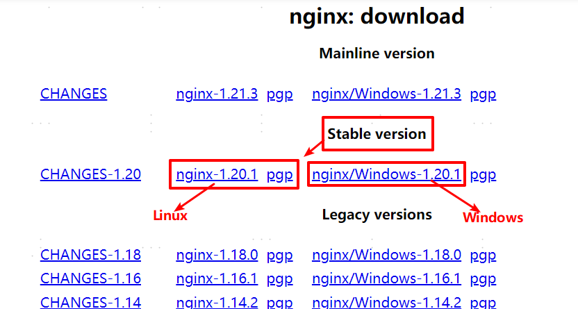

## Linux

* 权限不够就 **su root** 或 **sudo su root** 切换到root账号下

### 安装

1. 查看系统是否安装了Nginx，若有，卸载旧版本的
   
   * 查找Nginx文件
     
     ```shell
     whereis nginx
     find / -name nginx
     ```
     
     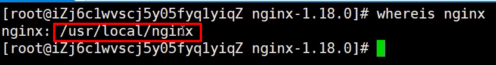
   
   * 将上述找到的文件全删了
     
     ```shell
     rm -rf xxxxx
     yum remove nginx
     ```

2. 将下载好的压缩包上传到Linux服务器上，并解压（位置随意），例如上传到了 **/usr/upload** 中
   
   * 如在/usr下没有upload文件夹就新建一个upload文件夹，然后再上传
     
     ```shell
     mkdir /usr/upload
     # 设置upload文件夹权限，不然上传不了文件
     chmod 777 -R /usr/upload
     ```
* 将Nginx压缩包解压出来
  
  ```shell
     cd /usr/upload
     tar -zxvf nginx-1.20.1.tar.gz
  ```
3. 安装和启动Nginx
   
   * 进入解压后的文件夹
     
     ```shell
     cd nginx-1.20.1
     ```
   
   * 加载配置安装
     
     ```shell
     # 运行Nginx的配置文件
     ./configure
     # 利用make命令安装一下
     make
     # 保险起见再用make install安装一下
     make install
     ```
     
     若`make`命令时报错：
     
     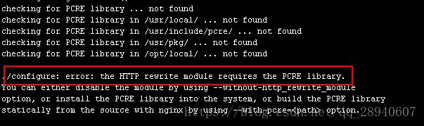
     
     则可先运行以下命令：
     
     ```shell
     yum -y install pcre-devel
     yum -y install openssl openssl-devel
     ```
   
   * 寻找安装目录，找到安装目录是 **/usr/local/nginx**
     
     ```shell
     whereis nginx
     ```
     
     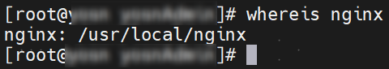
   
   * 进入安装目录，启动Nginx
     
     ```shell
     cd /usr/local/nginx/sbin
     # 启动Nginx
     ./nginx
     ```
     
     此时启动完毕后没有提示，可以查看是否存在nginx进程
     
     ```shell
     ps -ef | grep nginx
     ```
     
     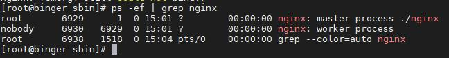
     
     或者，在浏览器地址栏中输入： **http://ip:80/** ，显示有Nginx欢迎页面，表示安装成功
     
     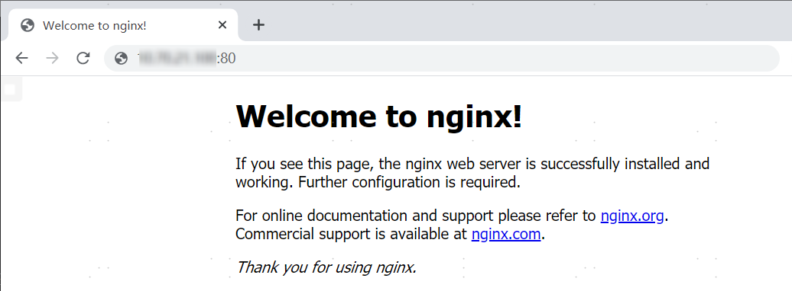
   
   * 删除上传和解压的文件
     
     ```shell
     rm -rf /usr/upload/*
     ```

### 环境配置

1. 将nginx环境变量添加到配置文件 **/etc/profile** 中
   
   * 编辑 **/etc/profile**
     
     ```shell
     vim /etc/profile
     ```
   
   * 在末尾添加Nginx环境变量
     
     ```shell
     # Nginx
     export NGINX_HOME=/usr/local/nginx
     export PATH=$PATH:$NGINX_HOME/sbin
     ```
     
     

2. 使配置文件 **/etc/profile** 重新生效
   
   ```shell
   source /etc/profile
   ```

3. 测试Nginx环境是否配置好
   
   ```shell
   nginx -V
   ```
   
   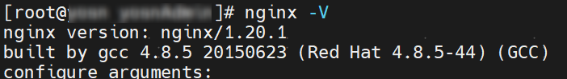

### 开机自启

#### CentOS

* 修改 **/etc/rc.d/rc.local** 文件，在末尾添加Nginx的启动路径（**/usr/local/nginx/sbin/nginx**）
  
  ```shell
  vim /etc/rc.d/rc.local
  ```
  
  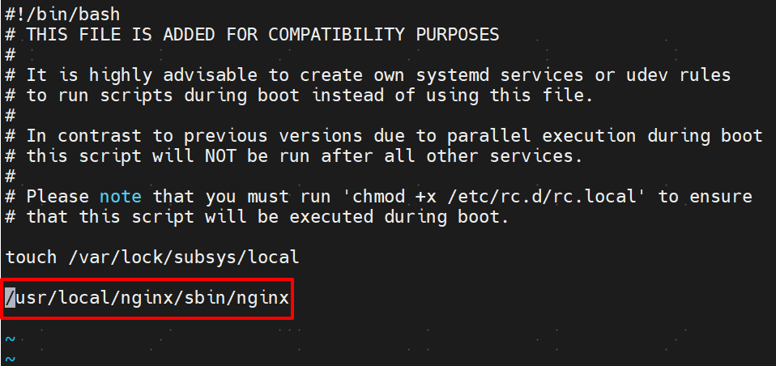

* 使 **/etc/rc.d/rc.local** 变成可执行文件
  
  ```shell
  chmod +x /etc/rc.d/rc.local
  ```

* 使用**reboot**命令重启Linux系统后，查看Nginx是否成功的自启动了
  
  ```shell
  reboot
  ps -ef | grep nginx
  ```
  
  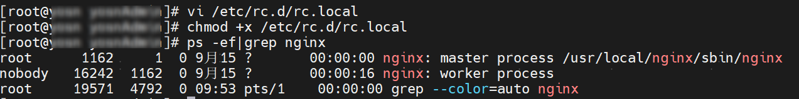

#### Ubuntu

* 建立服务文件
  
  ```shell
  vim /usr/lib/systemd/system/nginx.service
  ```

* 添加如下内容
  
  ```bash
  # 描述服务
  Description=Nginx - High Performance Web Server
  # 依赖，当依赖的服务启动之后再启动自定义的服务
  After=network.target remote-fs.target nss-lookup.target
  # 服务运行参数的设置
  [Service]
  # 设置后天运行
  Type=forking
  # 服务的具体运行命令(需要根据路径适配)
  ExecStart=/usr/local/nginx/sbin/nginx -c /usr/local/nginx/conf/nginx.conf
  # 重启命令(需要根据路径适配)
  ExecReload=/usr/local/nginx/sbin/nginx -s reload
  # 停止命令(需要根据路径适配)
  ExecStop=/usr/local/nginx/sbin/nginx -s stop
  # 服务安装的相关设置，可设置为多用户
  [Install]
  WantedBy=multi-user.target
  ```
  
  相关命令
  
  ```shell
  # 开启开机自启
  systemctl enable nginx.service
  # 关闭开机自启
  systemctl disable nginx.service
  # 查看服务状态
  systemctl status nginx.service
  # 开启服务
  systemctl start svn.service
  # 关闭服务
  systemctl stop svn.service
  # 重启服务
  systemctl restart nginx.service
  # 查看所有服务
  systemctl list-units --type=service
  ```

## Windows

#### 安装

* 直接解压缩压缩包就行
  
  运行Nginx后，在浏览器地址栏中输入： **http://localhost:80/** ，显示有Nginx欢迎页面
  
  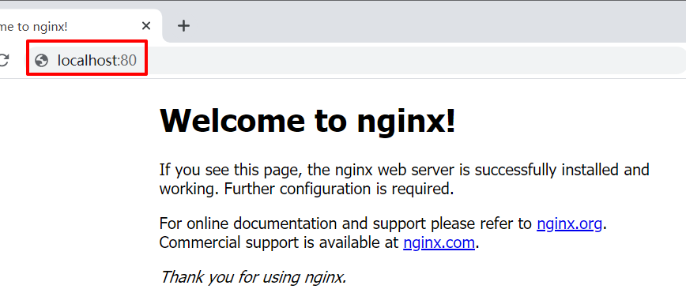

### 环境配置

1. 新建系统变量 **NGINX_HOME**
   
   * 变量名：NGINX_HOME
   
   * 变量值：D:\Program Files (x86)\Nginx-1.20.1
     
     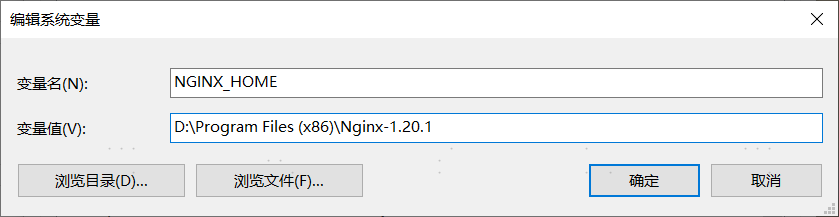

2. 编辑系统变量 **Path**
   
   * 添加：%NGINX_HOME%
     
     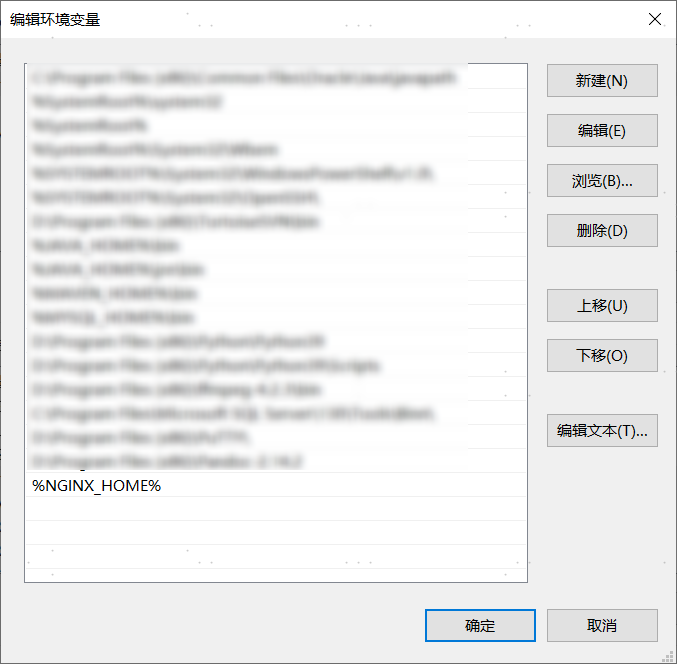

3. 运行CMD测试Nginx环境是否配置成功
   
   ```shell
   nginx -V
   ```
   
   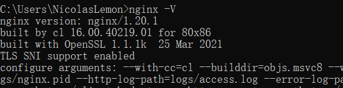

## 常用命令

### Nginx

* **注：** 启动Nginx后，修改其conf文件，需重新加载配置文件（**nginx -s reload**）
  
  ```shell
  # 启动
  nginx
  # 停止
  nginx -s stop
  # 安全退出
  nginx -s quit
  # 重新加载配置文件
  nginx -s reload
  # 查看nginx进程
  ps -ef | grep nginx
  ```

### Firewall

* 几个常用的防火墙命令
  
  ```shell
  # 查看火墙状态
  systemctl status firewalld
  # 开启火墙服务
  systemctl start firewalld
  # 重启启火墙服务
  systemctl restart firewalld
  # 关闭火墙服务
  systemctl stop firewalld
  # 开机自动启动防火墙服务
  systemctl enable firewalld
  # 取消开机自启防火墙服务
  systemctl disable firewalld
  # 列出public域中开放的端口
  firewall-cmd --zone=public --list-ports
  # 永久添加6666端口（去掉--permanent：只对本次生效，reboot后失效）
  firewall-cmd --zone=public --add-port=6666/tcp --permanent
  # 永久删除6666端口（去掉--permanent：只对本次生效，reboot后失效）
  firewall-cmd --zone=public --remove-port=6666/tcp --permanent 
  ```

## 使用Nginx

* Nginx的配置文件地址是 **/usr/local/nginx/conf/nginx.conf**

* 每次修改完nginx配置文件后，**都需要**重新加载配置文件（**nginx -s reload**）

* 若没配置全局nginx环境变量，则需先进入 **/usr/local/nginx/sbin** 目录下，再使用 **./nginx xxxxx** 等类型的命令
  
  ```shell
  cd /usr/local/nginx/sbin
  ./nginx -s reload
  ```

### 端口转发

* **前景：** 公网ip只开放一个6668端口，但是Linux服务器上部署了多个项目，此时就需要使用Nginx进行端口转发，共用该6668端口

* 假设**6668**端口是共用对外的，Linux上在**2233**端口和**8001**端口上部署了项目
1. 检查防火墙状态，如果防火墙是关闭的，就打开防火墙
   
   ```shell
   # 查看火墙状态
   systemctl status firewalld
   # 开启火墙服务
   systemctl start firewalld
   ```
   
   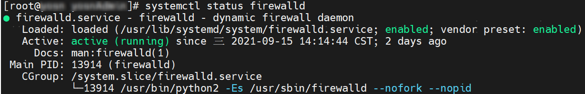

2. 开放需要开放的端口，并重启防火墙，使配置生效
   
   ```shell
   # 列出public域中开放的端口
   firewall-cmd --zone=public --list-ports
   # 永久添加端口（去掉--permanent：只对本次生效，reboot后失效）
   firewall-cmd --zone=public --add-port=6668/tcp --permanent
   firewall-cmd --zone=public --add-port=2233/tcp --permanent
   firewall-cmd --zone=public --add-port=8001/tcp --permanent
   # 重启启火墙服务
   systemctl restart firewalld
   ```
   
   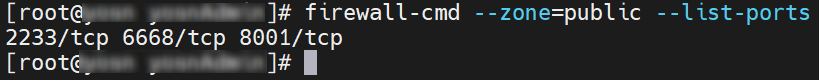

3. 修改Nginx配置文件
   
   * 编辑Nginx配置文件
     
     ```shell
     vim /usr/local/nginx/conf/nginx.conf
     ```
   
   * 将Nginx的**server**端口改成对外的6668端口
     
     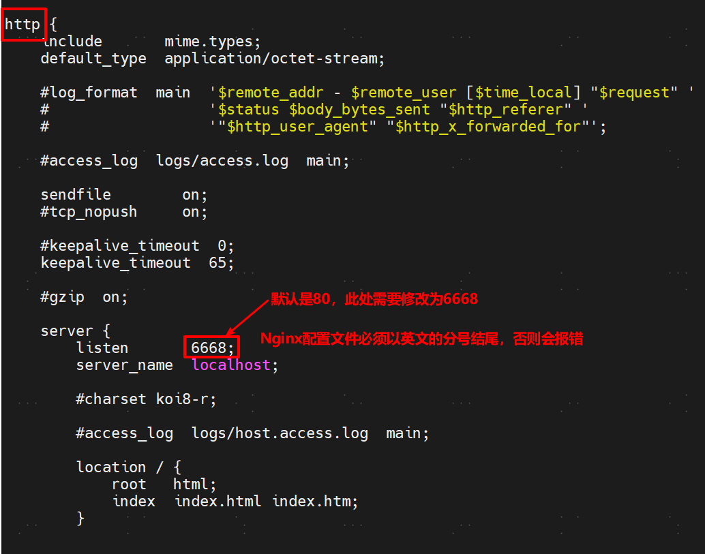
   
   * 添加端口转发
     
     ```java
     location /访问别名/ {
         # root   Demo;
         # index  index.html index.htm;
         # 代理地址
         proxy_pass http://127.0.0.1:转发端口号/;
         # 允许cros跨域访问
         add_header 'Access-Control-Allow-Origin' '*';
     }
     ```
     
     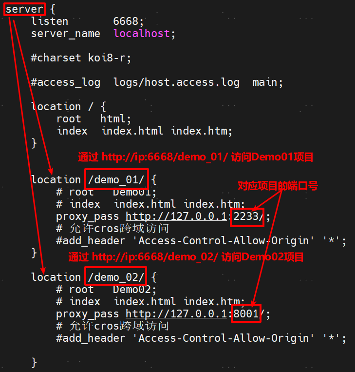

4. 重新加载Nginx配置文件
   
   * 方式一（通用）
     
     ```shell
     cd /usr/local/nginx/sbin
     ./nginx -s reload
     ```
   
   * 方式二（全局配置了Nginx环境变量）
     
     ```shell
     nginx -s reload
     ```
     
     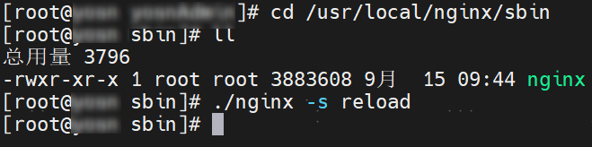

# Maven

* 推荐版本：跟着官网走呗，官方下载地址：**https://maven.apache.org/download.cgi**

## Windows

### 安装

1. 下载【**Binary zip archive**】版本的
   
   **Tip：** 作者下载Maven的时候还是3.8.1，所以下面不用纠结版本号，根据自己下载的版本配置即可
   
   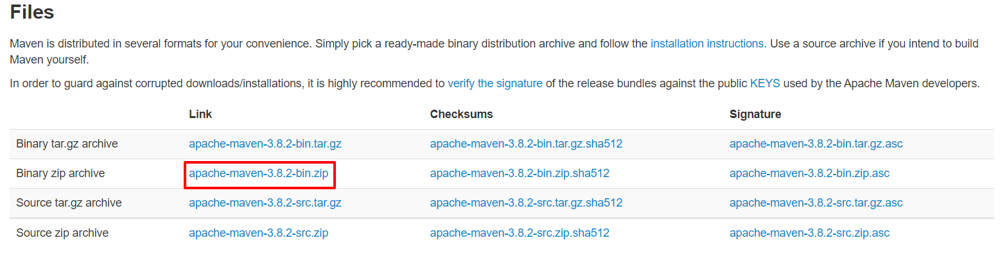

2. 在自己的安装目录下，新建一个Maven文件夹，例如**D:\Program Files (x86)\Maven**
   
   * 在Maven文件夹下解压**apache-maven-x.x.x-bin.zip**
   
   * 在Maven文件夹下新建**repository**文件夹，结构如下：
     
     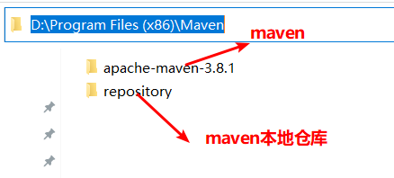

### 环境配置

1. 新建系统变量 **MAVEN_HOME**
   
   * 变量名：MAVEN_HOME
   
   * 变量值：D:\Program Files (x86)\Maven\apache-maven-3.8.1
     
     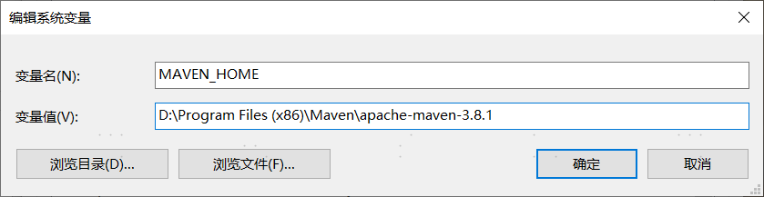

2. 修改系统变量 **Path**
   
   * 添加：%MAVEN_HOME%\bin
     
     

3. 运行CMD测试Maven环境是否配置成功
   
   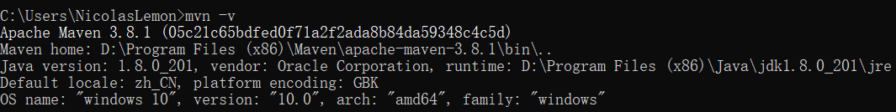

4. 修改Maven配置文件
   
   * 编辑**D:\Program Files (x86)\Maven\apache-maven-3.8.1\conf\settings.xml**
   
   * 下面贴出自用整个xml，只需要修改maven本地仓库地址即可
     
     ```xml
     <!-- 本地Maven仓库地址 -->
     <localRepository>D:\Program Files (x86)\Maven\repository</localRepository>
     ```
   
   * 完整settings.xml如下，根据自身的maven本地仓库地址，去修改上面那句代码中的地址即可
     
     ```xml
     <?xml version="1.0" encoding="UTF-8"?>
     
     <!--
     Licensed to the Apache Software Foundation (ASF) under one
     or more contributor license agreements.  See the NOTICE file
     distributed with this work for additional information
     regarding copyright ownership.  The ASF licenses this file
     to you under the Apache License, Version 2.0 (the
     "License"); you may not use this file except in compliance
     with the License.  You may obtain a copy of the License at
     
         http://www.apache.org/licenses/LICENSE-2.0
     
     Unless required by applicable law or agreed to in writing,
     software distributed under the License is distributed on an
     "AS IS" BASIS, WITHOUT WARRANTIES OR CONDITIONS OF ANY
     KIND, either express or implied.  See the License for the
     specific language governing permissions and limitations
     under the License.
     -->
     
     <!--
      | This is the configuration file for Maven. It can be specified at two levels:
      |
      |  1. User Level. This settings.xml file provides configuration for a single user,
      |                 and is normally provided in ${user.home}/.m2/settings.xml.
      |
      |                 NOTE: This location can be overridden with the CLI option:
      |
      |                 -s /path/to/user/settings.xml
      |
      |  2. Global Level. This settings.xml file provides configuration for all Maven
      |                 users on a machine (assuming they're all using the same Maven
      |                 installation). It's normally provided in
      |                 ${maven.conf}/settings.xml.
      |
      |                 NOTE: This location can be overridden with the CLI option:
      |
      |                 -gs /path/to/global/settings.xml
      |
      | The sections in this sample file are intended to give you a running start at
      | getting the most out of your Maven installation. Where appropriate, the default
      | values (values used when the setting is not specified) are provided.
      |
      |-->
     <settings xmlns="http://maven.apache.org/SETTINGS/1.2.0"
               xmlns:xsi="http://www.w3.org/2001/XMLSchema-instance"
               xsi:schemaLocation="http://maven.apache.org/SETTINGS/1.2.0 http://maven.apache.org/xsd/settings-1.2.0.xsd">
         <!-- localRepository
        | The path to the local repository maven will use to store artifacts.
        |
        | Default: ${user.home}/.m2/repository
       <localRepository>/path/to/local/repo</localRepository>
       -->
         <!-- 本地Maven仓库地址 -->
         <localRepository>D:\Program Files (x86)\Maven\repository</localRepository>
         <!-- interactiveMode
        | This will determine whether maven prompts you when it needs input. If set to false,
        | maven will use a sensible default value, perhaps based on some other setting, for
        | the parameter in question.
        |
        | Default: true
       <interactiveMode>true</interactiveMode>
       -->
     
         <!-- offline
        | Determines whether maven should attempt to connect to the network when executing a build.
        | This will have an effect on artifact downloads, artifact deployment, and others.
        |
        | Default: false
       <offline>false</offline>
       -->
     
         <!-- pluginGroups
        | This is a list of additional group identifiers that will be searched when resolving plugins by their prefix, i.e.
        | when invoking a command line like "mvn prefix:goal". Maven will automatically add the group identifiers
        | "org.apache.maven.plugins" and "org.codehaus.mojo" if these are not already contained in the list.
        |-->
         <pluginGroups>
             <!-- pluginGroup
          | Specifies a further group identifier to use for plugin lookup.
         <pluginGroup>com.your.plugins</pluginGroup>
         -->
         </pluginGroups>
     
         <!-- proxies
        | This is a list of proxies which can be used on this machine to connect to the network.
        | Unless otherwise specified (by system property or command-line switch), the first proxy
        | specification in this list marked as active will be used.
        |-->
         <proxies>
             <!-- proxy
          | Specification for one proxy, to be used in connecting to the network.
          |
         <proxy>
           <id>optional</id>
           <active>true</active>
           <protocol>http</protocol>
           <username>proxyuser</username>
           <password>proxypass</password>
           <host>proxy.host.net</host>
           <port>80</port>
           <nonProxyHosts>local.net|some.host.com</nonProxyHosts>
         </proxy>
         -->
         </proxies>
     
         <!-- servers
        | This is a list of authentication profiles, keyed by the server-id used within the system.
        | Authentication profiles can be used whenever maven must make a connection to a remote server.
        |-->
         <servers>
             <!-- server
          | Specifies the authentication information to use when connecting to a particular server, identified by
          | a unique name within the system (referred to by the 'id' attribute below).
          |
          | NOTE: You should either specify username/password OR privateKey/passphrase, since these pairings are
          |       used together.
          |
         <server>
           <id>deploymentRepo</id>
           <username>repouser</username>
           <password>repopwd</password>
         </server>
         -->
     
             <!-- Another sample, using keys to authenticate.
         <server>
           <id>siteServer</id>
           <privateKey>/path/to/private/key</privateKey>
           <passphrase>optional; leave empty if not used.</passphrase>
         </server>
         -->
         </servers>
     
         <!-- mirrors
        | This is a list of mirrors to be used in downloading artifacts from remote repositories.
        |
        | It works like this: a POM may declare a repository to use in resolving certain artifacts.
        | However, this repository may have problems with heavy traffic at times, so people have mirrored
        | it to several places.
        |
        | That repository definition will have a unique id, so we can create a mirror reference for that
        | repository, to be used as an alternate download site. The mirror site will be the preferred
        | server for that repository.
        |-->
         <mirrors>
             <!-- mirror
          | Specifies a repository mirror site to use instead of a given repository. The repository that
          | this mirror serves has an ID that matches the mirrorOf element of this mirror. IDs are used
          | for inheritance and direct lookup purposes, and must be unique across the set of mirrors.
          |
         <mirror>
           <id>mirrorId</id>
           <mirrorOf>repositoryId</mirrorOf>
           <name>Human Readable Name for this Mirror.</name>
           <url>http://my.repository.com/repo/path</url>
         </mirror>
          -->
     
             <!-- 阿里云仓库 -->
             <mirror>
                 <id>alimaven</id>
                 <mirrorOf>central</mirrorOf>
                 <name>aliyun maven</name>
                 <url>http://maven.aliyun.com/nexus/content/repositories/central/</url>
             </mirror>
     
             <mirror>
                 <id>maven-default-http-blocker</id>
                 <mirrorOf>external:http:*</mirrorOf>
                 <name>Pseudo repository to mirror external repositories initially using HTTP.</name>
                 <url>http://0.0.0.0/</url>
                 <blocked>true</blocked>
             </mirror>
         </mirrors>
     
         <!-- profiles
        | This is a list of profiles which can be activated in a variety of ways, and which can modify
        | the build process. Profiles provided in the settings.xml are intended to provide local machine-
        | specific paths and repository locations which allow the build to work in the local environment.
        |
        | For example, if you have an integration testing plugin - like cactus - that needs to know where
        | your Tomcat instance is installed, you can provide a variable here such that the variable is
        | dereferenced during the build process to configure the cactus plugin.
        |
        | As noted above, profiles can be activated in a variety of ways. One way - the activeProfiles
        | section of this document (settings.xml) - will be discussed later. Another way essentially
        | relies on the detection of a system property, either matching a particular value for the property,
        | or merely testing its existence. Profiles can also be activated by JDK version prefix, where a
        | value of '1.4' might activate a profile when the build is executed on a JDK version of '1.4.2_07'.
        | Finally, the list of active profiles can be specified directly from the command line.
        |
        | NOTE: For profiles defined in the settings.xml, you are restricted to specifying only artifact
        |       repositories, plugin repositories, and free-form properties to be used as configuration
        |       variables for plugins in the POM.
        |
        |-->
         <profiles>
     
             <!-- java版本 -->
             <profile>
                 <id>jdk-1.8</id>
                 <activation>
                     <activeByDefault>true</activeByDefault>
                     <jdk>1.8</jdk>
                 </activation>
     
                 <properties>
                     <maven.compiler.source>1.8</maven.compiler.source>
                     <maven.compiler.target>1.8</maven.compiler.target>
                     <maven.compiler.compilerVersion>1.8</maven.compiler.compilerVersion>
                 </properties>
             </profile>
     
             <!-- profile
          | Specifies a set of introductions to the build process, to be activated using one or more of the
          | mechanisms described above. For inheritance purposes, and to activate profiles via <activatedProfiles/>
          | or the command line, profiles have to have an ID that is unique.
          |
          | An encouraged best practice for profile identification is to use a consistent naming convention
          | for profiles, such as 'env-dev', 'env-test', 'env-production', 'user-jdcasey', 'user-brett', etc.
          | This will make it more intuitive to understand what the set of introduced profiles is attempting
          | to accomplish, particularly when you only have a list of profile id's for debug.
          |
          | This profile example uses the JDK version to trigger activation, and provides a JDK-specific repo.
         <profile>
           <id>jdk-1.4</id>
     
           <activation>
             <jdk>1.4</jdk>
           </activation>
     
           <repositories>
             <repository>
               <id>jdk14</id>
               <name>Repository for JDK 1.4 builds</name>
               <url>http://www.myhost.com/maven/jdk14</url>
               <layout>default</layout>
               <snapshotPolicy>always</snapshotPolicy>
             </repository>
           </repositories>
         </profile>
     
         -->
     
             <!--
          | Here is another profile, activated by the system property 'target-env' with a value of 'dev',
          | which provides a specific path to the Tomcat instance. To use this, your plugin configuration
          | might hypothetically look like:
          |
          | ...
          | <plugin>
          |   <groupId>org.myco.myplugins</groupId>
          |   <artifactId>myplugin</artifactId>
          |
          |   <configuration>
          |     <tomcatLocation>${tomcatPath}</tomcatLocation>
          |   </configuration>
          | </plugin>
          | ...
          |
          | NOTE: If you just wanted to inject this configuration whenever someone set 'target-env' to
          |       anything, you could just leave off the <value/> inside the activation-property.
          |
         <profile>
           <id>env-dev</id>
     
           <activation>
             <property>
               <name>target-env</name>
               <value>dev</value>
             </property>
           </activation>
     
           <properties>
             <tomcatPath>/path/to/tomcat/instance</tomcatPath>
           </properties>
         </profile>
         -->
         </profiles>
     
         <!-- activeProfiles
        | List of profiles that are active for all builds.
        |
       <activeProfiles>
         <activeProfile>alwaysActiveProfile</activeProfile>
         <activeProfile>anotherAlwaysActiveProfile</activeProfile>
       </activeProfiles>
       -->
     </settings>
     ```

5. 运行CMD，输入**mvn help:system**测试，配置成功则本地仓库**D:\Program Files (x86)\Maven\repository**中会出现一些文件
   
   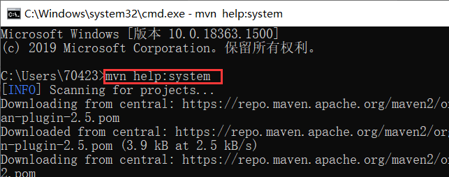
   
   * **至此，Maven环境，配置完毕**

### Intellij IDEA配置

* 在**Intellij IDEA**设置中如下图所配置本地maven环境
  
  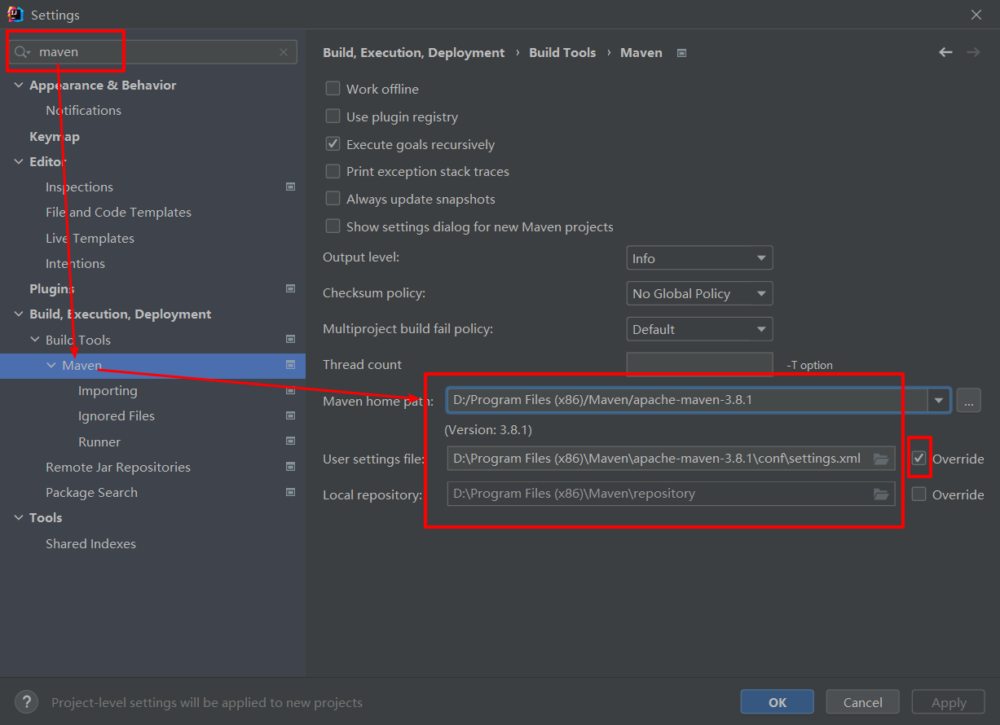

# SVN - 服务端

## Linux

* 权限不够就 **su root** 或 **sudo su root** 切换到root账号下
* 此处的Linux系统是 **Ubuntu 9.3.0-17ubuntu1**

### 安装

1. 查看系统是否安装了SVN，若有，卸载旧版本的
   
   * 产看SVN版本号，若有显示，则卸载旧版本的
     
     ```shell
     svn --version
     ```
     
     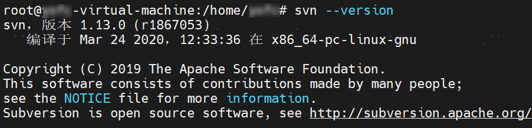
   
   * 卸载旧版SVN
     
     ```shell
     apt-get remove --purge subversion
     ```

2. 安装svnserve
   
   ```shell
   # 安装之前可先更新一下apt-get
   apt-get update
   # 利用apt-get安装svn
   apt-get install subversion
   # 查看svnserve是否安装成功
   svnserve --version
   ```
   
   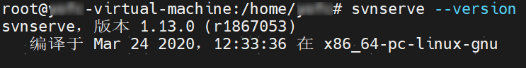

3. 创建SVN仓库，仓库名为**AIoT**
   
   ```shell
   # 新建SVN仓库目录
   mkdir -p /usr/svn/AIoT
   # 给仓库开放读写权限
   chmod 777 -R /usr/svn/AIoT
   # 创建SVN仓库，执行命令后，会在AIoT下生成若干文件
   svnadmin create /usr/svn/AIoT
   ```
   
   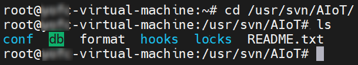
   
   ```shell
   # 对db进入权限设置
   chmod 777 -R /usr/svn/AIoT/db
   ```

### 基本配置

1. 修改SVN的配置文件，配置文件是**SVN仓库**下的**conf/svnserve.conf**
   
   ```shell
   # 进入SVN仓库下的conf文件夹
   cd /usr/svn/AIoT/conf
   ```
   
   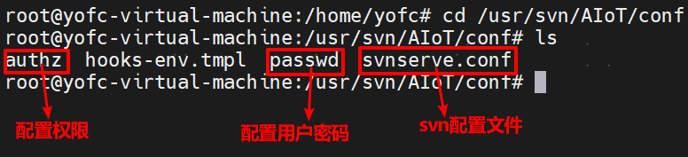
   
   ```shell
   # 编辑配置文件
   vim svnserve.conf
   ```
   
   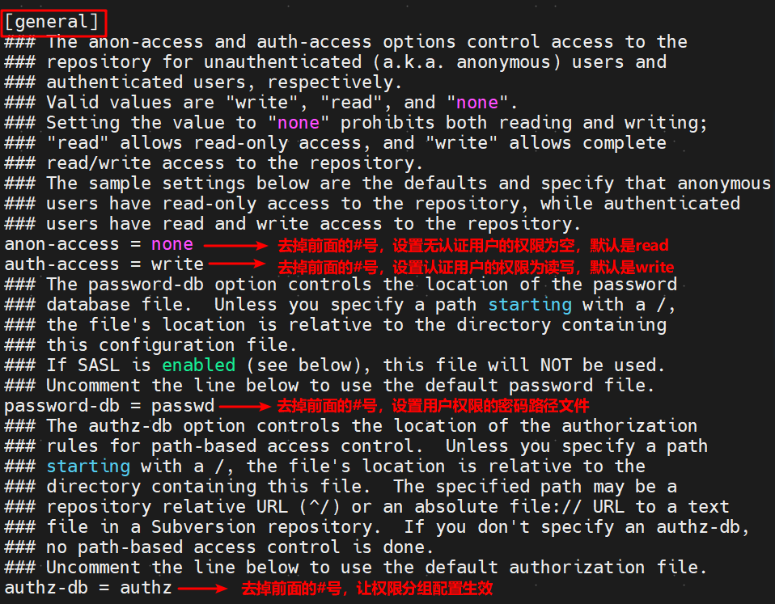

2. 添加访问用户
   
   ```shell
   vim passwd
   ```
   
   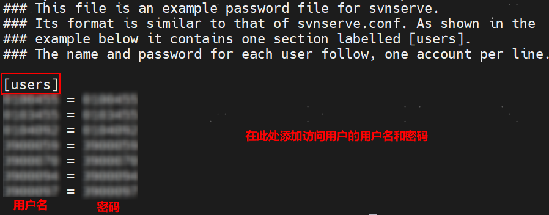

3. 设置权限分组
   
   ```shell
   vim authz
   ```
   
   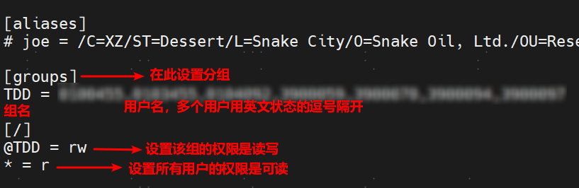

### 分组权限

```shell
vim /usr/svn/AIoT/conf/authz
```

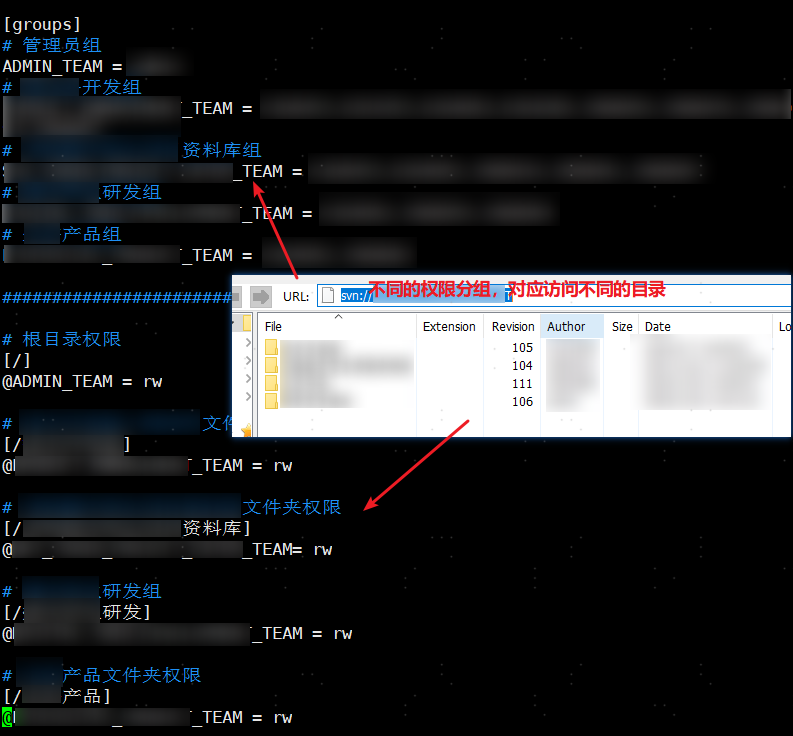

### 启动

```shell
# 启动SVN服务器
# -d：表示在后台运行
# -r：指定服务器的根目录
# --listen-port 指定端口
svnserve -d -r /usr/svn --listen-port 3090
# 查看是否启动成功 
ps -ef | grep svnserve
```

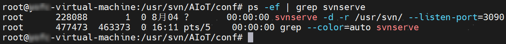

### 开机自启

##### Ubuntu

* 建立服务文件
  
  ```shell
  vim /usr/lib/systemd/system/svn.service
  ```

* 添加如下内容
  
  ```bash
  # 描述服务
  Description=SVN
  # 依赖，当依赖的服务启动之后再启动自定义的服务
  After=network.target remote-fs.target nss-lookup.target
  # 服务运行参数的设置
  [Service]
  # 设置后天运行
  Type=forking
  # 服务的具体运行命令(需要根据路径适配)
  ExecStart=svnserve -d -r /usr/svn --listen-port 3090
  # 重启命令(需要根据路径适配)
  ExecReload=svnserve -d -r /usr/svn --listen-port 3090
  # 停止命令(需要根据路径适配)
  ExecStop=killall svnserve
  # 服务安装的相关设置，可设置为多用户
  [Install]
  WantedBy=multi-user.target
  ```
  
  相关命令
  
  ```shell
  # 开启开机自启
  systemctl enable svn.service
  # 关闭开机自启
  systemctl disable svn.service
  # 查看服务状态
  systemctl status svn.service
  # 开启服务
  systemctl start svn.service
  # 关闭服务
  systemctl stop svn.service
  # 重启服务
  systemctl restart svn.service
  # 查看所有服务
  systemctl list-units --type=service
  ```

## 连接服务端

1. 下载并安装小乌龟
   
   
   
   **下载地址：**
   
   https://mirrors.gigenet.com/OSDN//storage/g/t/to/tortoisesvn/1.14.1/Application/TortoiseSVN-1.14.1.29085-x64-svn-1.14.1.msi
   
   安装完成后，任意文件夹下右键会有如图所示，则表示安装成功
   
   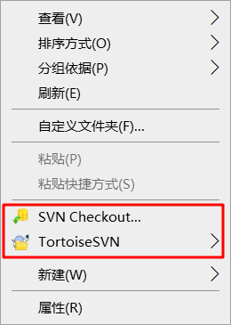

2. 连接到SVN服务端仓库
   
   * 在任意地方右键，选择 **TortoiseSVN** -> **Repo-browser**
     
     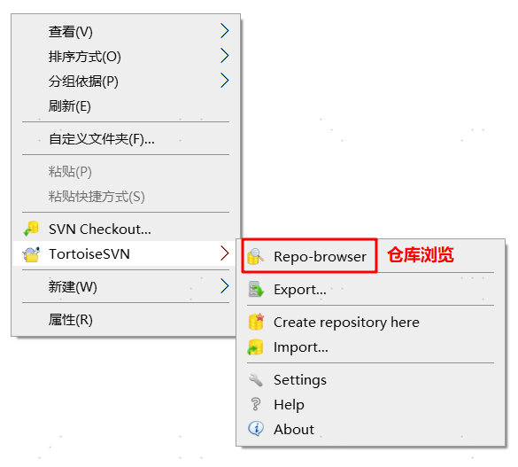
   
   * 输入 **svn://ip:3090/AIoT**，点击OK
     
     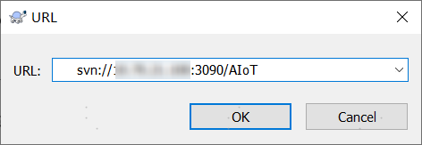
   
   * 输入用户名和密码即可访问成功
     
     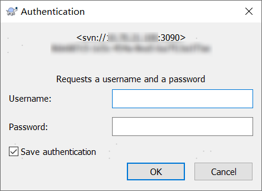
     
     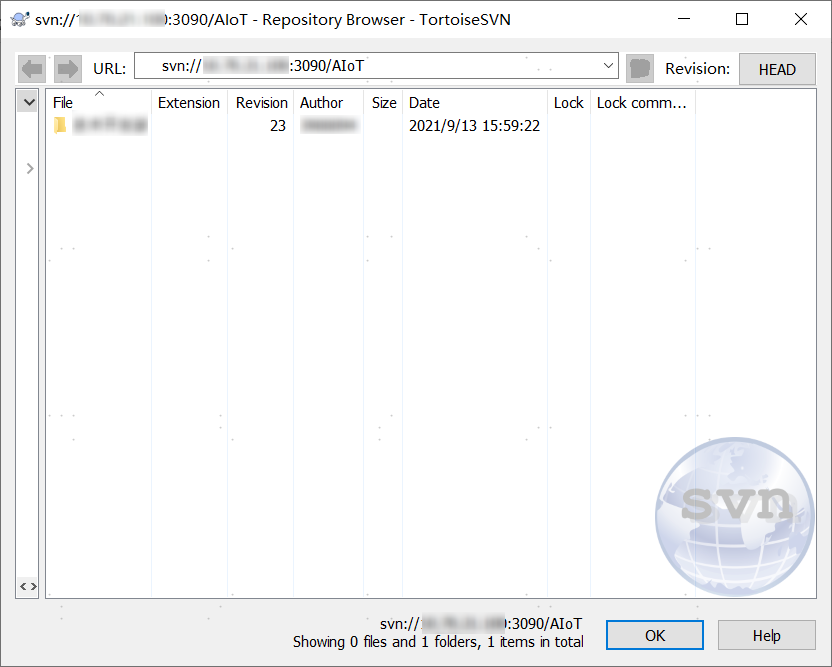
