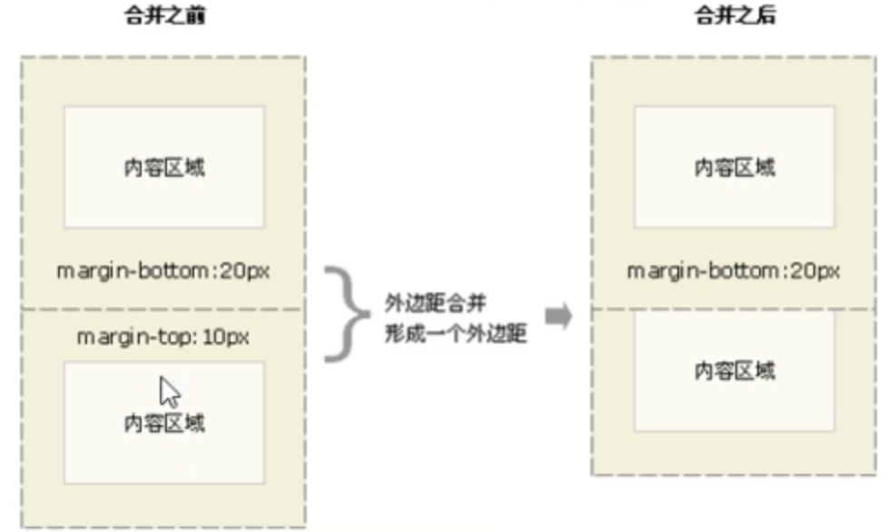
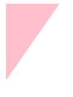
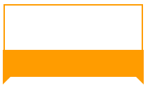

**CSS入坑记录**

- **作者：** Nicolas·Lemon
- **修改：** Nicolas·Lemon
- **创建日期：** 2022.08.09
- **修改日期：** 2022.08.11

# 盒子模型

## 组成

CSS盒子模型本质上就是一个盒子

`盒子模型` = `边框` + `外边距` + `内边距` + `实际内容`

## 边框

| 属性           | 作用       |
|:------------:|:--------:|
| border-width | 边框粗细（px） |
| border-style | 边框样式     |
| border-color | 边框颜色     |

* **简写方式**
  
  ```css
  .box {
      /** 对顺序没有要求 */
      border: 5px solid pink;
  }
  ```

* **边框分开写法**
  
  ```css
  .box {
      /** 只设定上边框，其余同理 */
      border-top: 1px solid red;
  }
  ```

* **注意边框的层叠性**
  
  ```css
  .box {
      /** 标注1 */
      border: 1px solid pink;
      /** 标注2 */
      border-top: 1px solid red;
  }
  ```
  
  `标注1`在上，`标注2`在下：上边框为红色，其余边框为粉色
  
  `标注1`在下，`标注2`在上：整个边框都为粉色

* **边框会影响盒子实际大小**
  
  边框会额外增加盒子的实际大小。
  
  1. 测量盒子的时候，不量边框。
  
  2. 如果测量的时候包含了边框，则对应的宽高需要减去边框的宽度

## 内边距

`padding`属性用于设置边框与内容之间的距离

| 属性             | 作用   |
|:--------------:|:----:|
| padding-left   | 左内边距 |
| padding-right  | 右内边距 |
| padding-top    | 上内边距 |
| padding-bottom | 下内边距 |

* **简写方式**
  
  ```css
  .box {
      /** 上下左右内边距均为50px */
      padding: 50px;
      /** 上下内边距为50px，左右内边距为100px */
      padding: 50px 100px;
      /** 上内边距5px，左右内边距20px，下内边距30px */
      padding: 10px 20px 30px;
      /** 上右下左（顺时针） */
      padding: 10px 20px 30px 40px;
  }
  ```

* **内边距影响盒子实际大小**
  
  如果为了保证盒子跟效果图大小一致，则需要让宽高减去多出来的内外边距大小

* **内边距不会撑开盒子的情况**
  
  如果盒子本身没有指定宽度或高度，则对应的padding不会撑开盒子

## 外边距

`margin`属性用于控制盒子与盒子之间的距离

| 属性            | 作用   |
|:-------------:|:----:|
| margin-left   | 左外边距 |
| margin-right  | 右外边距 |
| margin-top    | 上外边距 |
| margin-bottom | 下外边距 |

* **简写形式同内边距** 

* **使块级元素水平居中**
  
  1. 盒子必须指定了宽度`width`
  
  2. 盒子的左右外边距设置为`auto`
  
  ```css
  .box {
      width: 200px;
      margin: 0 auto;
  }
  ```

* **行内元素或者行内块元素水平居中**
  
  给其父元素添加`text-align: center`即可
  
  ```html
  <div class="father" >
      <span>示例文字</span>
  </div>
  ```
  
  ```css
  .father {
      text-align: center;
  }
  ```

* 外边距合并
  
  使用`margin`定义块元素的`垂直外边距`时，可能会出现外边距的合并问题
  
  1. 相邻块元素垂直外边距的合并
     
     当上下相邻的两个块元素（兄弟关系）相遇时，如果上面元素有下外边距`margin-bottom`，下面的元素有上外边距`margin-top`，则它们之间的垂直间距不是`margin-bottom`与`margin-top`之和，是**取两个值中较大者的间距**
     
     
     
     **解决方案：**
     
     尽量只给一个盒子添加`margin`值
  
  2. 嵌套块元素垂直外边距的塌陷
     
     对于两个嵌套关系（父子关系）的块元素，**父元素**有上外边距`margin-top`的同时**子元素**也有上外边距`margin-top`，此时父元素会**塌陷较大的外边距值**
     
     
     
     **解决方案：**
     
     1. 可以为父元素定义`上边框`
     
     2. 可以为父元素定义`上内边距`
     
     3. **[推荐]** 可以为父元素添加`overflow: hidden`
     
     4. `浮动`、`固定`、`绝对`定位的盒子不会有塌陷问题

* **清除内外边距**
  
  网页元素很多都带有默认的内外边距，而且不同的浏览器默认的也不一样
  
  ```css
  * {
      pardding: 0;
      margin: 0;
  }
  ```
  
  **注意：** 行内元素为了照顾兼容性，尽量只设置左右内外边距。但是转换为块级或者行内块元素就不用担心了

# 浮动

## 特性

* 浮动元素会脱离标准流（脱标）
  
  1. 脱离标准普通流的控制（浮）移动到指定位置（动），俗称`脱标`。
  
  2. 浮动的盒子不再保留原先的位置。

* 浮动的元素会在一行内显示并且元素顶部对齐
  
  **注意：** 浮动的元素是互相贴靠在一起的（不会有缝隙），如果父级宽度装不下这些浮动的盒子，多出的盒子会另起一行对齐。

* 浮动的元素会具有行内块元素的特性
  
  任何元素都可以浮动，不管原先是什么模式的元素，添加浮动之后具有`行内块元素`相似的特性。
  
  * 如果块级盒子没有设置宽度，默认宽度和父级一样宽，但是添加浮动后，它的大小根据内容来决定。
  
  * 浮动的盒子中间是没有缝隙的，是紧挨在一起的。
  
  * 行内元素同理。

## 注意

1. 浮动和标准流的父盒子搭配
   
   先用标准流的父元素排列上下位置，之后内部子元素采取浮动排列左右位置。

2. 一个元素浮动了，理论上其余的兄弟元素也要浮动
   
   一个盒子里面有多个子盒子，如果其中一个盒子浮动了，那么其他兄弟也应该浮动，以防止引起问题。
   
   **浮动的盒子只会影响浮动盒子后面的标准流，不会影响前面的标准流**

## 清除浮动

### 原因

由于父级盒子在很多情况下，不方便给高度，但是子盒子浮动又不占有位置，最后父级盒子高度为0时，就会影响下面的标准流盒子。

* 由于浮动元素不再占用原文档流的位置，所以它会对后面的元素排版产生影响。

### 本质

* 清除浮动的本质时清除浮动元素造成的影响。

* 如果父盒子本身有高度，则不需要清除浮动。

* 清除浮动后，父级就会根据浮动的子盒子自动检测高度。父级有了高度，就不会影响下面的标准流了。

### 语法

```css
选择器 {
    clear : 属性值（通常为both）;
}
```

| 属性值   | 描述                    |
|:-----:|:---------------------:|
| left  | 不允许左侧有浮动元素（清除左侧浮动的影响） |
| right | 不允许右侧有浮动元素（清除右侧浮动的影响） |
| both  | 同时清除左右两侧浮动的影响         |

清除浮动的策略：`闭合浮动`

### 额外标签法

**额外标签法**也称`隔墙法`，是W3C推荐的做法

`额外标签法`会在浮动元素末尾添加一个空的标签，例如：`<div style="clear:both" ></div>`，或者其他标签如`<br />`等。

* 优点：通俗易懂，书写方便

* 缺点：添加许多无意义的标签，结构化较差

**注意：** 要求这个新的标签必须是`块级`元素。

### 父级添加overflow

```html
<div class="father">
    <div class="son1"></div>
    <div class="son2"></div>
</div>
```

```css
.father {
  /** 清除浮动 */
  overflow: hidden;
}
.father .son1,
.father .son2 {
  float: left;
}
```

* 优点：代码简洁

* 缺点：无法显示溢出的部分

### 父级添加::after

是`额外标签法`的升级版

```html
<div class="father clearfix">
    <div class="son1"></div>
    <div class="son2"></div>
</div>
```

```css
.clearfix {
 /** IE6、7专有 */
 *zoom: 1;
}
.clearfix::after {
 content: "";
 display: block;
 height: 0;
 clear: both;
 visibility: hidden;
}
.father .son1,
.father .son2 {
  float: left;
}
```

* 优点：没有增加标签，结构更简单

* 缺点：需要照顾低版本浏览器

### 父级添加双伪元素

```html
<div class="father clearfix">
    <div class="son1"></div>
    <div class="son2"></div>
</div>
```

```css
.clearfix {
  /** IE6、7专有 */
  *zoom: 1;

}
.clearfix::before,
.clearfix::after {
  content: "";
  display: table;
}
.clearfix::after {
  clear: both;
}
.father .son1,
.father .son2 {
  float: left;
}
```

* 优点：代码更简洁

* 缺点：需要照顾低版本浏览器

# 定位

## 组成

`定位` = `定位模式` + `边偏移`

* 定位模式
  
  用于指定一个元素在文档中的定位方式
  
  | 值          | 语义       |
  |:----------:|:--------:|
  | `static`   | **静态**定位 |
  | `relative` | **相对**定位 |
  | `absolute` | **绝对**定位 |
  | `fixed`    | **固定**定位 |

* 边偏移
  
   决定元素的最终位置
  
  | 边偏移属性    | 示例             | 描述                              |
  |:--------:|:--------------:|:-------------------------------:|
  | `top`    | `top: 80px`    | **顶部**偏移量，定义元素相对于其父元素**上边线的距离** |
  | `bottom` | `bottom: 80px` | **底部**偏移量，定义元素相对于其父元素**下边线的距离** |
  | `left`   | `left: 80px`   | **左侧**偏移量，定义元素相对于其父元素**左边线的距离** |
  | `right`  | `right: 80px`  | **右侧**偏移量，定义元素相对于其父元素**右边线的距离** |

## 静态定位

**静态定位**是元素的**默认定位方式**，**无定位**的意思

* 静态定位按照标准流特性摆放位置，它没有偏移量

* 静态定位在布局时很少用到

## 相对定位

**相对定位**是元素在移动位置的时候，是相对于它**原来的位置**来说的（自恋型）。 

**特点：**

* 它是相对于自己原来的位置来移动的（`移动位置的时候的参照点是自己原来的位置`）

* `原来`在标准流的`位置`继续占有，后面的盒子仍然以标准流的方式对待它（`不脱标，继续保留原来的位置`）

因此，相对定位并没有脱标。它最典型的应用是给绝对定位当爹的= =。

## 绝对定位

**绝对定位**是元素在移动位置的时候，是相对它**祖先元素**来说的（拼爹型）。

**特点：**

* 如果**没有祖先元素**或者**祖先元素没有定位**，则以浏览器为准定位（Document文档）

* 如果祖先元素有定位（相对、绝对、固定定位），则以最近一级的有定位祖先元素为参考点移动位置。

* 绝对定位**不再占有原先的位置**（脱标）

## 子绝父相

父级需要占有位置，因此是相对定位，子盒子不需要占有位置，则是绝对定位。

如果父元素不需要占有位置，**子绝父绝**也是可以的。

## 固定定位

**固定定位**是元素**固定于浏览器可视区的位置**。主要使用场景：可以在浏览器页面滚动时元素的位置不会改变。

**特点：**

* 以浏览器的可视窗口为参照点移动元素
  
  * 跟父元素没有任何关系
  
  * 不随滚动条滚动

* 固定定位**不再占有原先的位置**
  
  固定定位也是脱标的，其实固定定位也可以看作是一种特殊的绝对定位。

## 粘性定位

**粘性定位**可以被认为是相对定位和固定定位的混合。`Sticky 粘性的`

**特点：**

* 以浏览器的可视窗口为参照点移动元素（固定定位特点）

* 粘性定位**占有原先的位置**（相对定位特点）

* 必须添加`top、left、right、bottom`其中一个才有效

跟页面滚动搭配使用。兼容性较差，IE不支持。

## 定位叠放次数

**z-index**

在使用定位布局时，可能会出现盒子重叠的情况。此时，可以使用**z-index**来控制盒子的前后次序（z轴）

* 数值可以是正整数、负整数或0，默认是`auto`，数值越大，盒子越靠上

* 如果属性值相同，则按照书写顺序，后来者居上

* 数字后面不能加单位

* 只有定位的盒子才有`z-index`属性

## 定位盒子居中

加了绝对定位的盒子不能通过`margin:0 auto`的方式水平居中

**水平居中&垂直居中**

```html
<div class="box" ></div>
```

```css
.box {
    position: absolute;
    width: 200px;
    height: 100px;
    background-color: pink;
    /** 1. left走50% 父容器宽度的一半 */
    left: 50%;
    /** 2. margin 负值 往左边走 自己盒子宽度的一半 */
    margin-left: -100px;
    /** 3. top走50% 父容器高度的一半 */
    top: 50%;
    /** 4. margin 负值 往上边走 自己盒子高度的一半 */
    margin-top: -50px;
}
```

## 定位的特殊性

绝对定位和固定定位也和浮动类似。

1. 行内元素添加`绝对`或者`固定`定位，可以直接设置宽度和高度。

2. 块级元素添加`绝对`或`固定`定位，如果不给宽度和高度，默认大小是内容的大小。

3. 脱标的盒子不会触发外边距塌陷
   
   浮动元素、绝对定位、固定定位的元素都不会触发外边距合并的问题。

4. 绝对定位、固定定位会完全压住盒子
   
   浮动元素只会压住它下面标准流的盒子，但是不会压住下面标准流盒子里面的文字或图片。
   
   但是绝对定位、固定定位会压住下面标准流中所有的内容。
   
   浮动之所以不会压住文字，是因为浮动产生的效果是文字环绕型，文字会围绕浮动元素。

# 三角形

## 原理


```html
<div class="box"></div>
```

```css
.box {
  /** 宽高必须为0 */
  width: 0;
  height: 0;
  /** 兼容性 */
  line-height: 0;
  font-size: 0;
  /** 上右下左 */
  border-color: pink blue yellow green;
  border-style: solid;
  border-width: 50px;
}
```

## 基础三角

## 等腰直角三角形

### triangle1


```html
<div class="box"></div>
```

```css
.box {
  /** 宽高必须为0 */
  width: 0;
  height: 0;
  /** 兼容性 */
  line-height: 0;
  font-size: 0;
  /** 上右下左，需要原理中的哪块就显示哪块 */
  border-color: pink transparent transparent transparent;
  border-style: solid;
  /** 其互补面的宽度设为0 上->下 */
  border-width: 50px 50px 0 50px;
}
```

### triangle2


```html
<div class="box"></div>
```

```css
.box {
  /** 宽高必须为0 */
  width: 0;
  height: 0;
  /** 兼容性 */
  line-height: 0;
  font-size: 0;
  /** 上右下左，需要原理中的哪块就显示哪块 */
  border-color: pink transparent transparent transparent;
  border-style: solid;
  border-width: 50px 50px 0 0;
}
```

## 等腰三角形


```html
<div class="box"></div>
```

```css
.box {
  /** 宽高必须为0 */
  width: 0;
  height: 0;
  /** 兼容性 */
  line-height: 0;
  font-size: 0;
  /** 上右下左，需要原理中的哪块就显示哪块 */
  border-color: pink transparent transparent transparent;
  border-style: solid;
  /** 其互补面的宽度设为0 上->下 */
  /** 上：控制高，右和左：间接控制腰（腰是作为原理中的斜边） */
  border-width: 100px 20px 0 20px;
}
```

## 直角三角形



```html
<div class="box"></div>
```

```css
.box {
  /** 宽高必须为0 */
  width: 0;
  height: 0;
  /** 兼容性 */
  line-height: 0;
  font-size: 0;
  /** 上右下左，需要原理中的哪块就显示哪块 */
  border-color: pink transparent transparent transparent;
  border-style: solid;
  border-width: 100px 70px 0 0;
}
```

## 一般三角形


```html
<div class="box"></div>
```

```css
.box {
  /** 宽高必须为0 */
  width: 0;
  height: 0;
  /** 兼容性 */
  line-height: 0;
  font-size: 0;
  /** 上右下左，需要原理中的哪块就显示哪块 */
  border-color: pink transparent transparent transparent;
  border-style: solid;
  border-width: 100px 20px 30px 50px;
}
```

## 案例1

实现斜边框带`Border`效果的


### 分析

实际上是由两个斜边框堆叠而成，而一个斜边框又可以由一个正常边框+三角形构成


### 实现

```html
<div class="bottom">
    <div class="top"></div>
</div>
```

1. 底图层
   
   ```css
   .bottom {
     /** 子绝父相定位 */
     position: relative;
     width: 696px;
     height: 80px;
     background-color: #22c3ed;
     /** 自身after伪元素 */
     &::after {
       /** 子绝父相定位 */
       position: absolute;
       /** 伪元素必须要这个值 */
       content: "";
       /** 定位到底层父容器的最右边 */
       top: 0;
       right: -80px;
       /** 宽高必须为0 */
       width: 0;
       height: 0;
       /** 兼容性 */
       line-height: 0;
       font-size: 0;
       /** 上右下左 */
       border-color: #22c3ed transparent transparent transparent;
       border-style: solid;
       border-width: 80px 80px 0 0;
     }
   }
   ```

2. 顶图层
   
   ```css
   .bottom .top {
     /** 子绝父相定位 */
     position: relative;
     width: 100%;
     height: 77px;
     background-color: pink;
     /** 自身after伪元素 */
     &::after {
       /** 子绝父相定位 */
       position: absolute;
       /** 伪元素必须要这个值 */
       content: "";
       /** 显示在最上层 */
       z-index: 1;
       /** 定位到顶层父容器的最右边 */
       top: 0;
       right: -77px;
       /** 宽高必须为0 */
       width: 0;
       height: 0;
       /** 兼容性 */
       line-height: 0;
       font-size: 0;
       /** 上右下左 */
       border-color: pink transparent transparent transparent;
       border-style: solid;
       border-width: 77px 77px 0 0;
     }
   }
   ```

可以发现顶层和底层只是和颜色不同，高度差即为视觉`Border`的宽度，所以可以提取公共css，进行样式优化，减少重复代码

### 优化

提取出公共css部分

```html
<div class="box bottom">
    <div class="box top"></div>
</div>
```

```css
.box {
  /** 子绝父相定位 */
  position: relative;
  /** 父容器的宽度 */
  /** h(底图层) - h(顶图层) = BorderWidth */
  width: 696px;
  /** 自身after伪元素 */
  &::after {
    /** 子绝父相定位 */
    position: absolute;
    /** 伪元素必须要这个值 */
    content: "";
    /** 定位贴到父容器的顶部 */
    top: 0;
    /** 宽高必须为0 */
    width: 0;
    height: 0;
    /** 兼容性 */
    line-height: 0;
    font-size: 0;
    border-style: solid;
  }
}
.bottom {
  /** 底图层的高度 */
  height: 80px;
  background-color: #22c3ed;
  /** 自身after伪元素 */
  &::after {
    /** 定位到底层父容器的最右边 */
    right: -80px;
    /** 上右下左 */
    border-color: #22c3ed transparent transparent transparent;
    border-width: 80px 80px 0 0;
  }
}
.bottom .top {
  width: 100%;
  /** 顶图层的高度 */
  height: 77px;
  background-color: pink;
  /** 自身after伪元素 */
  &::after {
    /** 显示在最上层 */
    z-index: 1;
    /** 定位到顶层父容器的最右边 */
    right: -77px;
    /** 上右下左 */
    border-color: pink transparent transparent transparent;
    border-width: 77px 77px 0 0;
  }
}
```

## 案例2

突出边框的



### 分析

实际上可由一个正常的盒子加上两个三角形组成


### 实现1

利用伪元素拼凑出两个三角形

```html
<div class="border">
    <div class="top"></div>
    <div class="bottom"></div>
</div>
```

```css
.border {
  /** 整个边框的宽高 */
  width: 160px;
  height: 87px;
}
.border .top {
  /** 上面部分的样式 */
  width: 100%;
  height: 53px;
  text-align: center;
  line-height: 53px;
  font-size: 35px;
  font-weight: 800;
  border: 2px solid #ff9c00;
  border-bottom: none;
}
.border .bottom {
  /** 子绝父相定位 */
  position: relative;
  width: 100%;
  height: 31px;
  background-color: #ff9c00;
  /** 自身before伪元素 */
  &::before {
    /** 子绝父相定位 */
    position: absolute;
    /** 伪元素必要 */
    content: "";
    /** 显示在最下层避免压到中间的内容 */
    z-index: -1;
    // 定位到父容器的最左上
    left: -1px;
    width: 0;
    height: 0;
    border-color: #ff9c00 transparent transparent transparent;
    border-style: solid;
    border-width: 40px 40px 0 0;
  }
  /** 自身after伪元素 */
  &::after {
    position: absolute;
    content: "";
    z-index: -1;
    // 定位到父容器的最右上
    right: -1px;
    width: 0;
    height: 0;
    border-color: #ff9c00 transparent transparent transparent;
    border-style: solid;
    border-width: 40px 0 0 40px;
  }
}
```

可以看出`::before`和`::after`拼凑出来的三角形相当于做了镜像翻转的，因此也可以采用方式2

### 实现2

只实现左边的三角形，然后对它做一个沿`Y轴翻转`的动作


```html
<div class="border">
    <div class="top"></div>
    <div class="bottom">
        <i class="triangle triangle-left"></i>
        <i class="triangle triangle-right"></i>
    </div>
</div>
```

```css
.border {
  /** 整个边框的宽高 */
  width: 160px;
  height: 87px;
}
.border .top {
  /** 上面部分的样式 */
  width: 100%;
  height: 53px;
  text-align: center;
  line-height: 53px;
  font-size: 35px;
  font-weight: 800;
  border: 2px solid #ff9c00;
  border-bottom: none;
}
.border .bottom {
  /** 底部整体的样式 */
  position: relative;
  width: 100%;
  height: 31px;
  background-color: #ff9c00;
}
.border .bottom .triangle {
  position: absolute;
  /** i元素是行内元素，需要转换一下 */
  display: inline-block;
  /** 让其显示到下层，避免压到中间的内容 */
  z-index: -1;
  width: 0;
  height: 0;
  border-color: #ff9c00 transparent transparent transparent;
  border-style: solid;
  border-width: 40px 40px 0 0;
}

.border .bottom .triangle-left {
  /** 控制左边的三角形 */
  left: -1px;
}
.border .bottom .triangle-right {
  /** 控制右边的三角形 */
  right: -1px;
  /** 沿Y轴翻转 */
  transform: rotateY(180deg);
}
```

## 案例3


```html
<div class="border"></div>
```

```css
.border {
  position: relative;
  width: 122px;
  height: 53px;
  /** 边框的样式 */
  background: linear-gradient(to left, #457d9c, #457d9c) left top no-repeat,
    linear-gradient(to bottom, #457d9c, #457d9c) left top no-repeat,
    linear-gradient(to left, #457d9c, #457d9c) right top no-repeat,
    linear-gradient(to bottom, #457d9c, #457d9c) right top no-repeat,
    linear-gradient(to left, #457d9c, #457d9c) left bottom no-repeat,
    linear-gradient(to bottom, #457d9c, #457d9c) left bottom no-repeat,
    linear-gradient(to left, #457d9c, #457d9c) right bottom no-repeat,
    linear-gradient(to left, #457d9c, #457d9c) right bottom no-repeat;
  background-size: 3px 11px, 11px 3px, 3px 11px, 11px 3px;
  &::after {
    position: absolute;
    content: "";
    /** 定位到容器的最中间和贴近底部 */
    left: 50%;
    margin-left: -6px;
    bottom: 0;
    width: 0;
    height: 0;
    line-height: 0;
    font-size: 0;
    border: 6px solid transparent;
    border-bottom-color: #457d9c;
  }
}
```

# 渐变色边框


```html
<div class="border">
    <div class="title">内容测试</div>
</div>
```

```css
.border {
  position: relative;
  width: 460px;
  height: 243px;
  color: #feffff;
  border: 1px solid #264c67;
  background-image: linear-gradient(
    to bottom,
    RGB(14, 48, 75, 0.8) 5%,
    RGB(10, 33, 65, 0.8) 99%
  );
  &::before {
    position: absolute;
    content: "";
    width: 100%;
    right: 0;
    top: -3px;
    border-top: 3px solid;
    border-image: linear-gradient(
        to right,
        rgba(255, 255, 255, 0) 0%,
        #2fb7e2 50%,
        rgba(255, 255, 255, 0) 99%
      )
      2 2 2 2;
    background: linear-gradient(
      to right,
      rgba(255, 255, 255, 0) 0%,
      #2fb7e2 50%,
      rgba(255, 255, 255, 0) 99%
    );
  }
}
.border .title {
  position: absolute;
  font-size: 18px;
  font-weight: 800;
  top: 10px;
  left: 26px;
  z-index: 2;
  &::after {
    position: absolute;
    content: "";
    z-index: -1;
    left: -4px;
    top: 15px;
    width: 115px;
    height: 11px;
    transform: skewX(-30deg);
    background-image: linear-gradient(
      to right,
      RGB(29, 146, 177, 0.7) 5%,
      RGB(22, 97, 123, 1) 30%,
      RGB(15, 46, 71, 0.7) 99%
    );
  }
}
```
