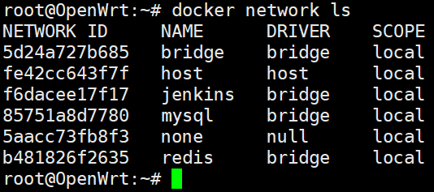
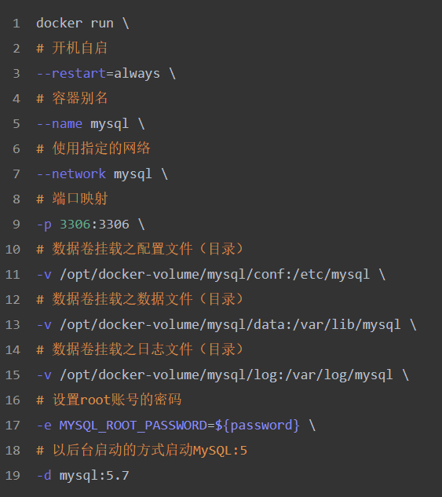
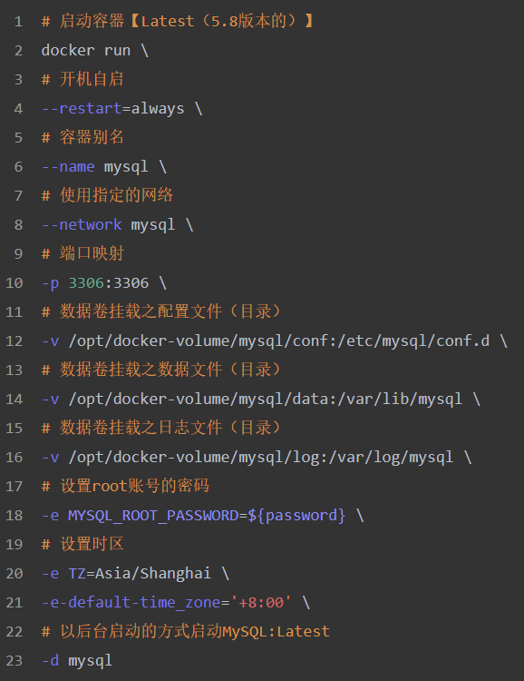
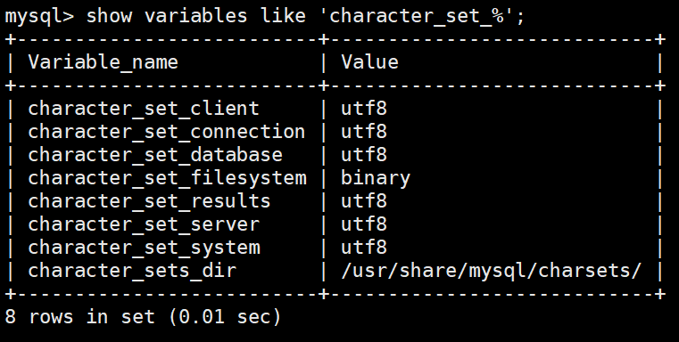
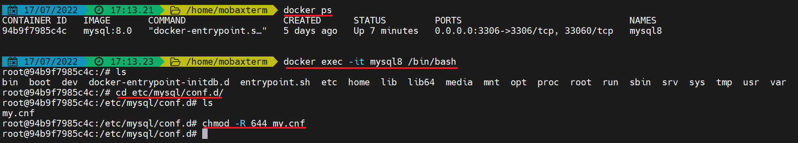
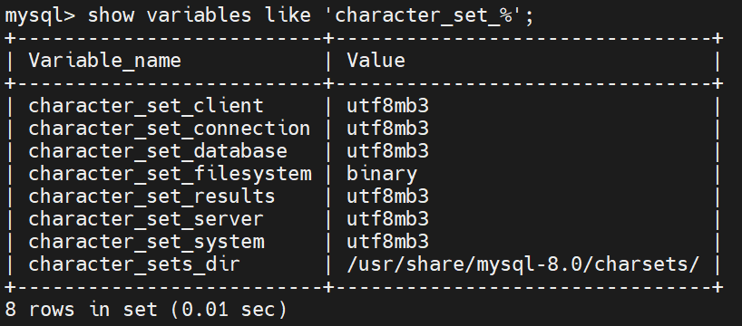
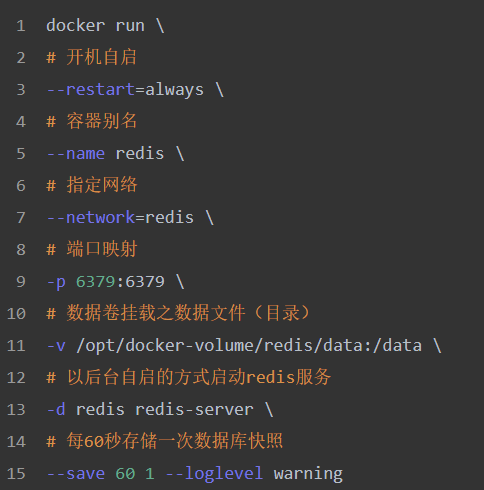
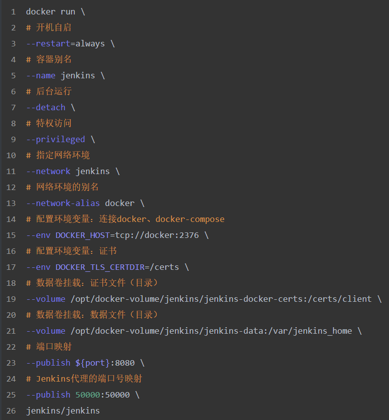
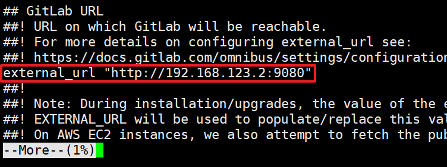
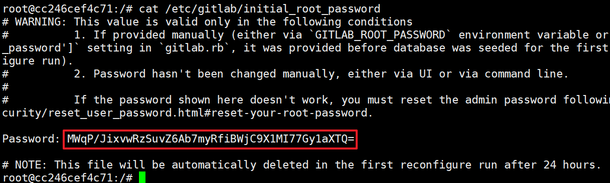

# Docker - Notes

* **作者：** Nicolas·Lemon
* **修改：** Nicolas·Lemon
* **创建时间：** 2022.01.01
* **修改时间：** 2022.07.17

## 常用命令

### 镜容相关

```sh
# 查看docker帮助文档
docker --help
docker ${command} --help

# 查看镜像
docker images -a
# 删除镜像
docker rmi ${image}

# 查看正在运行的容器
docker ps
# 查看所有的容器（包括已经停止运行的）
docker ps -a
# 停止容器
docker stop ${container}
# 删除容器
docker rm ${container}
# 进入容器控制台
docker exec -it ${container} ${/bin/bash}

# 将容器中的文件（夹）复制到本地
docker cp ${container_id}:${container_target_path} ${local_target_path}
# 将本地文件（夹）复制到容器中
docker cp ${local_target_path} ${container_id}:${container_target_path}
```

### 网络相关

```sh
# 查看网络帮助文档
docker network --help
# 查看已有网络列表
docker network ls
# 创建网络
docker network create ${network_name}
# 查看网络详情
docker network inspect ${network_name}
```

### 移除镜容步骤

**步骤【不可】随意调换**

```sh
# 1. 先查看容器是否在运行，如果在运行中，则先停止容器，否则删除容器会失败
docker ps
docker stop ${container}
# 2. 移除容器
docker rm ${container}
# 3. 移除镜像
docker rmi ${container}
```



## MySQL

### 创建网络

```sh
# 创建网络
docker network create mysql
```

### 运行容器

#### MySQL 5.7

```sh
docker run \
--restart=always \
--name mysql \
--network mysql \
-p 3306:3306 \
-v /opt/docker-volume/mysql/conf:/etc/mysql \
-v /opt/docker-volume/mysql/data:/var/lib/mysql \
-v /opt/docker-volume/mysql/log:/var/log/mysql \
-e MYSQL_ROOT_PASSWORD=${password} \
-d mysql:5.7
```



#### MySQL 8.0

1. 运行容器
   
   * **Linux**
     
     ```sh
     docker run \
     --restart=always \
     --name mysql8 \
     --network mysql \
     -p 3306:3306 \
     -v /opt/docker-volume/mysql/conf:/etc/mysql/conf.d \
     -v /opt/docker-volume/mysql/data:/var/lib/mysql \
     -v /opt/docker-volume/mysql/log:/var/log/mysql \
     -e MYSQL_ROOT_PASSWORD=${password} \
     -e TZ=Asia/Shanghai \
     -e-default-time_zone='+8:00' \
     -d mysql:8.0
     ```
   
   * **Windows**
     
     ```sh
     docker run \
     --name mysql8 \
     --network mysql \
     -p 3306:3306 \
     -v /d/Daturm/DockerVolume/mysql/conf:/etc/mysql/conf.d \
     -v /d/Daturm/DockerVolume/mysql/data:/var/lib/mysql \
     -v /d/Daturm/DockerVolume/mysql/log:/var/log/mysql \
     -e MYSQL_ROOT_PASSWORD=root \
     -e TZ=Asia/Shanghai \
     -e-default-time_zone='+8:00' \
     -d mysql:8.0
     ```
   
   

2. 配置权限
   
   ```mysql
   # 配置root连接权限
   GRANT ALL PRIVILEGES ON *.* TO 'root'@'%'WITH GRANT OPTION;
   
   #创建一个开发者账户，且指定只能访问的数据库
   create user 'developer'@'%' identified by '${devPassword}';
   # 查看用户权限
   show grants for 'developer'@'%';
   # 赋予数据库权限
   GRANT ALL PRIVILEGES ON ${database}.* TO 'developer'@'%' WITH GRANT OPTION;
   # 移除权限
   REVOKE ALL PRIVILEGES,GRANT OPTION FROM 'developer'@'%';
   # 刷新配置
   FLUSH PRIVILEGES;
   ```

### 字符集设置

#### MySQL 5.7 & 8.0

1. 新增/修改配置文件
   
   ```sh
   # 编辑/新增my.cnf配置文件
   cd /opt/docker-volume/mysql/conf/
   vim my.cnf
   ```
   
   * **my.cnf**
     
     ```shell
     [client]
     default-character-set=utf8
     [mysql]
     default-character-set=utf8
     [mysqld]
     init_connect='SET collation_connection = utf8_unicode_ci'
     init_connect='SET NAMES utf8'
     character-set-server=utf8
     collation-server=utf8_unicode_ci
     skip-character-set-client-handshake
     skip-name-resolve
     ```

2. 重启MySQL
   
   ```sh
   docker restart mysql
   ```

3. 进入MySQL容器查看字符集
   
   ```sh
   # 进入Docker中的MySQL容器
   docker exec -it mysql /bin/bash
   # 登录MySQL
   mysql -uroot -p
   ```
   
   ```mysql
   # 查看字符集
   show variables like 'character_set_%';
   ```
   
   

4. 若在`Windows`下，发现上述配置无法生效，请进入容器内部配置`644`权限
   
   ```bash
   docker exec -it mysql8 /bin/bash
   cd etc/mysql/conf.d/
   chmod -R 644 my.cnf
   ```
   
   然后再重启MySQL容器即可
   
   
   
   

## Redis

### 创建网络

```sh
# 创建网络
docker network create redis
```

### 运行容器

```sh
docker run \
--restart=always \
--name redis \
--network=redis \
-p 6379:6379 \
-v /opt/docker-volume/redis/data:/data \
-d redis redis-server \
--save 60 1 --loglevel warning
```



## Jenkins

### 创建网络

```sh
# 创建网络
docker network create jenkins
```

### 运行容器

```sh
docker run \
--restart=always \
--name jenkins \
--detach \
--privileged \
--network jenkins \
--network-alias docker \
--env DOCKER_HOST=tcp://docker:2376 \
--env DOCKER_TLS_CERTDIR=/certs \
--volume /opt/docker-volume/jenkins/jenkins-docker-certs:/certs/client \
--volume /opt/docker-volume/jenkins/jenkins-data:/var/jenkins_home \
--publish ${port}:8080 \
--publish 50000:50000 \
jenkins/jenkins 
```



## GitLab

### 创建网络

```sh
# 创建网络
docker network create gitlab
```

### 运行容器

```sh
docker run --detach \
--publish ${web_port}:${web_port} --publish ${ssh_port}:22 \
--name gitlab \
--restart=always \
--network gitlab \
--volume /opt/docker-volume/gitlab/config:/etc/gitlab \
--volume /opt/docker-volume/gitlab/logs:/var/log/gitlab \
--volume /opt/docker-volume/gitlab/data:/var/opt/gitlab \
--shm-size 256m \
gitlab/gitlab-ce
```

### 配置端口

在上一步启动中，将GitLab的Web端口指向了自定义的 **${web_port}** 端口，将SSH连接的端口指向了自定义的 **${ssh_port}** ，故需要进入GitLab容器中，更新它自身相应的端口。

1. 进入GitLab容器
   
   ```sh
   docker exec -it gitlab /bin/bash
   ```

2. 修改Web对应的端口配置
   
   ```sh
   vi /etc/gitlab/gitlab.rb
   
   # 在配置文件中加入下面一行话
   external_url "http://${ip}:${web_port}"
   ```
   
   
   
   保存并退出

3. 修改GitLab - SSH对应的端口配置
   
   ```sh
   gitlab_rails[gitlab_shell_ssh_port]=${s_port}
   ```

4. 使配置重新生效，并重启GitLab服务
   
   ```sh
   # 是配置重新生效
   gitlab-ctl reconfigure
   # 重启GitLab服务
   gitlab-ctl restart
   ```

### 初始密码

配置好GitLab后，会有个初始账号和密码

* **初始账号**
  
  root

* **初始密码**
  
  ```sh
  # 先进入容器
  docker exec -it gitlab /bin/bash
  # 查看初始密码
  cat /etc/gitlab/initial_root_password 
  ```
  
  

## Nginx

### 创建网络

```sh
# 创建网络
docker network create nginx
```

### 运行容器

如果需要挂载配置文件到本地的话，直接进行挂载，可能会报找不到相应配置文件的错误，因此，在这，就先准备好配置文件后，再进行挂载启动和运行容器。

#### 配置文件准备

思路：**直接将Nginx容器中的配置文件复制出来**

1. 先启动一个不挂载的Nginx容器
   
   ```sh
   docker run \
   --name nginx \
   --network nginx \
   -p 8080:80 \
   -d nginx
   ```

2. 进入启动好的Nginx容器，查找配置文件的目录
   
   ```sh
   # 进入Nginx容器
   docker exec -it nginx bash
   
   # 不出意外的话，是需要拷贝以下这个地方的配置文件
   /etc/nginx/nginx.conf
   ```

3. 将容器中的配置文件复制到本地
   
   ```sh
   docker cp ${container_id}:/etc/nginx/nginx.conf /opt/docker-volume/nginx/nginx.conf
   ```

不出意外的话，复制出来的配置文件在本地的 **/opt/docker-volume/nginx/** 目录下

#### 正式运行容器

在上述操作中，已经启动了一个未进行挂载的Nginx容器，现在需要删除它

```sh
docker stop nginx
docker rm nginx
```

接下来就可以已挂载启动的方式运行一个Nginx容器了

```sh
docker run \
--name nginx \
--restart=always \
--network nginx \
-p 8080:80 \
-v /opt/docker-volume/nginx/nginx.conf:/etc/nginx/nginx.conf:ro \
-d nginx
```

### 配置文件基础转发

```sh
location /${proxy_alias}/ {
    # root   /usr/share/nginx/html;
    # index  index.html index.htm;
    # 代理地址
    proxy_pass http://${ip}:${port}/;
    # 允许cross跨域访问
    add_header 'Access-Control-Allow-Origin' '*';
}
```

### 重新加载配置文件

**重新加载配置文件** 和 **重启Docker Nginx容器** 二选一

```sh
# 重新加载配置文件
docker exec -it nginx service nginx reload

# 重启Docker Nginx
docker restart nginx
```
