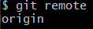
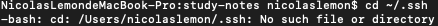
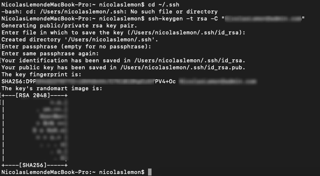
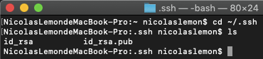

**Git 初玩**

**在使用Git中碰到的常见玩法**

* **作者：** Nicolas·Lemon
* **修改：** Nicolas·Lemon
* **创建日期：** 2021.12.24
* **修改日期：** 2023.03.27

# 创建项目

## 啥也没有

* Create a new repository
  
  ```bash
  # 将空白远程仓库里的Git项目文件夹拉取到本地
  git clone http://${remote_address}/${project}.git
  # 进入这个项目的文件夹的目录
  cd ${project}
  # 选择master分支 &&
  # 创建一个README文件 &&
  # 添加所有文件变化至暂存空间 &&
  # 提交并添加提交记录 && 推送master分支至远程仓库
  git switch -c master && \
  touch README.md && \
  git add . && \
  git commit -m "Add README file" && \
  git push -u origin master
  ```

## 文件夹式

* Push an existing folder
  
  ```bash
  # 进入到文件夹中
  cd ${existing_folder}
  # 初始化分支为master
  git init --initial-branch=master
  # 将分支关联到远程仓库
  git remote add origin http://${remote_address}/${project}.git
  # 添加所有文件变化至暂存空间 &&
  # 提交并添加提交记录 &&
  # 更新推送至远程仓库
  git add . && \
  git commit -m "Initial commit" && \
  git push -u origin master
  ```

## 本地仓库

* Push an existing Git repository（未测试）
  
  ```bash
  # 进入到仓库中
  cd ${existing_repo}
  # 重命名分支
  git remote rename origin ${old_origin}
  # 将分支关联到远程仓库
  git remote add origin http://${remote_address}/${project}.git
  # 更新所有分支
  git push -u origin --all
  git push -u origin --tags
  ```

# 命令连接符

## && 连接

命令连接符 `&&` ：前一条命令执行成功才执行后一条命令

## ;; 连接

命令连接符 `;;` ：不论前一条命令是否执行成功都继续执行后一条命令

# 常用玩法

## 全局设置

* Git全局设置
  
  ```bash
  # 设置Git用户名
  git config --global user.name "${yourname}"
  # 设置Git用户邮箱
  git config --global user.email "${youremail}"
  # 设置Git-HTTP代理
  git config --global http.proxy 'socks5://127.0.0.1:10808'
  # 取消HTTP代理，让Git-HTTP走系统代理
  git config --global --unset http.proxy
  # 设置Git-HTTPS代理
  git config --global https.proxy 'socks5://127.0.0.1:10808'
  # 取消HTTPS代理，让Git-HTTPS走系统代理
  git config --global --unset https.proxy
  
  # 配置全局.gitignore文件，并将macOS的配置文件给忽略掉
  echo "*.DS_Store" >> ~/.gitignore
  git config --global core.excludesfile ~/.gitignore
  ```

## 强制推送

* 强制推送
  
  ```bash
  # 强制推送master分支
  git push origin master --force
  ```

## 清除冗余

* 清除远程仓库中不需要的文件
  
  ```bash
  # 先pull远程代码，保持同步
  git pull
  # 删除单个文件
  git rm ${file} --cached
  # 删除文件夹
  git rm -r ${floder} --cached
  # 提交
  git commit -m "清除冗余"
  # 推送
  git push
  ```

## 覆盖本地

* 将远程仓库强制覆盖到本地
  
  ```bash
  # 拉取所有更新，不同步 && 本地代码同步线上最新版本（会覆盖本地所有与远程仓库上同名的文件） && 再更新一次
  git fetch --all &&  git reset --hard origin/master && git pull origin master
  ```

## 抹除记录

* 抹除Git的提交记录
  
  ```bash
  # 基于当前分支创建一个独立的分支new_branch &&
  # 添加所有文件变化至暂存空间 && 
  # 提交并添加提交记录 &&
  # 删除master分支 && 
  # 重新命名当前独立分支为master && 
  # 强制推送到远程仓库
  git checkout --orphan new_branch && \
  git add . && \
  git commit -m "Initial commit" && \
  git branch -D master && \
  git branch -m master && \
  git push -f origin master
  ```

## 修改仓库指向

* 在Git远程仓库中修改了项目名后，远程仓库地址也会发生变化，所以需要将本地的仓库也同步一下
  
  ```bash
  # 查看远程仓库名称
  git remote
  ```
  
  
  
  ```bash
  # 更新指向的远程仓库
  git remote set-url ${origin} ${new_remote_address}
  ```

## 生成ssh密钥

macOS系统下默认的`.ssh`的目录是 **~/.ssh** ，基本上也不用去改它

1. 先设置Git的 **全局用户名** 和 **全局用户邮箱**（如果没有配置过的话）
   
   ```bash
   # 设置Git用户名
   git config --global user.name "${yourname}"
   # 设置Git用户邮箱
   git config --global user.email "${youremail}"
   ```

2. 查看当前电脑下是否存在`.ssh`目录，如果存在，则先备份，然后再删除
   
   ```bash
   # 进入目录，看是否存在一个已有的.ssh目录
   cd ~/.ssh
   ```
   
   

3. 生成密钥
   
   ```bash
   ssh-keygen -t rsa -C "${youremail}"
   ```

4. 根据提示，一路三个回车即可，当然需要设置密码的，就设置
   
   

5. 然后就可以在 **~/.ssh** 目录下见到两个文件
   
   `id_rsa.pub`是公钥，`id.rsa`是私钥（这个要自己 **保密** 哦）
   
   

6. 测试连接
   
   ```bash
   # 测试连接（有提示输入yes即可）
   ssh -T git@github.com
   # ssh连接debugx
   ssh git@github.com -vT
   ssh git@github.com -vv
   ```

## 分支合并

* `git merge` 与 `git rebase` 的区别
  
  `git merge`会导致git历史记录错综复杂，`git rebase`（变基）会让历史记录呈一条线性关系

* 应先`git rebase`再`git merge`
  
  `dev`分支合并到`master`分支：
  
  ```bash
  # 切换到dev分支 && \
  # 将dev分支变基至master分支上 && \
  # 切换回master分支 && \
  # 合并dev分支至master分支 && \
  # push修改 && \
  # 切回dev分支 && \
  # 重置dev分支的head指向
  git checkout dev && \
  git rebase master && \
  git checkout master && \
  git merge dev && \
  git push origin master && \
  git checkout dev && \
  git reset --hard origin/dev
  ```

* 合并时需要忽略部分文件（例如配置文件）
  
  `dev`分支合并到`master`分支，第一次合并：
  
  若没有配置过全局配置，则需要先配置一下全局配置，有则跳过
  
  ```bash
  # 开启 merge.ours 驱动配置 
  git config --global merge.ours.driver true
  
  # 开启 diff.nodiff 驱动跳过配置
  # 在${path}下新建一个文件夹，名字改为true
  # 这样就有了类似跳过的效果，不让其走内置的指令
  git config --global diff.nodiff.command ${path}/true
  ```
  
  新建一个`.gitattributes`配置文件：
  
  `.gitattributes`（示例）：
  
  ```bash
  src/main/resources/application.yml merge=ours
  src/main/resources/application.yml diff=nodiff
  
  src/main/resources/application-druid.yml merge=ours
  src/main/resources/application-druid.yml diff=nodiff
  
  README.md merge=ours
  README.md diff=nodiff
  ```
  
  然后再合并分支：
  
  ```bash
  # 切换到dev分支 && \
  # 将dev分支变基至master分支上 && \
  # 切换回master分支 && \
  # 合并dev分支至master分支
  git checkout dev && \
  git rebase master && \
  git checkout master && \
  git merge dev
  
  # 修改相应的配置文件后进行添加和提交
  # 切回dev分支 && \
  # 重置dev分支的head指向
  git add . && \
  git commit -m "初始化生产配置文件" &&
  git push origin master && \
  git checkout dev && \
  git reset --hard origin/dev
  ```

## 本地忽略提交

保持项目中的`.gitignore`文件不发生变化，且有的**已追踪**的文件不想提交到仓库里（若是**未追踪**的文件，用**全局**的`.gitignore`）

```bash
# 忽略某个已修改的文件
git update-index --assume-unchanged ${file}
# 取消某个文件忽略
git update-index --no-assume-unchanged ${file}

# 找到所有用上述方法忽略的文件
git ls-files -v | grep '^h\ '
# 找到所有用上述方法忽略的文件并提取相应的路径
git ls-files -v | grep '^h\ ' | awk '{print $2}'
# 全部取消忽略
git ls-files -v | grep '^h' | awk '{print $2}' |xargs git update-index --no-assume-unchanged
```

## 迁移仓库

假设有两个地址的git，其中a.git中有很多孤儿分支，b.git中只有一个master分支，b.git中是原仓库地址，里面之前有提交过一些代码记录，把b.git迁移到a.git中的一个新的孤儿分支中，迁移保留提交记录，并且迁移后a.git与b.git互不影响。

```bash
# 本地克隆 a.git 仓库
git clone ${a.git URL}
# 在a仓库中新建孤儿分支
cd a
git checkout --orphan ${new_branch}
# 将 b.git 仓库添加为 a.git 的一个 remote
git remote add b ${b.git URL}
# 将 b.git 的 master 分支拉取到本地
git fetch b master
# 将 b.git 的 master 分支的提交记录合并到 ${new_branch} 分支上
git merge b/master
# 如果在合并时出现了 “refusing to merge unrelated histories” 的错误，可以使用以下命令解决：
git merge b/master --allow-unrelated-histories
# 将 ${new_branch} 分支推送到 a.git 上
git push -u origin ${new_branch}
```
