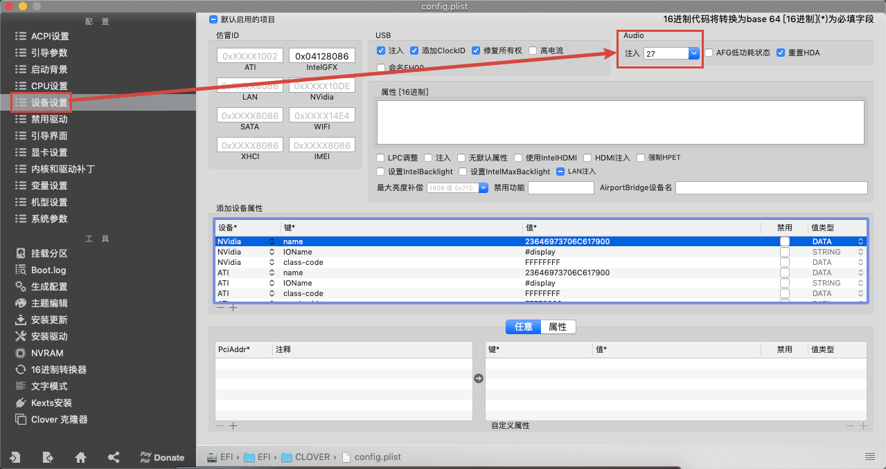
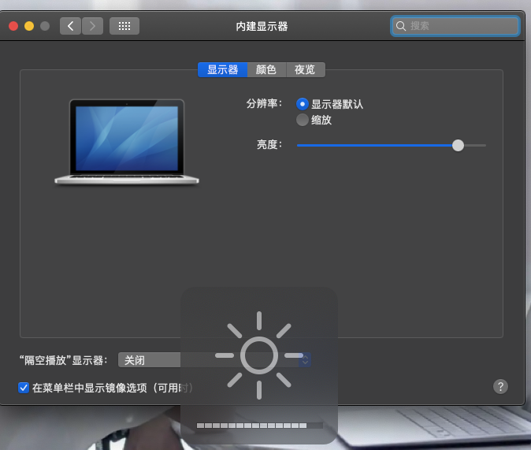

**Hackintosh黑苹果折腾日记**

* **作者：** Nicolas·Lemon
* **修改：** Nicolas·Lemon
* **创建时间：** 2022.01.11
* **修改时间：** 2022.04.11

# 前言

## 知己知彼

先对自己的机器配置有个了解，在各种搜索引擎上搜一下，看看有没有相应的教程，不说完全一样，大致相同也行。

* **声卡型号：** 
  
  需要查看一下声卡型号，刷好黑苹果后，可能会没有声音，利用 **AppleALC** 仿冒苹果声音的时候，需要用到。
  
  Windows下可以通过 **设备管理器** 来查看
  
  
  
  或者通过 **主板型号** ，在相应主板官网，去查看主板的说明手册，在主板说明手册中查询

* **集成显卡型号：**
  
  引导启动，需要加载对应型号的 **config.plist** 配置文件

* **有线网卡型号：**
  
  下载对应有线网卡的驱动，可能安装黑苹果后，有线网卡上不了网
  
  （WIFI驱动可能有点难，还是去找一下相应的网卡驱动吧，万一成了呢，实在不行，就利用USB外接网卡吧）

## 资料参考

* **Hackintosh 黑苹果长期维护机型 EFI 及安装教程整理：** https://github.com/daliansky/Hackintosh
* **黑果小兵的部落阁：** https://blog.daliansky.net/
* **威锋论坛：** https://www.feng.com/
* **远景论坛：** https://www.pcbeta.com/
* **macOS安装教程兼小米Pro安装过程记录：** https://blog.daliansky.net/MacOS-installation-tutorial-XiaoMi-Pro-installation-process-records.html
* **Clover使用教程：** https://blog.daliansky.net/clover-user-manual.html
* **从Clover到OpenCore：** https://blog.daliansky.net/From-Clover-To-OpenCore.html
* **AppleALC layout_id查询：** https://github.com/acidanthera/AppleALC/wiki/Supported-codecs

## 驱动下载

* **AppleALC.kext：** https://github.com/acidanthera/AppleALC/releases
* **Lilu.kext：** https://github.com/acidanthera/Lilu/releases
* **BrightnessKeys.kext：** https://github.com/acidanthera/BrightnessKeys/releases

# Lenovo S40-70

## 前言

这台本子目前算是被我整理的95%的适配了吧，略微有点小毛病，毕竟不是白苹果，能忍。

驱动已适配：**有线网上网** 、**系统声音** 、**电池电量显示** 、**触控板设置** 、**屏幕亮度调节** 

存在的小问题：

1. **触控板设置** 是能显示了，但是似乎设置不管用，可忍；
2. **蓝牙** 用不了，对于我来说基本上不用蓝牙，能忍；
3. **系统声音** 可能适配还是有点小问题，比如说播放视频有声音，系统操作等也有声音，但是微信消息，没声音（可能也是跟设置有关的吧）， 毕竟是用得 **万能声卡** 驱动，能忍。

## 基本配置

* **CPU：**
  
  Intel Core i5-4210U Processor；
  
  主频：1.7GHz；
  
  最大睿频：2.7GHz；
  
  核心数：2；
  
  线程数：4；
  
  缓存：3M

* **内存：** 8GB DDR3L × 1

* **硬盘：** Samsung SSD 860 EV0 500GB

* **显卡：**
  
  集成显卡：Intel HD Graphics 4400
  
  独立显卡：AMD R5 M230；显存类型：GDDR3；显存容量：2GB
  
  （此处在黑苹果下**不**支持AMD独显驱动）

* **有线网卡：** Realtek RTL8106E 10/100M自适应网卡

* **屏幕：**
  
  屏幕尺寸：14.0英寸；
  
  屏幕显示比例：16：9；
  
  分辨率：1366×768；
  
  屏幕背光：LED背光

* **主板型号：** 未知

* **声卡型号：** 未知（也许是ALC233）

## 资料参考

* **联想m40-70（s40-70）10.12.6 95%完美：** https://www.feng.com/post/13056781
* **驱动大全：** （未逐一验证）https://www.zdynb.cn/2020/hei-ping-guo-qu-dong.html
* **macOS Mojave 10.14安装中常见的问题及解决方法：** https://blog.daliansky.net/Common-problems-and-solutions-in-macOS-Mojave-10.14-installation.html
* **Clover使用教程：** https://blog.daliansky.net/clover-user-manual.html
* **Clover引导黑苹果——注入声卡：** https://www.yinxiang.com/everhub/note/d9bb0875-3276-41f7-a94d-2c1c10465db8

## 技术选型

### 系统选型

**macOS 10.14.3**

### 引导选型

**Clover**

好像现在主流是用 **OpenCore（OC）** 引导的，但我这款笔记本太low了，网上的教程也只有 **Clover** 版的，而且还只是 **macOS 10.12.6** 的系统。

由于 **macOS 10.12.6** 这个版本的系统太老了，我需要安装的 **Intelij IDEA 2021.2** 需要 **10.14+** 的系统，经过测试，可以从 **Clover** 安装到 **macOS 10.14.3** ，故此设备是用的 **Clover** 引导的。

## 准备工作

### 镜像下载

可以在 **黑果小兵的部落阁** 中下载

此设备是选用的 **macOS Mojave 10.14.3 18D42 正式版 with Clover 4859原版镜像** ：https://blog.daliansky.net/macOS-Mojave-10.14.3-18D42-official-version-with-Clover-4859-original-image.html

### U盘选择

至少准备一个16GB的U盘，因为macOS镜像，通常都比较大，如果安装更高的版本，可能就需要用到32GB的U盘了。

### Clover引导文件

准备好自己找到的相应机型、对应系统版本的 **Colver文件** ，此处没能找到自己机型的 **10.14+** 的引导文件，就把 **在黑果小兵的10.14.6** 的引导文件给拿过来了，引导文件在大版本下可能会造成冲突，小版本应该并不会有啥问题，所以虽然我是安装的 **10.14.3** 的系统，但其实是引用的 **10.14.6** 的引导文件。

### balenaEtcher

这是一款制作macOS U盘引导的软件

https://www.balena.io/etcher/

### DiskGenius

替换U盘中的Clover引导文件需要

https://www.diskgenius.cn/

## 系统安装

### 制作启动U盘

打开 **balenaEtcher** 软件，选择需要安装的macOS系统镜像文件，然后再选择写入的U盘，最后**Flash**写入即可，写入成功后，会有一个校验**Validating**的过程，据我理解，这应该就是验证这个镜像是否可以用，不需要校验的可以跳过**Skip**（我是从黑果小兵下载原版镜像，验证这步也是比较耗时间的，所以也就跳过**Skip**了）


### 替换Clover引导

有关替换配置的，最好都先**备份**一下，避免出错以后能救回来，别以为照着那些教程就能托大了。

启动U盘制作好了以后，如果有自己找到的CLover，就利用**DiskGenius**把U盘中 **EFI/CLOVER** 给替换掉，我这里是没有相应的Clover文件，就把黑果小兵10.14.6中的Clover给替换过去了，并把 **EFI/CLOVER/COLVER_OTHER** 中的 **configHD4400xxx.plist** 给重命名为 **config.plist** ，并替换 **EFI/CLOVER/** 中的 **config.plist** 文件（我的集成显卡是HD4400的，替换成自己 **相应的集成显卡型号** 的config.plist即可）。


### U盘启动

1. 需要将目标电脑的BIOS主板设置中的安全启动模式（ **Secure Boot Mode** ）给关了。

2. 利用EFI启动引导U盘，可以发现能进入引导页面
   
   
   
   最好开启啰嗦模式（跑码模式），以便后续排错，参看教程 **Clover使用教程：** https://blog.daliansky.net/clover-user-manual.html

### macOS安装

#### 阶段一 初步安装

前期准备工作已经做的差不多了，现在就可以正式进入macOS系统安装了。

如果在安装系统中有报错，则可以搜索相关的报错内容，查看解决方法。

反正我是先刷了 **10.12.6** 的系统，没啥问题，因为有相应的教程（**联想m40-70（s40-70）10.12.6 95%完美：** https://www.feng.com/post/13056781），但是刷完 **10.12.6** 后，发现似乎这个系统太老了，估计找软件的时候，就异常难受了，果不其然，我查看 **Intellij IDEA** 的时候，发现，至少要 **10.14+** 的系统，没办法，我只好放弃这个版本的，尝试能否刷高一点版本的。

然后我开始尝试刷 **10.15+** 的，结果发现好像报错了，卡在下面 **第1步** 苹果图标那，我也是初次摸索，似乎当时也没开啰嗦模式，然后就放弃尝试 **10.15+** 的系统了。

然后转型 **10.14.6** 的系统，结果也发现卡着不动了，于是也就放弃了，现在安装好了 **10.14.3** 的系统，回过头来看看，似乎是可以解决一下，说不准 **10.15+** 的系统也能安装了，这个就后续再看吧，先用用 **10.14.3** 的看看吧，反正我基础的软件能安装就行（ **Intellij IDEA 2021.2** ）。

好了，闲话少说，开始正式安装：

1. **开始引导macOS系统**
   
   **提示：** 图片有些是基于 **网图** 的，因为装系统的时候，当时没拍，不过没有影响，有不一样的地方，结合 **文字优先**。
   
   如果已经开启了啰嗦模式，则会先跑一些代码，根据这些代码有没有在不断加载，可以基本判断是否是正常加载状态，跑码模式过了，就会出现下面这个界面
   
   
   
   这个过程需要1-2分钟，或者稍微长一点，耐心等待进入安装程序，出现语言选择界面即可。
   
   若大半个小时一个小时，都卡在这个界面，可能就是出问题了，如果没打开啰嗦模式的话，就打开啰嗦模式，看看会报什么错。

2. **选择语言**
   
   选择 **简体中文** 即可
   
   
   
   出现`macOS实用工具`界面,选择 **磁盘工具**

3. **磁盘工具**
   
   
   
   选择`显示所有设备`：
   
   
   
   **注意：** 假设以下这步，是基于 **备份了** 原硬盘的所有资料，或者原硬盘是 **空** 的。
   
   选择`自己的硬盘`，点击`抹掉`按钮，选择默认的`Mac OS扩展(日志型)`，将名称修改为`iMac`,点击`抹掉`按钮
   
   
   
   抹盘成功后，它会自动生成一个200MB的 **EFI** 分区
   
   
   
   到这里，磁盘工具的动作就已经结束了。退出磁盘工具进入安装界面，进行系统的安装了。

4. **安装macOS**
   
   
   
   点击到这一步的时候，可能会报一个错误：`"安装 macOS xxx"应用程序副本已损坏，不能用来安装macOS`，这个不是镜像本身有问题，是由于镜像的证书过期，并且苹果没有更新证书日期导致的，设置一下时间就可以了。
   
   
   
   先断开 **网络连接** ，然后打开 **终端** ，**修改时间** 即可。
   
   
   
   输入命令`date 0201010116`，修改时间为2016年。
   
   
   
   关闭终端，再次安装即可。
   
   
   
   **不同版本的对应的修改时间有：**  （从网上找的，未能一一验证）
   
   ```shell
   # macOS Big Sur
   date 030400002021.00
   # OS X El Capitan 10.11.6适用
   date 0201010116
   # macOS Sierra 10.12适用
   date 010514102017.30
   # 10.13、10.14适用
   date 062614102014.30
   # 10.15
   date 121212122019
   date 032208102015.20
   date 112202022015
   # 10.10可用
   date 122014102015.30
   ```

5. **进入安装界面**
   
   

6. **选择继续**
   
   


   点击同意，选择`iMac`安装


   期间，它会把USB安装盘上的安装文件预复制到要安装的系统分区里，这个过程会持续若干分钟，数据复制完后,它会 **自动重启** 。


#### 阶段二 重启安装

**注意：** 如果重启的话，也是需要从 **U盘引导进入** 的，不能从电脑硬盘里启动的，如果是电脑自动选择了从硬盘启动，是启动不了的，此时也不用慌，关机，重新用 **U盘引导进入** 即可。

再次进入Clover引导页面后，选择 **电脑硬盘进入** ，别选usb进入了，usb进入是 **阶段一** 干的事。

第二阶段的安装会有两种界面，一种是不进安装界面直接安装，另一种是先进入安装界面直接安装，需要注意的是，无论是哪一种界面下，安装的过程中全程是禁用鼠标和键盘的，需要你做的只是耐心等待它安装完成。


安装速度取决于你的磁盘速度，第二阶段的安装已经与USB安装盘没什么关系了，如果会多次重启，记得要 **先从U盘引导启动，然后再进入电脑硬盘安装** 。系统安装完成后，重启进入系统设置向导。

后续就是 **设置向导** 了，就不赘述步骤了，这个教程很详细：**macOS安装教程兼小米Pro安装过程记录：** https://blog.daliansky.net/MacOS-installation-tutorial-XiaoMi-Pro-installation-process-records.html


**向导** 设置好了以后，就能成功的进入到系统桌面了


### 脱离U盘启动

再上述 **重启安装** 的步骤中，多次出现了`要以U盘的方式引导启动`的字样，是因为，在安装系统的过程中，引导文件始终是在U盘里的，**并没有** 被复制到目标电脑硬盘里的引导分区中，所以依旧需要用U盘来进行引导启动，但是不可能随时随地都用U盘引导启动吧，所以，只需要将U盘中引导分区的 **CLOVER** 文件夹复制到本地硬盘引导分区中即可。

点开桌面上的`访达`，发现并没有 **本地硬盘的EFI分区** 和 **U盘的EFI分区** 


不要着急，接下来就是用 **终端命令** 的时候了

1. 打开终端，输入下面的命令查看磁盘情况
   
   ```shell
   # 查看磁盘列表
   diskutil list
   ```
   
   
   
   可以发现有两个 **EFI** 的分区，一个名为`disk0s1`，一个名为`disk2s1`，可以从上图中很容易分析出，容量较大的那个磁盘（ **disk0** ），就是本地硬盘了，下面那个 **disk2** 就是U盘了。

2. **挂载** 两个EFI分区
   
   在 **终端** 中输入下面两个命令，然后根据提示输入账号密码即可挂载成功：
   
   ```shell
   # 挂载本地硬盘的EFI分区
   sudo diskutil mount disk0s1
   # 挂载U盘的EFI分区
   sudo diskutil mount disk2s1
   # 打开访达，注意后面有个英文的点 . 哦
   oepn .
   ```
   
   

3. 在`访达`中将 **U盘里的EFI分区里的CLOVER文件夹和BOOT文件夹** 复制到 **本地硬盘中的EFI分区** 里
   
   如果本地硬盘EFI中存在 **CLOVER文件夹** 和 **BOOT文件夹** ，先删除，然后再从U盘里复制即可。
   
   本地硬盘EFI分区结构：
   
   
   
   此时，就可以关机，然后拔掉U盘，正常启动了。

**成功** 从硬盘启动后的系统（ **关于本机** ）：


## 完善驱动

### 前言

macOS安装完成以后，先别急着激动，最大的坑就在此了—— **驱动安装** 。

**前排提示：** 先备份好能正常启动的 **CLOVER文件夹** ，**启动U盘** 也别急着格式化，因为在鼓捣各种驱动的时候，碰上不合适的，在重启的时候，都直接启动不了的，需要用U盘引导启动，去复原上一次的操作，因此，驱动最好一个一个调，别一股脑怼了多个.kext上去，结果出问题了，又不知道要删除哪个了。

另外，`.kext`文件是需要放在 **EFI/CLOVER/kexts/Other** 下的，操作可以参看目录`2.7.4.2 仿冒苹果声卡`，**而且** ，每次换了驱动或者新增驱动，**都要重启** 电脑，才能生效。


至少我这台本子碰到的情况有：**有线网上不了网** 、**系统没有声音** 、**没有蓝牙** 、**屏幕亮度无法调节** 、**系统电池电量不能显示** 、**触控板设置不能显示** 。

经过了各种调试之后，大部分问题已解决，略微还有点小问题，但对我来说至少不太影响使用：

1. **触控板设置** 是能显示了，但是似乎设置不管用，可忍；
2. **蓝牙** 用不了，对于我来说基本上不用蓝牙，能忍；
3. **系统声音** 可能适配还是有点小问题，比如说播放视频有声音，系统操作等也有声音，但是微信消息，没声音（可能也是跟设置有关的吧）， 毕竟是用得 **万能声卡** 驱动，能忍。

好在 **黑果小兵** 的引导文件里，有一些说明，对照着也算是能清楚点，不至于完全是瞎猫对耗子，基本上我本子的问题，装装kext驱动就差不多能解决了，还没有到打dsdt补丁那个复杂的场景，可能也是运气比较好吧。

### 黑果小兵的驱动说明

- **触控板设置驱动：** `VoodooPS2Controller.kext`和`ApplePS2SmartTouchPad.kext`两者选其一，不可全用

- `IntelGraphicsDVMTFixup.kext`用于五代以上机器，四代及以下删除，`Whatevergreen.kext`v1.2.1已经包括这个补丁

- `XHCI`开头的三个`kext`对应适用于`x99`、`200`和`300`系主板，非此类主板删除

- `AzulPatcher4600.kext`只适用于核心显卡`HD4600`，其他型号删除

- `CoreDisplayFixup.kext`用于破解`4K`支持，合理选用，`Whatevergreen.kext`v1.2.1已经包括这个补丁

- `ATH9KFixup.kext`用于驱动`AR946x`、`AR956X`、`AR9485`高通无线网卡，合理选用

- `NoTouchID`用于禁止`TouchID`的检测，合理选用

- `NoVPAJpeg.kext` VEGA显卡修复quicklook、jpg无法打开的驱动

- `WhateverGreen.kext`已经更新，合并了`igfx`、`ngfx`，以及`Shiki`，启动参数和以前一样，不论`A`卡、`N`卡还是`Intel`核心显卡，都建议使用

- `ACPIBatteryManager.kext`用于实现电量显示，如遇五国卡`BAT0`之类的请删除

- **声卡驱动：** `AppleALC.kext`和`VoodooHDA-2.9.1.kext`任选其一

- **网卡驱动：** `RTL8100.kext`、`RTL8111.kext`、`IntelMausiEthernet.kext`、`AppleIGB`、`SmallTree-Intel-211-AT-PCIe-GBE.kext`、`ALXEthernet.kext`、`AtherosE2200Ethernet.kext`分别对应不同的网卡合理选用
  
  > 对应关系如下：
  > 
  > | RTL8100.kext                         | RTL8107E、RTL810X、RTL8139                                                                                                                    |
  > | ------------------------------------ | ------------------------------------------------------------------------------------------------------------------------------------------- |
  > | RTL8111.kext                         | Realtek RTL8111/8168 B/C/D/E/F/G/H                                                                                                          |
  > | IntelMausiEthernet.kext              | 82578LM、82578LC、82578DM、82578DC、82579LM、82579V、I217LM、I217V、I218LM、I218V、I218LM2、I218V2、I218LM3、I219V、I219LM、I219V2、I219LM2、I219LM2         |
  > | AtherosE2200Ethernet.kext            | AR816x、AR817x、Killer E220x、Killer E2400、Killer E2500                                                                                        |
  > | SmallTree-Intel-211-AT-PCIe-GBE.kext | Intel I211                                                                                                                                  |
  > | AppleIntelE1000.kext                 | Intel系列 82540, 82541, 82542, 82543, 82544, 82545, 82546, 82547, 82578 (P55/H55)  82579 (P67/H67) 82574L 82571 82572 82573 82574 82583 I217V |
  > | AppleIGB.kext                        | Intel 82575, 82576, 82580, dh89xxcc, i350, i210 and i211                                                                                    |
  > | ALXEthernet.kext                     | Atheros alx Ethernet                                                                                                                        |
  > | FakePCIID_BCM57XX_as_BCM57765.kext   | BCM57XX                                                                                                                                     |
  > | FakePCIID_Intel_GbX.kext             | Small Tree drivers for Intel chipset                                                                                                        |

----

- `FakePCIID_BCM57XX_as_BCM57765.kext`详细支持列表
  - Broadcom NetXtreme BCM5700 Gigabit Ethernet [14e4:1644]
  - Broadcom NetXtreme BCM5701 Gigabit Ethernet PCIe [14e4:1645]
  - Broadcom NetXtreme BCM5702 Gigabit Ethernet PCIe [14e4:1646]
  - Broadcom NetXtreme BCM5703 Gigabit Ethernet PCIe [14e4:1647]
  - Broadcom NetXtreme BCM5717 Gigabit Ethernet PCIe [14e4:1655]
  - Broadcom NetXtreme BCM5717 Gigabit Ethernet PCIe [14e4:1665]
  - Broadcom NetXtreme BCM5718 Gigabit Ethernet PCIe [14e4:1656]
  - Broadcom NetXtreme BCM5719 Gigabit Ethernet PCIe [14e4:1657]
  - Broadcom NetXtreme BCM5725 Gigabit Ethernet PCIe [14e4:1643]
  - Broadcom NetXtreme BCM5727 Gigabit Ethernet PCIe [14e4:16f3]
  - Broadcom NetXtreme BCM5761 10/100/1000BASE-T Ethernet [14e4:1688]
  - Broadcom NetXtreme BCM5762 Gigabit Ethernet PCIe [14e4:1687]
  - Broadcom NetXtreme BCM57760 Gigabit Ethernet PCIe [14e4:1690]
  - Broadcom NetXtreme BCM57764 Gigabit Ethernet PCIe [14e4:1642]
  - Broadcom NetXtreme BCM57767 Gigabit Ethernet PCIe [14e4:1683]
  - Broadcom NetLink BCM57781 Gigabit Ethernet PCIe [14e4:16b1]
  - Broadcom NetXtreme BCM57782 Gigabit Ethernet PCIe [14e4:16b7]
  - Broadcom NetLink BCM57785 Gigabit Ethernet PCIe [14e4:16b5] -- Confirmed
  - Broadcom NetXtreme BCM57786 Gigabit Ethernet PCIe [14e4:16b3] -- Confirmed
  - Broadcom NetXtreme BCM57787 Gigabit Ethernet PCIe [14e4:1641]
  - Broadcom NetLink BCM57788 Gigabit Ethernet PCIe [14e4:1691]
  - Broadcom NetLink BCM57790 Gigabit Ethernet PCIe [14e4:1694]
  - Broadcom NetLink BCM57791 Gigabit Ethernet PCIe [14e4:16b2]
  - Broadcom NetLink BCM57795 Gigabit Ethernet PCIe [14e4:16b6]
  - Broadcom NetLink BCM5785 Gigabit Ethernet [14e4:1699]
  - Broadcom NetLink BCM5785 Fast Ethernet [14e4:16a0]
  - Broadcom NetLink BCM5787M Gigabit Ethernet PCI Express [14e4:1693]
  - Broadcom Network Adapter [14e4:1689]

----

- `FakePCIID_Intel_GbX.kext`详细支持列表
  - Supported devices for SmallTreeIntel8254x.kext:
  - 8086:1010 82546EB Gigabit Ethernet Controller (Copper)
  - 8086:1011 82545EM Gigabit Ethernet Controller (Fiber)
  - 8086:1012 82546EB Gigabit Ethernet Controller (Fiber)
  - 8086:101d 82546EB Gigabit Ethernet Controller
  - 8086:1026 82545GM Gigabit Ethernet Controller
  - 8086:1027 82545GM Gigabit Ethernet Controller
  - 8086:1028 82545GM Gigabit Ethernet Controller
  - 8086:105e 82571EB Gigabit Ethernet Controller (Also covered by AppleIntel8254XEthernet.kext)
  - 8086:105f 82571EB Gigabit Ethernet Controller
  - 8086:1079 82546GB Gigabit Ethernet Controller
  - 8086:107a 82546GB Gigabit Ethernet Controller
  - 8086:107b 82546GB Gigabit Ethernet Controller
  - 8086:107c 82541PI Gigabit Ethernet Controller
  - 8086:107d 82572EI Gigabit Ethernet Controller (Copper)
  - 8086:107e 82572EI Gigabit Ethernet Controller (Fiber)
  - 8086:10a4 82571EB Gigabit Ethernet Controller
  - 8086:10b5 82546GB Gigabit Ethernet Controller (Copper)
  - 8086:10b9 82572EI Gigabit Ethernet Controller (Copper)
  - 8086:10bc 82571EB Gigabit Ethernet Controller (Copper)
  - SmallTreeIntel82576.kext:
  - 8086:1521 I350 Gigabit Network Connection
  - 8086:1522 I350 Gigabit Fiber Network Connection
  - 8086:1533 I210 Gigabit Network Connection (Also covered by AppleIntelI210Ethernet.kext)
  - SmallTreeIntel8259x.kext:
  - 8086:10c6 82598EB 10-Gigabit AF Dual Port Network Connection
  - 8086:10c7 82598EB 10-Gigabit AF Network Connection
  - 8086:10c8 82598EB 10-Gigabit AT Network Connection
  - 8086:10ec 82598EB 10-Gigabit AT CX4 Network Connection
  - 8086:10d8 82599EB 10 Gigabit Network Connection
  - 8086:10fb 82599ES 10-Gigabit SFI/SFP+ Network Connection
  - 8086:10f1 82598EB 10-Gigabit AF Dual Port Network Connection
  - 8086:151c 82599 10 Gigabit TN Network Connection
  - 8086:150b 82598EB 10-Gigabit AT2 Server Adapter
  - 8086:1528 Ethernet Controller 10-Gigabit X540-AT2
  - 8086:10fc 82599 10 Gigabit Dual Port Network Connection
  - 8086:1560 Ethernet Controller X540

### 网卡驱动

我的本子无线网卡和有线网卡都是100M的，所以我都换成了外接的USB网卡，它们都有对应的驱动，下载安装即可


#### 无线网卡

##### 外接网卡

用的802.11ac网卡，comfast的CF-811AC，不带蓝牙，驱动下载可以在官网上找到：http://www.comfast.cn/index.php?m=content&c=index&a=show&catid=30&id=335

#### 有线网卡

##### 外接网卡

用的绿联的AX88179，驱动下载可以在官网上找到：https://www.lulian.cn/download/list-34-cn.html

##### 内置网卡

用的`RealtekRTL8100.kext`驱动

### 声卡驱动

#### 万能声卡

这个简单粗暴，直接怼上`VoodooHDA.kext`驱动即可，但建议先尝试一下第二个仿冒苹果声卡，不过我这台本子，用第二个仿冒声卡，却是没能成功调出声音，可能是驱动没生效又或者是声卡ID没注入对吧，因此最后无奈用的万能声卡。

用万能声卡还需要注意一点，需要自己修改一点参数，因为默认的音量比较小

1. 右键万能声卡`VoodooHDA.kext`驱动 -> `显示包内容`
   
   

2. 打开下图目录中的`Info.plist`文件
   
   

3. 将里面的数值由`90`改为`100`
   
   

4. **保存修改** 后退出，**重启电脑** 
   
   

#### 仿冒苹果声卡

用的是`AppleALC.kext`驱动（这个要配合`Lilu.kext`驱动使用）

1. 先删除其它的声音驱动文件，比如说`VoodooHDA.kext`等

2. 下载`AppleALC.kext`：https://github.com/acidanthera/AppleALC/releases

3. 下载`Lilu.kext`：https://github.com/acidanthera/Lilu/releases

4. 安装四叶草app：`Clover Configurator`，下载合适的版本

5. 打开`Clover Configurator`四叶草app，**挂载** EFI分区，并`打开分区`
   
   

6. 将这两个`.kext`驱动文件复制到 **EFI/CLOVER/kexts/Other** 目录中
   
   

7. 重启电脑，看能不能正常启动，如果不能正常启动，就换个版本的测试

8. 确定自己声卡的型号，这个应该是在装系统之前的准备步骤就弄了，   我的是`ALC233`

9. 查询自己声卡对应的 **layout_id** ：https://github.com/acidanthera/AppleALC/wiki/Supported-codecs
   
   
   
   由上图，只需要看 **layout** 后面的数字，即`3,4,5,13,21,27,28,29,32,33`，这些就是等会要注入的id

10. 打开`Clover Configurator`四叶草app，**挂载** EFI分区，并`打开分区`

11. 找到 **EFI/CLOVER/config.plist** 文件，并用四叶草app打开
    
    

12. 在`设备设置` -> `Audio` -> `注入`中填入刚才找到的id（只填其中的一个id）
    
    

13. **保存修改** 后重启电脑，看看重启后的电脑，有没有声音，如果有的话，就可以测试一下，光有声还不一定成，说不定还有点其它的小问题，看看耳机接入呀，拔出耳机呀等。如果重启的时候，发现启动不了电脑了，而刚刚只是修改那个id，那多半就是这个系统不太支持那个四叶草app的版本，换一个版本的四叶草app试试。

14. 如果重启后 **依然无声音** ，那么就接着换Id注入吧，如果都注入完毕，还没有声音的话，那就考虑用 **万能声卡驱动** 吧。

### 亮度调节驱动

1. 怼上`AppleBacklightFixup.kext`驱动和`BrightnessKeys.kext`驱动

2. 把`SSDT-PNLF.aml`放入 **EFI/ACPI/patched** 文件夹中（这些文件都可以在我这台型号的CLOVER文件夹中能找到）
   
   

3. 找到 **EFI/CLOVER/config.plist** 文件，并用四叶草app打开

4. 在`ACPI设置` -> `Fixes` -> `2` 中勾选`添加PNLF`
   
   

5. **保存修改** 后退出，并 **重启电脑** 
   
   

### 触控板驱动

`ApplePS2SmartTouchPad.kext`和`VoodooPS2Controller.kext`二选一，我用的前者，有 **显示设置** 了，但设置没效果


### 电池电量驱动

怼上`ACPIBatteryManager.kext`驱动


