# Jenkins 玩法笔记

* **作者：** Nicolas·Lemon
* **修改：** Nicolas·Lemon
* **创建时间：** 2021.12.24
* **修改时间：** 2022.01.05
* **基于 Jenkins2.321、Jenkins2.327**


## 必要工具和插件

**如果有，则不需要重复安装**

### 安装Maven

此工具是构建Maven项目必要的工具

**Jenkins仪表盘** -> **系统管理** -> **全局工具配置** -> **Maven** -> **Maven安装**

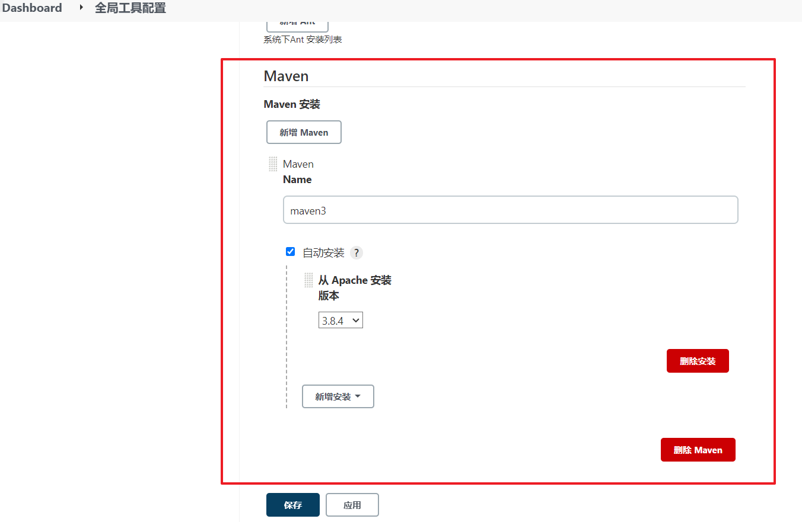

### Maven Integration

如果没有这个插件，则在新建任务中就不会看到名为 **构建一个maven项目** 字样的选项了

**Jenkins仪表盘** -> **插件管理** -> **可选插件** 搜索 **Maven Integration**

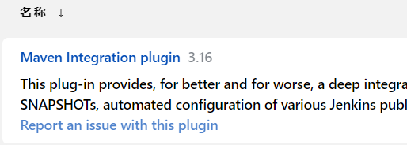

### Publish Over SSH

构建好项目后，将打包好的东西，通过SSH协议发送给目标服务器，需要这个插件

**Jenkins仪表盘** -> **插件管理** -> **可选插件** 搜索 **Publish Over SSH**

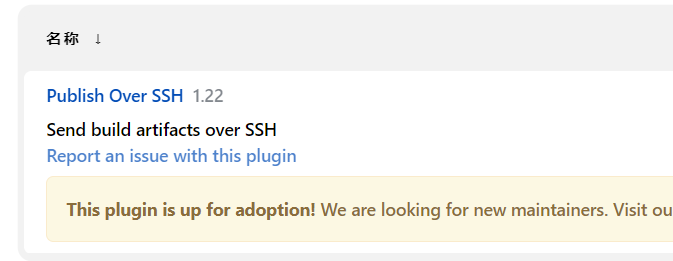

### NodeJs

构建Node前端项目需要

1. 安装NodeJs插件

   **Jenkins仪表盘** -> **插件管理** -> **可选插件** 搜索 **NodeJs**

   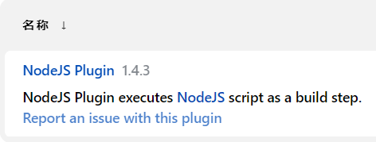

2. 安装NodeJs

   **Jenkins仪表盘** -> **系统管理** -> **全局工具配置** -> **NodeJs** -> **NodeJs安装**

   **版本推荐：** 12.3.1

   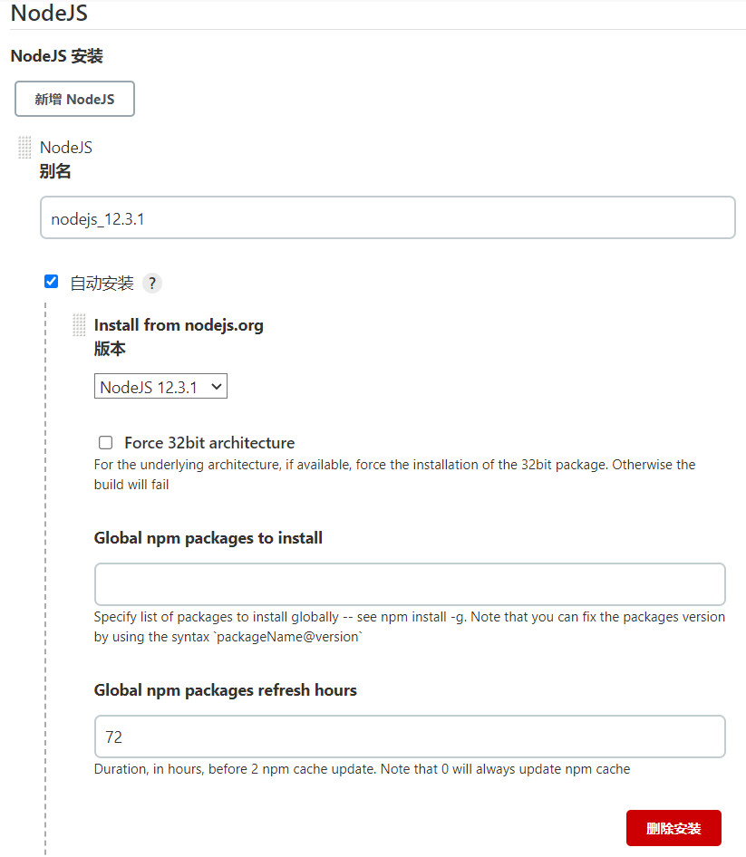


## CI/CD之Maven项目

### 新建任务

* 在仪表盘中**新建任务**，并选择**构建一个Maven项目**

  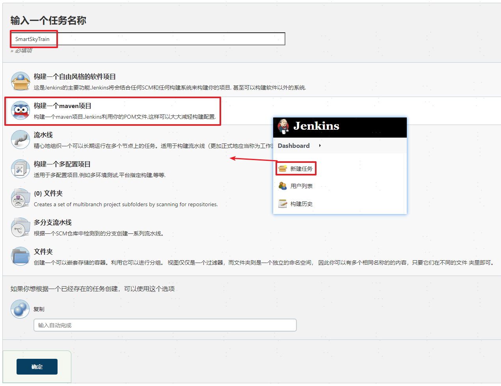

### 配置任务

#### 源码管理

* 配置Git源

  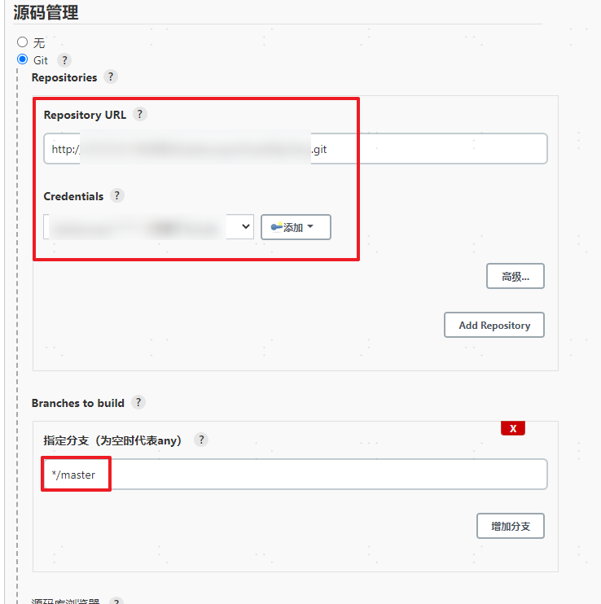

#### 构建触发器

* 构建任务触发器，此处使用**5分钟对Git钩子轮询一次**

  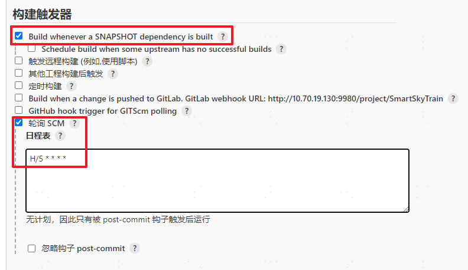

#### 构建依据

* 项目构建打包的依据

  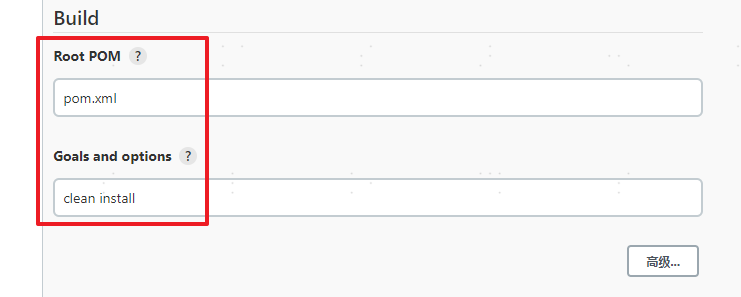

  ```sh
  clean install
  ```

#### 自动部署

##### 目标传送

将Jenkin打包好的文件发送至目标服务器上

1. 在**Jenkins**中添加目标服务器

   **Jenkins仪表盘** -> **系统管理** -> **系统配置** -> **SSH Server**

   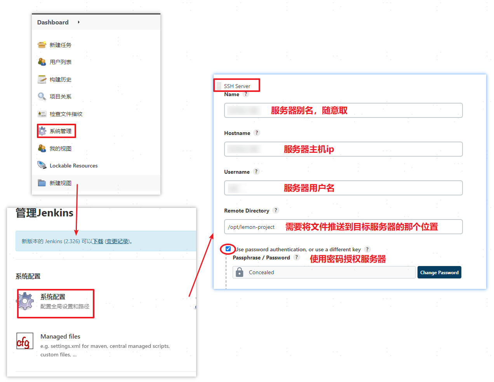

2. 在**项目配置**中增加传送任务

   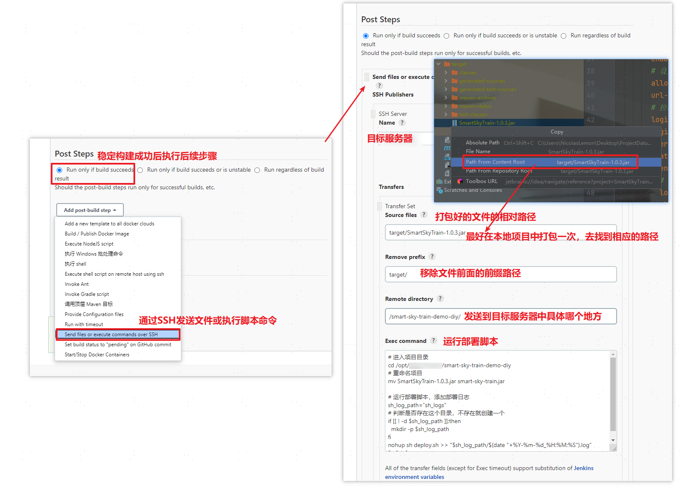

   ```sh
   # 进入项目目录
   cd ${target_server_project_floder}
   # 重命名项目
   mv ${TargetProject.jar} ${target-project.jar}
   
   # 运行部署脚本，添加部署日志
   sh_log_path="sh_logs"
   # 判断是否存在这个目录，不存在就创建一个
   if [[ ! -d $sh_log_path ]];then
     mkdir -p $sh_log_path
   fi
   nohup sh deploy.sh >> "$sh_log_path/$(date "+%Y-%m-%d_%H:%M:%S").log"  2>&1 &
   ```

##### 部署脚本

* deploy.sh

  ```sh
  # 变量：当前项目名称
  this_project_name="${project_name}"
  # 停止容器
  docker stop $this_project_name
  # 删除容器
  docker rm $this_project_name
  # 删除镜像
  docker rmi $this_project_name
  # 构建镜像
  docker build -t $this_project_name .
  # 运行镜像
  docker run -itd --name $this_project_name -d -p ${port}:8080 $this_project_name
  ```

##### Dockerfile

* Dockerfile

  ```dockerfile
  # 基于java8
  FROM java:8
  # 维护者的信息
  MAINTAINER NicolasLemon
  ADD ${project.jar} ${project.jar}
  # 暴露容器内部的端口号
  EXPOSE 80
  # 执行的命令
  ENTRYPOINT ["java","-jar","-Djava.security.egd=file:/dev/.urandom","${project.jar}"]
  ```

##### 只欠东风

在上一步中，已经将**部署脚本**和**Dockerfile**编写好了，现在只需要将这两个文件，上传至目标服务器中项目对应的文件夹中

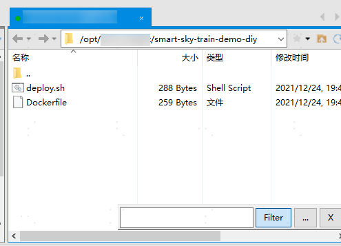

然后测试一下，将代码更新到Git中，等待一会儿，就会发现项目被更新部署了

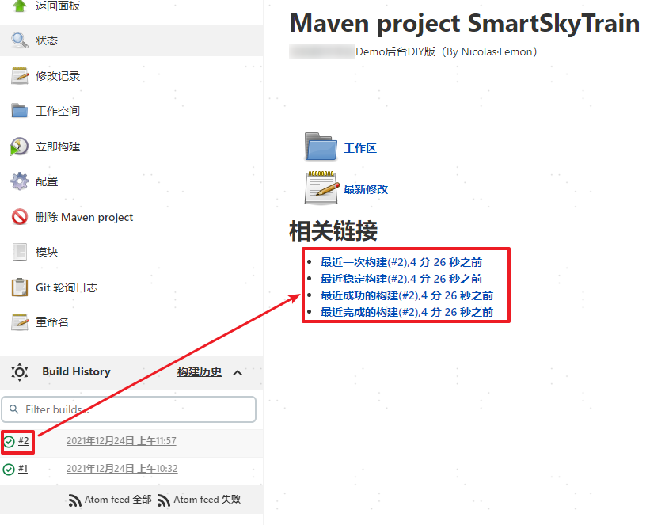

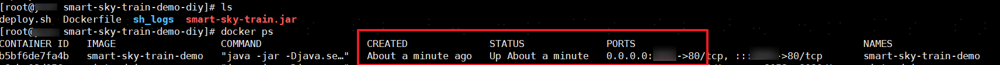

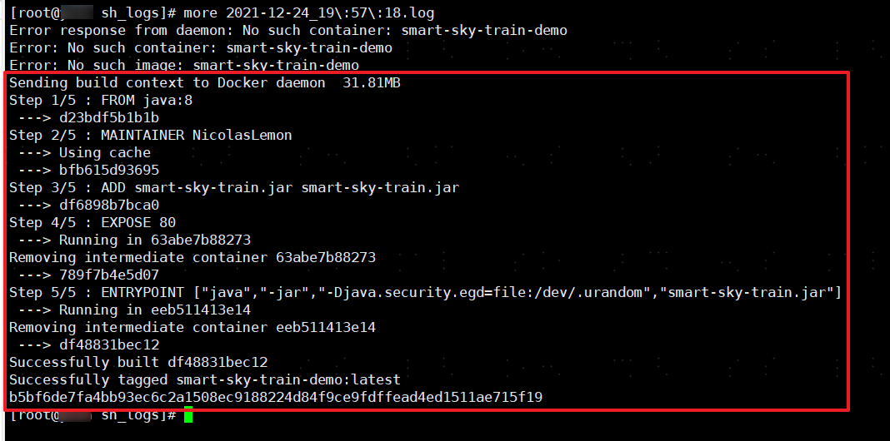


## CI/CD之Vue项目

**玩法跟第一个差不太多，因此只讲差异化的地方**

### 新建任务

**Jenkins仪表盘** -> **新建任务** -> **构建一个自由风格的软件项目**

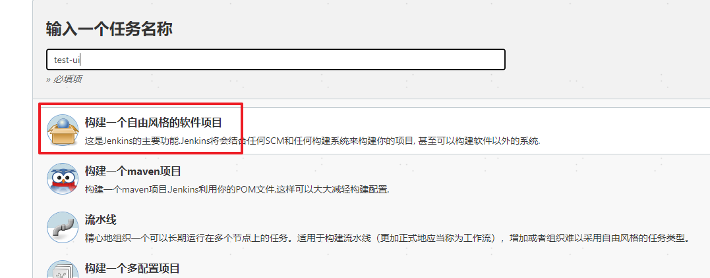

### 配置任务

#### 构建环境

选择以**Node**环境构建

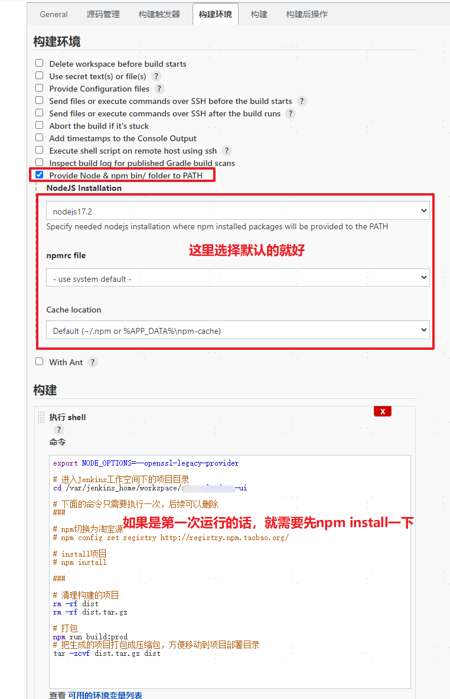

* shell脚本

  ```sh
  # 高版本需要这一句话，低版本不用（亲测8.9.2、12.3.1不用加这句话）
  export NODE_OPTIONS=--openssl-legacy-provider
  ```
  
  ```sh
  # 进入Jenkins工作空间下的项目目录
  cd /var/jenkins_home/workspace/${project_floder}
  
  # 下面的命令只需要执行一次，后续可以删除
  ###
  
  # npm切换为淘宝源
  # npm config set registry http://registry.npm.taobao.org/
  
  # install项目
  # npm install
  
  ###
  
  # 清理构建的项目
  rm -rf dist
  rm -rf dist.tar.gz
  
  # 打包
  npm run build:prod
  # 把生成的项目打包成压缩包，方便移动到项目部署目录
  tar -zcvf dist.tar.gz dist 
  ```

#### 自动部署

##### 目标传送

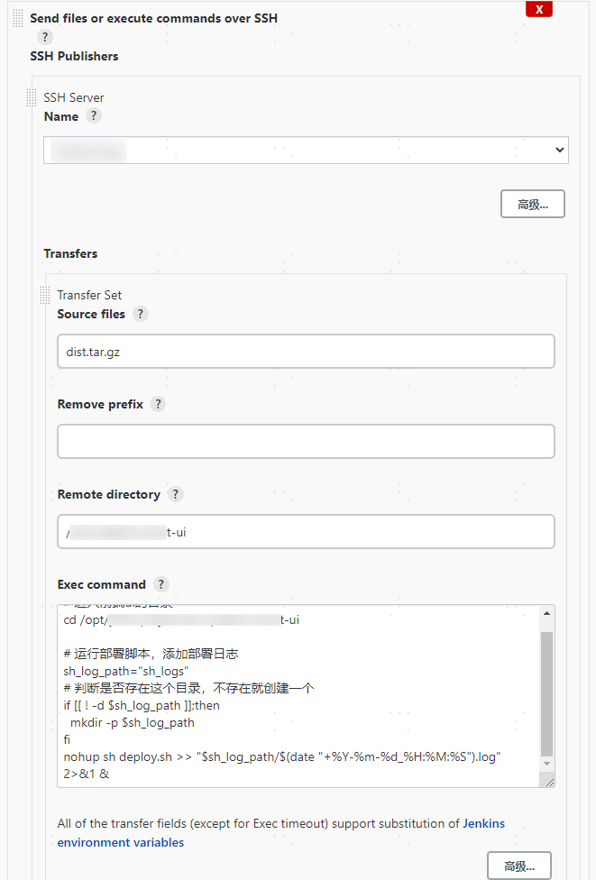

* shell脚本

  ```sh
  # 进入前端ui的目录
  cd ${project_floder}
  
  # 运行部署脚本，添加部署日志
  sh_log_path="sh_logs"
  # 判断是否存在这个目录，不存在就创建一个
  if [[ ! -d $sh_log_path ]];then
    mkdir -p $sh_log_path
  fi
  nohup sh deploy.sh >> "$sh_log_path/$(date "+%Y-%m-%d_%H:%M:%S").log"  2>&1 &
  ```

##### 部署脚本

* deploy.sh

  ```sh
  # 进入前端ui的目录
  cd ${project_floder}
  # 清除旧的前端文件
  rm -rf dist
  # 解压前端压缩包
  tar -zxvf dist.tar.gz
  # 移除前端压缩包
  rm -rf dist.tar.gz
  
  # 使Nginx配置重新生效，清除Nginx缓存
  /usr/local/nginx/sbin/nginx -s reload
  # docker exec -it nginx service nginx reload
  ```
