**光纤猫超密那些事儿**

- **作者：** Nicolas·Lemon
- **修改：** Nicolas·Lemon
- **创建时间：** 2022.10.09
- **修改时间：** 2022.10.09

**与运营商光猫斗智斗勇**

# 华为HS8145C5

## 设备基本信息

**当前软件版本是V5**

| 设备类型      | EPON                         |
|:---------:|:----------------------------:|
| **生产厂家**  | **华为**                       |
| **设备型号**  | **HS8145C5**                 |
| **设备标识号** | **20658E-3A85320658E45833A** |
| **硬件版本**  | **180F.A**                   |
| **软件版本**  | **V5.19.C20S135**            |

## 默认设置

* **超级用户名**：`telecomadmin`
  
  **超级密码**：`nE7jA%5m`

* **开启telnet访问权限**
  
  `超密登录` -> `安全` -> `广域网访问设置` -> `ONT访问控制配置` 
  
  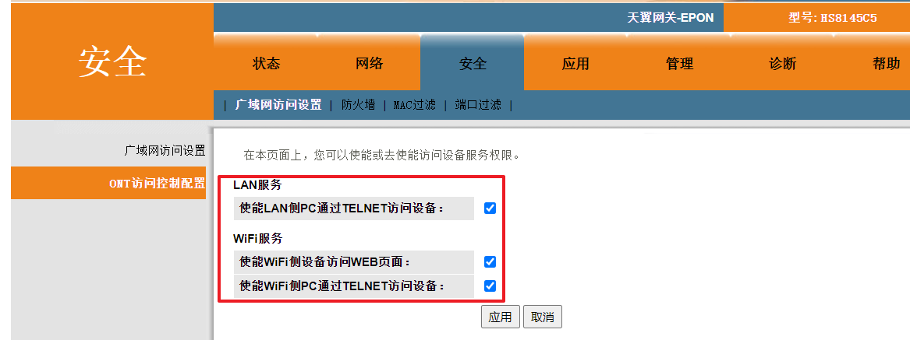

## Telnet大法

若不是默认的超级密码，则可以尝试以下方式，先尝试能不能用telnet连接，若被拒绝连接，则可以参看视频教程：https://www.bilibili.com/video/BV1LM4y1P78T/

### 附带工具

* [华为光猫使能工具2.0](./res/HS8145C5/华为光猫破解工具.zip)

* [基础配置好了的配置文件 - hw_ctree.xml](./res/HS8145C5/hw_ctree.xml)

### 连接光猫

```shell
# telnet连接光猫，用户名：root，密码：adminHW
telnet 192.168.1.1
# 获取超级权限，进入控制台
su
shell
```

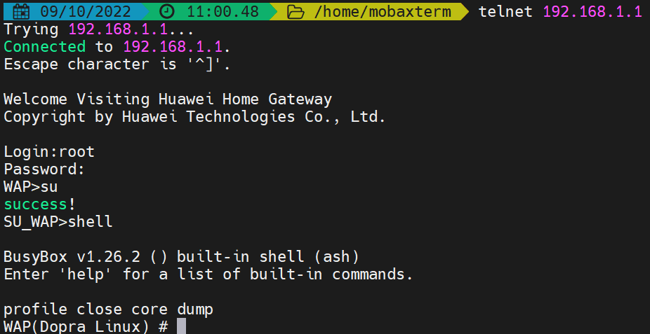

### 获取超密

用户配置文件在`/mnt/jffs2`下的`hw_ctree.xml`

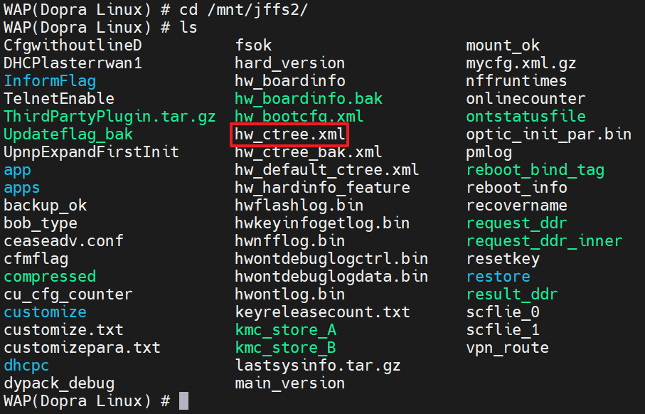

```shell
cd /mnt/jffs2/
# 将配置文件拷贝成.gz压缩文件
cp hw_ctree.xml mycfg.xml.gz
# AES解密压缩文件
aescrypt2 1 mycfg.xml.gz tmp
# 解压
gzip -d mycfg.xml.gz
# 查找含有超级密码的部分
grep WebUserInfoInstance mycfg.xml
```

### 禁止Tr069使能

通过上述`连接光猫`与`获取超密`的部分，将配置文件解密后可参与下面的操作

如果手边有u盘，可以将u盘插入光猫的usb口，然后将解密后的光猫配置文件`mycfg.xml`复制到u盘里，然后再在电脑中修改，会方便一点。

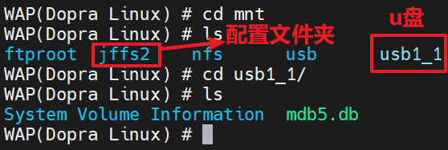

```shell
cp /mnt/jffs2/mycfg.xml /mnt/usb1_1/mycfg.xml
```

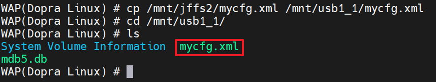

如果手边没有u盘，又或者是不想拷贝出来，那就用`vi`命令改吧

```shell
vi /mnt/jffs2/mycfg.xml
```

输入`/TR069`查找关键字，`n`查找下一个，找到相关的地方，把前面的`Enable`改为`0`

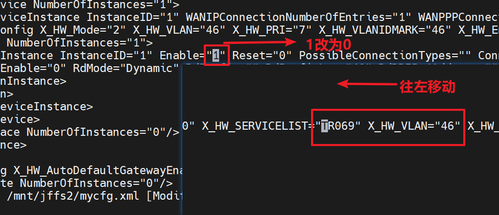

接下来就是把解密修改后的配置文件重新加密，并覆盖原先的配置文件后，重启光猫即可

```shell
cd /mnt/jffs2/
# 压缩自定义的配置文件
gzip mycfg.xml
# 加密压缩包
aescrypt2 0 mycfg.xml.gz tmp 
# 覆盖掉原先的配置文件
cp -f mycfg.xml.gz hw_ctree.xml
# 删除自定义的压缩包
rm -rf mycfg.xml.gz
```

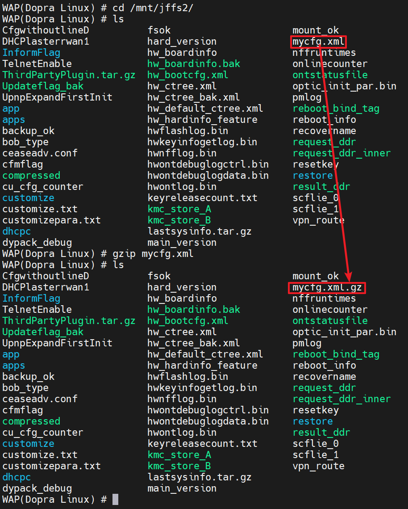

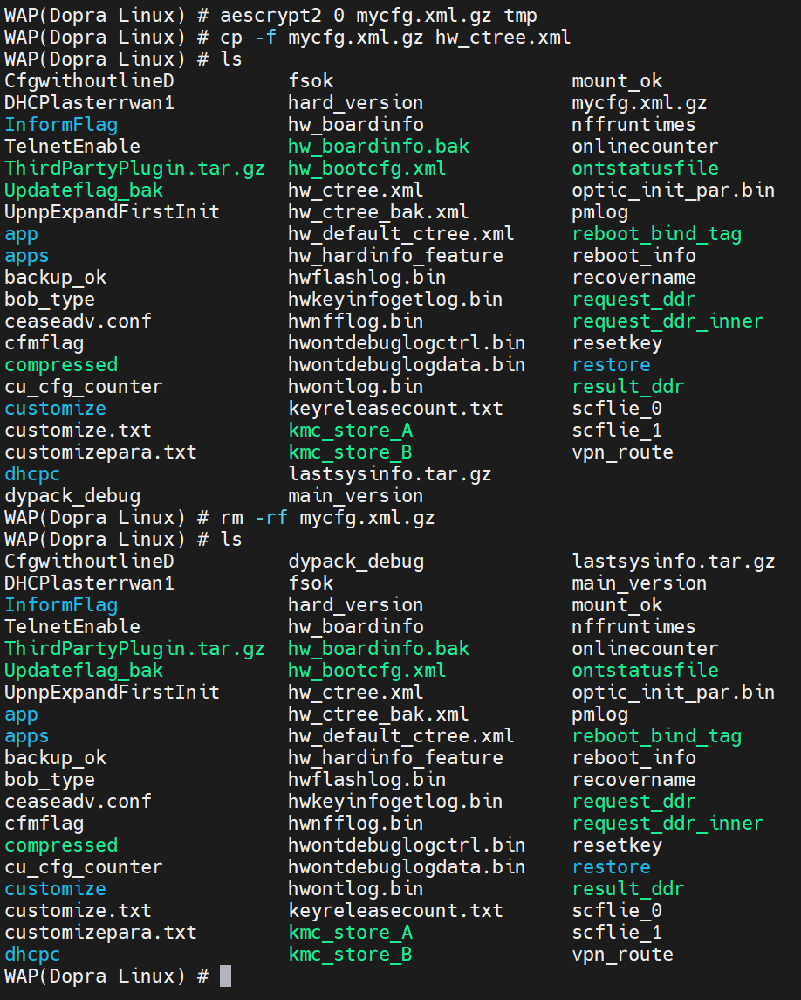

**重启光猫即可**

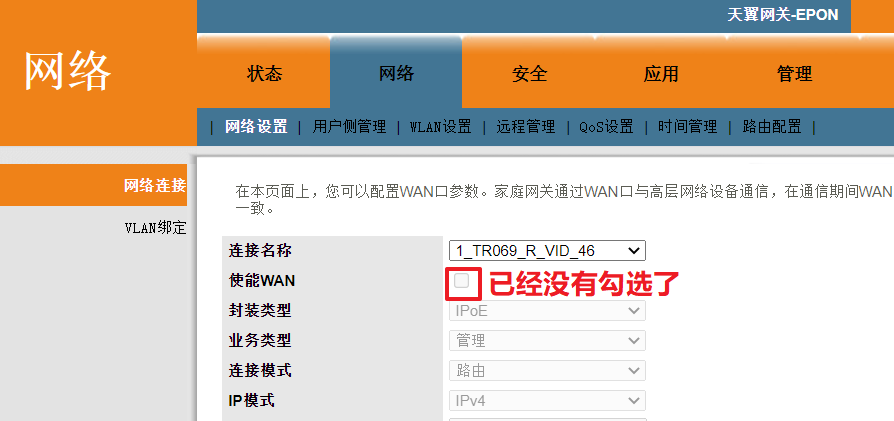

不放心的话，可以在`网络` -> `ITMS 服务器` -> `远程管理`中关闭周期上报

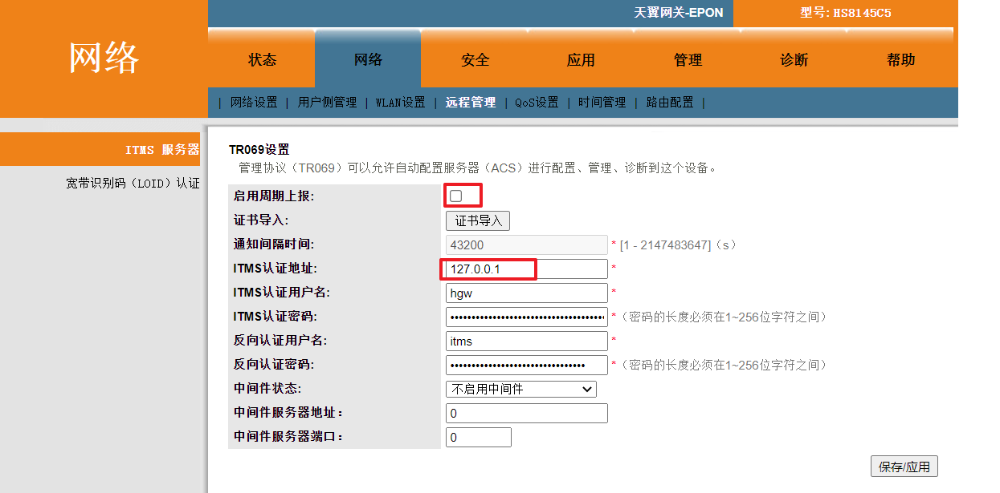

### 修改设备连接限制

可参考`禁止Tr069使能`部分的操作，输入`/TotalTerminalNumber`进行关键字查找，其余部分同`禁止Tr069使能`操作

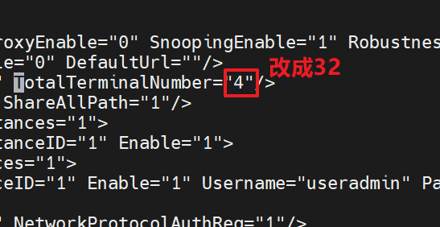
