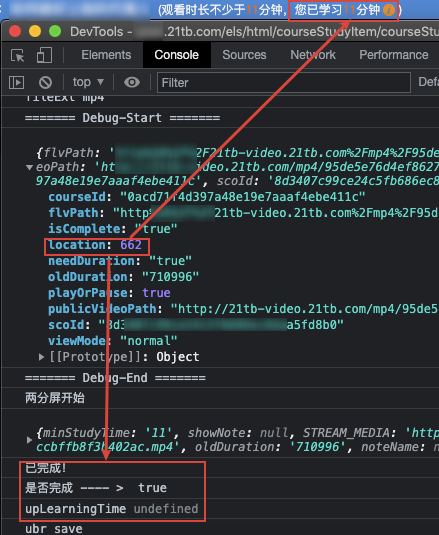

# ReRes JS

* **作者：** Nicolas·Lemon
* **修改：** Nicolas·Lemon
* **创建时间：** 2022.01.14
* **修改时间：** 2022.01.25

**ReRes专治各种不服**


## 前言

### ReRes


Change the response of the request. ReRes可以用来更改页面请求响应的内容。通过指定规则，您可以把请求映射到其他的url，也可以映射到本机的文件或者目录。ReRes支持单个url映射，也支持目录映射。

这是一款 **Google Chrome浏览器插件** ，用于修改浏览器的 **请求映射** ，通俗点讲，就有点像请求劫持，将本身映射到服务器上的文件l给映射到本地的文件或者其他服务器上的文件，然后通过修改相应的本地文件或者其他服务器上的文件，来达到劫持修改的目的。

### 安装说明

插件包放在 **./resource** 目录下，版本`v1.8.1`

`解压插件包` -> `Chrome 扩展程序` -> `打开开发者模式` -> `将解压后的插件包拖入Chrome`

### 使用说明


* **If URL match**

  这一栏复制需要修改的网站的文件的 **URL路径** ，详情在`F12`控制台里的`Sources`里面找

* **Response**

  需要应答的 **请求映射路径**

  其他服务器上的文件以`http://`开头

  本地文件以`file:///`开头， **Windows** 和 **macOS** 下都是 **绝对路径** 


## 实例

### 21tb.com

21tb网课学院，至于要干啥，只能说懂得都懂`Doge`

#### 模式1

##### 模式说明

有 **学习进度xx%** 字样的


##### 使用方法

1. 添加规则

   

   * **If URL match** 这栏填写

     ```http
     http://${xxx}.21tb.com/courseSetting/static/js/coursePlay.*.js
     ```

     这个东西能被我找出来也是有点玄学了

     

   * **Response** 那栏填写本地修改后的JS文件路径

     ```http
     file:///${local_file_path}
     ```

2. 勾选`选择框`，启用该规则

   

3. 刷新网课界面，点击相应的课程目录即可

   我这里修改的JS文件中，是修改了相关课程的播放的进度条，让初始播放就到了需要观看的最短学习时长那，然后再把进度条往后稍微拖拖，拖到最后即可（达到最少观看的播放时间后，进度条就可以拖动了）。

   屏幕中就会出现`下一节`或者目录那边就会显示`已完成`，点击`下一节`即可，要是点了`下一节`后，还没显示`已完成`，那就刷新一下页面看看

   

##### 授之以渔

如果该静态JS失效了，可以仿照该方法去替换成最新的静态JS

原理：修改播放器初始进度，让初始进度直接到达最小学习时间处

思路：播放进度之类的，一般跟`seek`字眼有关，所以找到相应的JS文件后，去搜索里面的`seek`字样的文件，然后去简易分析一下这部分是干什么用的

1. 找到相应的JS，保存到本地

   这部分比较玄学，我自己也是稀里糊涂就找到的

   

2. 搜索关键词`seek`

   很神奇的找到了一处地方

   

   看到了`player`、`ready`、`t.seek(e.seek)`字样，盲猜一下，这会不会就是播放器再预加载数据的时候，设置的播放进度的条件？

3. 先输出一下`对象e`

   不是有看到`t.player`、`t.seek(e.seek)`的字样吗，`对象t`应该是跟播放器相关的吧，跟课程应该没太多关系吧，那就输出一下`对象e`，不行就再把`对象t`也输出一下

   

   在`对象e`里发现了有关`Time`字样的，点开一看，根据英文意思，`minStudyTime`后面的值，应该就是需要观看的最短时间了吧，那`currentStudyTime`就应该是当前学习的时间，于是就产生了下面的代码，代码放置如图

   
   
   ```js
   /** 原有的 */
   // e.playerBuild = 1, t.seek(e.seek)
   /** NicolasLemon修改1 */
   // 调试信息，查看当前对象里面有哪些内容
   // console.log('========= Debug =========='),
   // console.log(e),
   // console.log('========= Debug =========='),
   e.playerBuild = 1,
       // 将对象e的seek时间设置为当前课程需要学习的最少时间
       e.seek = e.curTime.minStudyTime + 10,
       // 更新当前学习时间
       e.curTime.currentStudyTime = e.seek,
       // 设置对象t的seek时间
       t.seek(e.seek)
   ```
   
   刷新页面，然而，似乎是没成功？
   
4. 接着搜索关键词`seek`

   又发现了一处很神奇的地方

   
   
   发现有`timeupdate`、`Math.floor(this.player.getCurrentTime())`、`this.seek=Math.max(this.seek,n)`等字样，想到似乎这个网课播放器的，向前拖动进度条，会自动回到当前播放时的播放进度，似乎这块就是控制这种自动回到当前播放进度的关键代码了？
   
   先输出一下`this.player.getCurrentTime()`，看看这个当前播放器的时间指的是个啥，结果神奇的发现，这就是上面那一步，修改的当前课程需要的最少播放时间。
   
5. 更新`this.seek`的值，使其值变为`this.player.getCurrentTime()`的值，再是试试看效果

   

   ```js
   /** NicolasLemon修改2 */
   // 修改当前对象的seek时间，在 修改1 中已经将播放器的播放时间设置成需要观看的最小的学习时间
   this.seek = Math.floor(this.player.getCurrentTime());
   ```

   然后刷新网课页面，神奇的发现，这个播放进度已经被更新至最小学习时间的地方了，虽然里视频末尾还有丢丢时间，但现在是已经可以随意拖动进度条了。

该模式打完收工~

#### 模式2

##### 模式说明

有 **观看时长不少于a分钟，您已学习b分钟** 字样的


##### 使用方法

1. 添加规则

   

   * **If URL match** 这栏填写

     ```http
     https://21tb-static.21tb.com/web-static/assets/courseV2/js/lib/newStudyCourse_video.js*
     ```

     找出来这步依旧是有些玄学，在`Chrome控制台`中，发现了一些很有意思的输出

     

     `视频总时长`、`当前播放进度`这个提示的也算很明显了吧，然后点击进去后面的JS文件，就可以看到详细的JS代码了

     

   * **Response** 那栏填写本地修改后的JS文件路径

     ```http
     file:///${local_file_path}
     ```

2. 勾选`选择框`，启用该规则

   

3. 刷新页面，点击相应网课的目录即可

   这个我破的比较彻底，操作上不需要如同`模式1`那么复杂，直接点击目录即可，一般点2次（点完1次，等页面加载完再点下一次），然后就该课程目录后就有`勾勾`了

   

##### 授之与渔

如果该静态JS失效了，可以仿照该方法去替换成最新的静态JS

思路：在`模式1`中，通过关键词`seek`等一系列操作，使初始播放进度就在最小学习时间那里，举一反三，如果我们让 **初始播放进度就在最小学习时间那** ，那不就成功破解了嘛？

原理：其核心就是让播放器初始化的时候，不去使用从服务器上查询到的`上一次的播放进度`，而直接修改成我们需要让它跟上的进度。

1. 找到相应的JS，保存到本地

   既然在`Chrome控制台`里看到了相关的输出，那不就点击后面的链接，直接跳转到相应的JS处，然后再保存它

   

   

2. 确立需要的`初始播放进度`

   在`模式2`下，我们很容易就从网页中看到，需要学习的最少时间，那么用`元素选择器`查看一下
   
   
   
   好家伙，看到有`id="minStudyTime"`的字样，难道是利用这个`id`作为唯一标识的嘛？
   
   利用jQuery的`ID选择器`输出一下，看看是不是这样子
   
   ```js
   $('#minStudyTime').html()
   ```
   
   
   
   
   
   嘿嘿嘿，果然如此。
   
   去下载好的`newStudyCourse_video.js`里搜索关键词`minStudyTime`，看看能搜到啥
   
   
   
   嘿嘿嘿，人家也是用的jQuery的`ID选择器`嘛，那在代码里用这个方式获取到的最小学习时间，妥妥的   
   
2. 查找播放器配置

   确立好了`初始播放进度`，接下来就看看能不能查找并修改播放器的配置了
   
   在下载好的`newStudyCourse_video.js`文件中，搜索关键词形如`player`、`seek`、`播放`之类的关键词，看看能不能找到什么惊喜
   
   
   
   感谢注释~~
   
   看到`function(p)`，传入了一个参数`p`，这个参数`p`是个啥呀，不知道，输出一下，看看里面是啥
   
   
   
   看到一个名为`location`的字段
   
   
   
   大致猜测一下，这个可能就是播放进度了，只不过`location`可能存的是秒
   
4. 测试修改`location`的值

   ```js
   /** NicolasLemon修改1 */
   // 将最小学习时间赋给location，并且将分钟转换成秒，保险起见，初始位置多加几秒也无所谓
   p.location = $('#minStudyTime').html() * 60 + 2;
   ```
   
   
   
   测试结果很Nice呀，点击`播放`的时候，进度条已经跳转到了最小学习时间
   
   
5. 然后多点几次课程目录（每次点完先等课程加载一下），然后就会发现学习进度已经更新到服务器上了

该模式打完收工~

   

   
