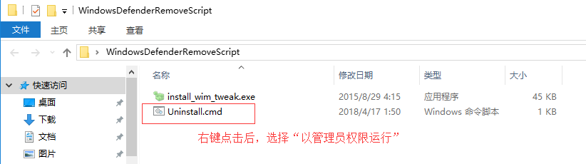

**系统&软件安装&环境配置指南**

* **作者：** Nicolas·Lemon
* **修改：** Nicolas·Lemon
* **创建日期：** 2022.06.28
* **修改日期：** 2022.06.28

# Windows 10

当前选择系统镜像：`zh-cn_windows_10_business_editions_version_21h1_updated_aug_2021_x64_dvd_e77da303.iso`

## 系统安装

* 下载系统镜像`ios`文件（略）
* 制作U盘启动盘（略）
* U盘启动电脑，格式化系统盘，安装镜像文件（略）

## 系统激活

**数字激活`win10 21H1 Business Editions(Build 19043)`**

**专业版密钥：** `W269N-WFGWX-YVC9B-4J6C9-T83GX`

**专业工作站密钥：** `DXG7C-N36C4-C4HTG-X4T3X-2YV77`

* 用管理员权限打开命令行，输入安装密钥命令：
  
  ```shell
  slmgr /ipk DXG7C-N36C4-C4HTG-X4T3X-2YV77
  ```

* 打开 `HWIDGen_62.01_汉化版.exe` 进行数字永久激活
  
  **注意：** 此处需要联网激活
  
  

## 系统打补丁

* 运行`DirectX Repair V3.8 (Enhanced Edition)`软件
  
  

## 卸载Defender

* 右键管理员运行脚本
  
  
  
  

* 重启电脑

## 卸载Edge浏览器

* 进入`…/edge/install`文件夹，右键在此运行命令行：
  
  ```shell
  .\setup.exe --uninstall --system-level --verbose-logging --force-uninstall
  ```

## 禁止开机启动项

* Win+R：`regedit`打开注册表
  
  `计算机\HKEY_LOCAL_MACHINE\SOFTWARE\Microsoft\Windows\CurrentVersion\Run`
  
  `计算机\HKEY_CURRENT_USER\SOFTWARE\Microsoft\Windows\CurrentVersion\Run`
  
  

## Office2016激活

**kms命令激活Office 2016 Plus**

**专业增强版密钥：** `XQNVK-8JYDB-WJ9W3-YJ8YR-WFG99`

* 命令行（管理员）进入Office安装目录
  
  （默认）：`C:\Program Files (x86)\Microsoft Office\Office16`

* 输入以下命令，安装密钥
  
  ```shell
  cscript ospp.vbs /inpkey:XQNVK-8JYDB-WJ9W3-YJ8YR-WFG99
  ```

* 若提示无许可证，则先进入许可证存放处
  
  （默认）：`C:\Program Files (x86)\Microsoft Office\root\Licenses16`
  
  新建并管理员运行脚本后再安装上述密钥：`aaa.bat`：
  
  ```bash
  @echo off
  :ADMIN
  openfiles >nul 2>nul ||(
  echo CreateObject^("Shell.Application"^).ShellExecute "%~s0", "", "", "runas", 1 >> "%temp%\getadmin.vbs"
  "%temp%\getadmin.vbs" >nul 2>&1
  goto:eof
  )
  del /f /q "%temp%\getadmin.vbs" >nul 2>nul
  
  for /f "tokens=6 delims=[]. " %%G in ('ver') do set win=%%G
  
  setlocal
  
  set OPPKEY=XQNVK-8JYDB-WJ9W3-YJ8YR-WFG99
  set PPKEY=YG9NW-3K39V-2T3HJ-93F3Q-G83KT
  set VPKEY=PD3PC-RHNGV-FXJ29-8JK7D-RJRJK
  set S4BKEY=869NQ-FJ69K-466HW-QYCP2-DDBV6
  
  pushd "%~dp0"
  Title Office 2016 Retail to Volume License Converter
  
  SET OfficePath=%ProgramFiles%\Microsoft Office
  if not exist "%OfficePath%\root\Licenses16" SET OfficePath=%ProgramFiles(x86)%\Microsoft Office
  if not exist "%OfficePath%\root\Licenses16" (
      echo Could not find the license files for Office 2016!
      pause
      goto :eof
  )
  
  echo Press Enter to start VL-Conversion...
  echo.
  pause
  echo.
  cd /D "%SystemRoot%\System32"
  
  if %win% GEQ 9200 (
      cscript slmgr.vbs /ilc "%OfficePath%\root\Licenses16\ProPlusVL_KMS_Client-ppd.xrm-ms"
      cscript slmgr.vbs /ilc "%OfficePath%\root\Licenses16\ProPlusVL_KMS_Client-ul.xrm-ms"
      cscript slmgr.vbs /ilc "%OfficePath%\root\Licenses16\ProPlusVL_KMS_Client-ul-oob.xrm-ms"
  
      cscript slmgr.vbs /ilc "%OfficePath%\root\Licenses16\ProjectProVL_KMS_Client-ppd.xrm-ms"
      cscript slmgr.vbs /ilc "%OfficePath%\root\Licenses16\ProjectProVL_KMS_Client-ul-oob.xrm-ms"
      cscript slmgr.vbs /ilc "%OfficePath%\root\Licenses16\ProjectProVL_KMS_Client-ul.xrm-ms"
  
      cscript slmgr.vbs /ilc "%OfficePath%\root\Licenses16\VisioProVL_KMS_Client-ppd.xrm-ms"
      cscript slmgr.vbs /ilc "%OfficePath%\root\Licenses16\VisioProVL_KMS_Client-ul-oob.xrm-ms"
      cscript slmgr.vbs /ilc "%OfficePath%\root\Licenses16\VisioProVL_KMS_Client-ul.xrm-ms"
  
      cscript slmgr.vbs /ilc "%OfficePath%\root\Licenses16\SkypeforBusinessVL_KMS_Client-ppd.xrm-ms"
      cscript slmgr.vbs /ilc "%OfficePath%\root\Licenses16\SkypeforBusinessVL_KMS_Client-ul.xrm-ms"
      cscript slmgr.vbs /ilc "%OfficePath%\root\Licenses16\SkypeforBusinessVL_KMS_Client-ul-oob.xrm-ms"
  
      cscript slmgr.vbs /ilc "%OfficePath%\root\Licenses16\client-issuance-bridge-office.xrm-ms
      cscript slmgr.vbs /ilc "%OfficePath%\root\Licenses16\client-issuance-root.xrm-ms
      cscript slmgr.vbs /ilc "%OfficePath%\root\Licenses16\client-issuance-root-bridge-test.xrm-ms
      cscript slmgr.vbs /ilc "%OfficePath%\root\Licenses16\client-issuance-stil.xrm-ms
      cscript slmgr.vbs /ilc "%OfficePath%\root\Licenses16\client-issuance-ul.xrm-ms
      cscript slmgr.vbs /ilc "%OfficePath%\root\Licenses16\client-issuance-ul-oob.xrm-ms
      cscript slmgr.vbs /ilc "%OfficePath%\root\Licenses16\pkeyconfig-office.xrm-ms
  )
   if %win% LSS 9200 (
      cscript "%OfficePath%\Office16\ospp.vbs" /inslic:"%OfficePath%\root\Licenses16\ProPlusVL_KMS_Client-ppd.xrm-ms"
      cscript "%OfficePath%\Office16\ospp.vbs" /inslic:"%OfficePath%\root\Licenses16\ProPlusVL_KMS_Client-ul.xrm-ms"
      cscript "%OfficePath%\Office16\ospp.vbs" /inslic:"%OfficePath%\root\Licenses16\ProPlusVL_KMS_Client-ul-oob.xrm-ms"
  
      cscript "%OfficePath%\Office16\ospp.vbs" /inslic:"%OfficePath%\root\Licenses16\ProjectProVL_KMS_Client-ppd.xrm-ms"
      cscript "%OfficePath%\Office16\ospp.vbs" /inslic:"%OfficePath%\root\Licenses16\ProjectProVL_KMS_Client-ul-oob.xrm-ms"
      cscript "%OfficePath%\Office16\ospp.vbs" /inslic:"%OfficePath%\root\Licenses16\ProjectProVL_KMS_Client-ul.xrm-ms"
  
      cscript "%OfficePath%\Office16\ospp.vbs" /inslic:"%OfficePath%\root\Licenses16\VisioProVL_KMS_Client-ppd.xrm-ms"
      cscript "%OfficePath%\Office16\ospp.vbs" /inslic:"%OfficePath%\root\Licenses16\VisioProVL_KMS_Client-ul-oob.xrm-ms"
      cscript "%OfficePath%\Office16\ospp.vbs" /inslic:"%OfficePath%\root\Licenses16\VisioProVL_KMS_Client-ul.xrm-ms"0
  
      cscript "%OfficePath%\Office16\ospp.vbs" /inslic:"%OfficePath%\root\Licenses16\SkypeforBusinessVL_KMS_Client-ppd.xrm-ms"
      cscript "%OfficePath%\Office16\ospp.vbs" /inslic:"%OfficePath%\root\Licenses16\SkypeforBusinessVL_KMS_Client-ul.xrm-ms"
      cscript "%OfficePath%\Office16\ospp.vbs" /inslic:"%OfficePath%\root\Licenses16\SkypeforBusinessVL_KMS_Client-ul-oob.xrm-ms"
  
      cscript "%OfficePath%\Office16\ospp.vbs" /inslic:"%OfficePath%\root\Licenses16\client-issuance-bridge-office.xrm-ms
      cscript "%OfficePath%\Office16\ospp.vbs" /inslic:"%OfficePath%\root\Licenses16\client-issuance-root.xrm-ms
      cscript "%OfficePath%\Office16\ospp.vbs" /inslic:"%OfficePath%\root\Licenses16\client-issuance-root-bridge-test.xrm-ms
      cscript "%OfficePath%\Office16\ospp.vbs" /inslic:"%OfficePath%\root\Licenses16\client-issuance-stil.xrm-ms
      cscript "%OfficePath%\Office16\ospp.vbs" /inslic:"%OfficePath%\root\Licenses16\client-issuance-ul.xrm-ms
      cscript "%OfficePath%\Office16\ospp.vbs" /inslic:"%OfficePath%\root\Licenses16\client-issuance-ul-oob.xrm-ms
      cscript "%OfficePath%\Office16\ospp.vbs" /inslic:"%OfficePath%\root\Licenses16\pkeyconfig-office.xrm-ms
  )
  
  for %%a in (%OPPKEY% %PPKEY% %VPKEY% %S4BKEY%) do cscript "%OfficePath%\Office16\ospp.vbs" /inpkey:%%a
  cscript "%OfficePath%\Office16\ospp.vbs" /act
  
  echo.
  echo Retail to Volume License conversion finished.
  echo.
  pause
  ```

* 在线激活密钥
  
  ```shell
  cscript ospp.vbs /sethst:kms.03k.org
  cscript ospp.vbs /act
  # 查询激活状态
  cscript ospp.vbs /dstatus
  ```