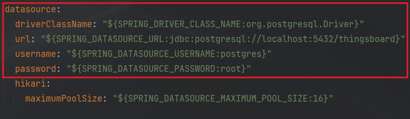
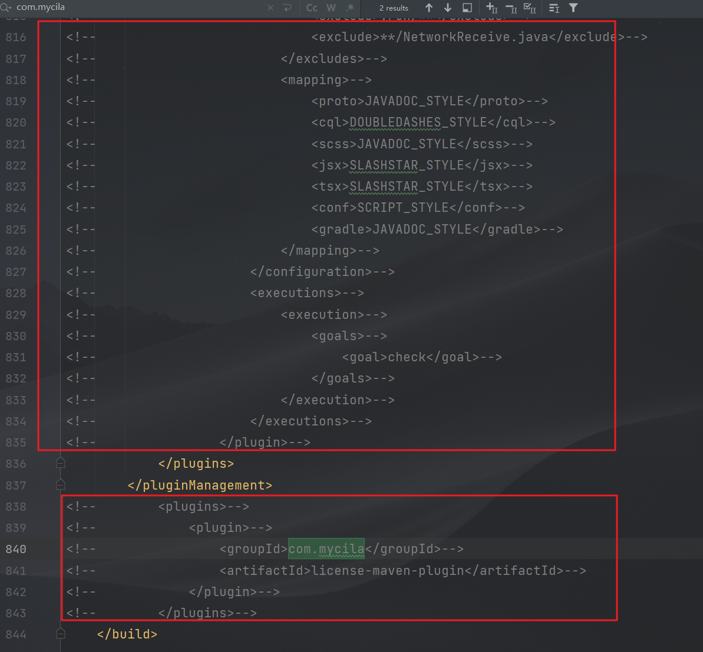

**ThingsBoard小试牛刀**

- **作者：** Nicolas·Lemon
- **修改：** Nicolas·Lemon
- **创建日期：** 2023.05.04
- **修改日期：** 2023.05.05
- **ThingsBorad版本：** release-3.4

# 源码下载

下面二选一即可（压缩包也是从git上下载的）

* [Release ThingsBoard 3.4 Release · thingsboard/thingsboard · GitHub](https://github.com/thingsboard/thingsboard/releases/tag/v3.4)

* [thingsboard-3.4.zip](./resource/thingsboard-3.4.zip)

# 环境搭建

## JDK 11

编译ThingsBorad需要Java11的环境，而笔者本地是Java8的环境，现在使Java8和Java11本地共存。

1. 安装包
   
   [jdk-11.0.14_windows-x64_bin.zip](./resource/jdk-11.0.14_windows-x64_bin.zip)

2. 更换其安装位置
   
   

3. 配置环境变量
   
   把之前的`JAVA_HOME`更名为`JAVA_HOME_8`，并新建`JAVA_HOME`，配置为java11的地址
   
   
   
   
   
   

4. 切换
   
   只需要把环境变量中path中的路径`%JAVA_HOME%\bin`改为`%JAVA_HOME_8%\bin`，就可以切回Java8了。

5. 项目配置
   
   将配置改为jdk11的，若idea中没有jdk11的，就手动添加一下
   
   
   
   

## PostgresSQL 14.2

**注：** 此处是Docker部署

1. 拉取镜像
   
   ```shell
   docker pull postgres:14.2
   ```
   
   

2. 运行容器
   
   ```shell
   docker run -it \
   --name postgres14 \
   --network localnet \
   -p 5432:5432 \
   -v /D/Daturm/DockerVolume/postgres:/var/lib/postgresql \
   -e POSTGRES_PASSWORD='root' \
   -e ALLOW_IP_RANGE=0.0.0.0/0 \
   -d postgres:14.2
   ```

3. 拷贝出数据文件夹
   
   ```shell
   docker cp postgres14:/var/lib/postgresql/data D:/Daturm/DockerVolume/postgres
   docker restart postgres14
   ```

4. 进入容器
   
   ```shell
   docker exec -it postgres14 /bin/bash
   ```

5. 切换用户
   
   将当前root切换成postgres
   
   ```shell
   su postgres
   ```
   
   

6. 登录数据库
   
   ```shell
   psql -U postgres -W
   ```
   
   输入密码：`root`
   
   
   
   证明数据库是可以成功登录访问的

7. 配置远程访问权限
   
   修改配置文件`pg_hba.conf`，在对应位置加入相应的内容
   
   
   
   
   
   重启容器
   
   ```shell
   docker restart postgres14
   ```
   
   利用Navicat外部连接成功
   
   

# 项目配置

## 新建数据库

1. 新建数据库，名为`thingsboard`
   
   

2. 导入sql表
   
   数据表在`./dao/src/main/resources/sql`下
   
   

## 配置数据连接

在`application/src/main/resources/thingsboard.yml`



## 注释liscense配置

直接搜索`com.mycila`，并注释掉相关的内容



# 报错

## 方法of找不到符号


解决：idea中的java编译器版本还是1.8的，需要改为11


