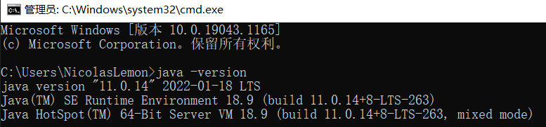

**ThingsBoard小试牛刀**

- **作者：** Nicolas·Lemon
- **修改：** Nicolas·Lemon
- **创建日期：** 2023.05.04
- **修改日期：** 2023.05.06
- **ThingsBorad版本：** release-3.4

**注：** 当前编译环境是在Win10下，若后续需要在macOS下编译再来补充

# 源码下载

下面二选一即可（压缩包也是从git上下载的）

* [Release ThingsBoard 3.4 Release · thingsboard/thingsboard · GitHub](https://github.com/thingsboard/thingsboard/releases/tag/v3.4)

* [thingsboard-3.4.zip](./resource/thingsboard-3.4.zip)

# 环境搭建

## JDK 11

编译ThingsBorad需要Java11的环境，而笔者本地是Java8的环境，现在使Java8和Java11本地共存。

1. 安装包
   
   [jdk-11.0.14_windows-x64_bin](./resource/jdk-11.0.14_windows-x64_bin)
   
   github有限制，不让上传大于100MB的文件，因此对压缩包做了拆分（python3）
   
   ```shell
   pip install filesplit
   ```
   
   拆分：
   
   ```python
   # -*- coding: utf-8 -*-
   from filesplit.split import Split
   ```
   
   def main():
   
       split = Split(r"./jdk-11.0.14_windows-x64_bin.zip", "./output")
       # 每个文件最多99MB
       split.bysize(size=1024 * 1000 * 99)
   
   if __name__ == '__main__':
   
       main()

```
合并：

```python
# -*- coding: utf-8 -*-
from filesplit.merge import Merge


def main():
    merge = Merge(inputdir="./output", outputdir="./", outputfilename="jdk-11.0.14_windows-x64_bin.zip")
    merge.merge()


if __name__ == '__main__':
    main()
```

2. 更换其安装位置
   
   

3. 配置环境变量
   
   把之前的`JAVA_HOME`更名为`JAVA_HOME_8`，并新建`JAVA_HOME`，配置为java11的地址
   
   
   
   
   
   

4. 切换
   
   只需要把环境变量中path中的路径`%JAVA_HOME%\bin`改为`%JAVA_HOME_8%\bin`，就可以切回Java8了。

5. 项目配置
   
   将配置改为jdk11的，若idea中没有jdk11的，就手动添加一下
   
   
   
   

6. 修改maven编译版本
   
   本地maven编译版本是jdk1.8，现在要用jdk11，打开maven的`settings.xml`配置，找到原来配置jdk1.8的地方，作如下修改：
   
   ```xml
   <!-- java版本 -->
   <profile>
       <id>jdk-1.8</id>
       <activation>
           <activeByDefault>false</activeByDefault>
           <jdk>1.8</jdk>
       </activation>
       <properties>
       <maven.compiler.source>1.8</maven.compiler.source>
           <maven.compiler.target>1.8</maven.compiler.target>
           <maven.compiler.compilerVersion>1.8</maven.compiler.compilerVersion>
       </properties>
   </profile>
   
   <profile>     
       <id>jdk-11</id>   
       <activation>        
           <activeByDefault>true</activeByDefault>    
           <jdk>11</jdk>      
       </activation>  
       <properties>  
           <maven.compiler.source>11</maven.compiler.source> 
           <maven.compiler.target>11</maven.compiler.target> 
           <maven.compiler.compilerVersion>11</maven.compiler.compilerVersion>   
       </properties>
   </profile>
   ```
   
   

## PostgresSQL 14.2

**注：** 此处是Docker部署

1. 拉取镜像
   
   ```shell
   docker pull postgres:14.2
   ```
   
   

2. 运行容器
   
   本地已经创建公共网络`localnet`，没创建的先用`docker network create localnet`创建一下
   
   ```shell
   docker run -it \
   --name postgres14 \
   --network localnet \
   -p 5432:5432 \
   -v /D/Daturm/DockerVolume/postgres/data:/var/lib/postgresql/data \
   -e POSTGRES_PASSWORD='postgres' \
   -e ALLOW_IP_RANGE=0.0.0.0/0 \
   -d postgres:14.2
   ```

3. 拷贝出数据文件夹
   
   ```shell
   docker cp postgres14:/var/lib/postgresql/data D:/Daturm/DockerVolume/postgres
   docker restart postgres14
   ```

4. 进入容器
   
   ```shell
   docker exec -it postgres14 /bin/bash
   ```

5. 切换用户
   
   将当前root切换成postgres
   
   ```shell
   su postgres
   ```
   
   

6. 登录数据库
   
   ```shell
   psql -U postgres -W
   ```
   
   输入密码：`postgres`，注意，当前密码是不显示的，直接输入并回车即可
   
   
   
   证明数据库是可以成功登录访问的

7. 配置远程访问权限
   
   修改配置文件`pg_hba.conf`，在对应位置加入相应的内容
   
   
   
   
   
   重启容器
   
   ```shell
   docker restart postgres14
   ```
   
   利用Navicat外部连接成功
   
   

## Kafka

**提示：** 在运行thingsboard的时候，发现没有要启动kafka，但是在thingsboard的services中，有要启动kafka和redis，这里暂时可以先不用管kafka，等后面需要的时候，再来安装kafka和redis


kafka依赖zookeeper，所以要先安装zookeeper

### Zookeeper

```shell
docker run -d \
--name zookeeper-server \
--network localnet \
-e ALLOW_ANONYMOUS_LOGIN=yes \
bitnami/zookeeper:latest
```

### Kafka

```shell
docker run -d \
--name kafka-server \
--network localnet \
-p 9092:9092 \
-e ALLOW_PLAINTEXT_LISTENER=yes \
-e KAFKA_CFG_ZOOKEEPER_CONNECT=zookeeper-server:2181 \
-e KAFKA_CFG_ADVERTISED_LISTENERS=PLAINTEXT://127.0.0.1:9092 \
bitnami/kafka:latest
```

# 项目配置

## 编译项目

用命令行的话，管理员运行cmd，进入项目根目录：`mvn clean package -DskipTests`

在idea中编译项目：参看截图


## 新建数据库

1. 新建数据库，名为`thingsboard`
   
   

2. 导入sql表
   
   数据表在`./dao/src/main/resources/sql`下
   
   

## 配置数据连接

在`application/src/main/resources/thingsboard.yml`，这里按照上述配置后是不用动此处的，项目中的默认配置是对的


## 初始化数据

**注：** 这一步非常重要，不然启动项目是会报错的（`DefaultMailService`注入失败的问题）

windows下的初始化数据脚本是：`./application/target/windows/install_dev_db.bat`

macOS下的初始化数据脚本是：`./application/target/bin/install/install_dev_db.sh`

用超级管理员权限运行对应的脚本后，会发现数据库表中多了初始数据


# 运行项目

直接运行`./application/src/main/java/org/thingsboard/server/ThingsboardServerApplication.java`


等过一会儿，如果发现没啥报错的话


就在浏览器中输入：`http://localhost:8080/`


| 用户名                      | 密码       | 用户角色  |
| ------------------------ | -------- | ----- |
| sysadmin@thingsboard.org | sysadmin | 系统管理员 |
| tenant@thingsboard.org   | tenant   | 租户管理员 |

登录成功后


# 参考资料

1. https://blog.csdn.net/nihaomabmt/article/details/107385241
   
   

# 遇到的报错

**注：** 项目在导入idea时，一定一定得导入真正的路径，像笔者之前在桌面上做了目录映射的，然后直接导入映射的路径，在项目编译的时候，就遇到路径错误的问题，所以要直接导入项目所在的真正路径，避免踩到奇奇怪怪的坑。

## 方法of找不到符号


解决：idea中的java编译器版本还是1.8的，需要改为11

**注：** 下面这种修改方法治标不治本，一旦module发生变化，那么又变成1.8的了，这个就需要修改maven的配置文件，设置编译版本为`jdk-11`，方法已补充在本笔记中的 `环境搭建` -> `JDK 11` - > `6.修改maven编译版本`中


