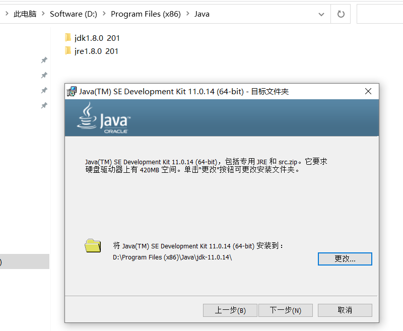

**ThingsBoard小试牛刀**

- **作者：** Nicolas·Lemon
- **修改：** Nicolas·Lemon
- **创建日期：** 2023.05.04
- **修改日期：** 2023.05.04
- **ThingsBorad版本：** release-3.4

# 源码下载

下面二选一即可（压缩包也是从git上下载的）

* [Release ThingsBoard 3.4 Release · thingsboard/thingsboard · GitHub](https://github.com/thingsboard/thingsboard/releases/tag/v3.4)

* [thingsboard-3.4.zip](./resource/thingsboard-3.4.zip)

# 环境搭建

## JDK 11

编译ThingsBorad需要Java11的环境，而笔者本地是Java8的环境，现在使Java8和Java11本地共存。

1. 安装包
   
   [jdk-11.0.14_windows-x64_bin.zip](./resource/jdk-11.0.14_windows-x64_bin.zip)

2. 更换其安装位置
   
   

3. 配置环境变量
   
   把之前的`JAVA_HOME`更名为`JAVA_HOME_8`，并新建`JAVA_HOME`，配置为java11的地址
   
   
   
   
   
   

4. 切换
   
   只需要把环境变量中path中的路径`%JAVA_HOME%\bin`改为`%JAVA_HOME_8%\bin`，就可以切回Java8了。

5. 项目配置
   
   将配置改为jdk11的，若idea中没有jdk11的，就手动添加一下
   
   
   
   
