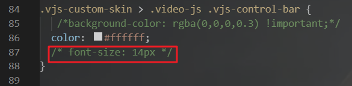

**Vue-Study**

- **作者：** Nicolas·Lemon
- **修改：** Nicolas·Lemon
- **创建日期：** 2022.07.17
- **修改日期：** 2022.07.21

# Vue2.0

## 前端环境

### 版本

* NodeJs：`v12.22.0`

* @vue/cli：`v4.5.17`


### 配置

#### Node地址

**安装目录：** `D:\Program Files (x86)\nodejs`

* 在安装目录下新建`node_cache`与`node_global`两个文件夹
  
  

* 设置node地址
  
  ```bash
  # 设置相关
  npm config set prefix "D:\Program Files (x86)\nodejs\node_global"
  npm config set cache "D:\Program Files (x86)\nodejs\node_cache"
  
  # 查看相关
  npm root -g
  npm config get prefix
  npm config get cache
  ```
  
  

* 添加环境变量
  
  ```textile
  D:\Program Files (x86)\nodejs\
  
  D:\Program Files (x86)\nodejs\node_global
  ```
  
  

#### 淘宝镜像

```bash
# 查看当前npm仓库镜像地址
npm config get registry
# 设置当前npm仓库镜像地址为淘宝镜像
npm config set registry http://registry.npm.taobao.org/
```


#### Vue脚手架

```bash
npm install -g @vue/cli@4.5.17
```


## 响应式布局

### 安装插件

- **flexible**
  
  阿里团队研发的自适应响应式布局插件
  
  ```bash
  npm install --save lib-flexible
  ```

- **postcss-plugin-px2rem**
  
  自动将代码中的`px`转换成`rem`，这样在写代码的时候，仍然可以写成`px`的单位
  
  ```bash
  npm install --save postcss-plugin-px2rem
  ```

- **cssrem** （可选）
  
  vs code插件，写代码时，可以提示将`px`转换成`rem`

### flexible

#### 引入

- 在`src/main.js`中import导入
  
  ```v
  // 引用 flexible 插件
  import "lib-flexible/flexible.js";
  ```
  
  

#### 配置

- 修改`flexible.js`
  
  找到`node_modules\lib-flexible\flexible.js`，修改`refreshRem()`函数
  
  ```js
  function refreshRem() {
      var width = docEl.getBoundingClientRect().width;
      // if (width / dpr > 540) {
      //     width = 540 * dpr;
      // }
  
      // 修改 最大值：2560   最小值：400
      if (width / dpr < 400) {
          width = 400 * dpr;
      } else if (width / dpr > 2560) {
          width = 2560 * dpr;
      }
      var rem = width / 10;
  
      docEl.style.fontSize = rem + 'px';
      flexible.rem = win.rem = rem;
  }
  ```
  
  

### postcss-plugin-px2rem

- 修改`vue.config.js`
  
  在`css.loaderOptions`选项后添加，其中根据自身项目去确定换算基数`rootValue`的值
  
  ```js
  css: {
      loaderOptions: {
          // ......
          postcss: {
              plugins: [
                  require("postcss-plugin-px2rem")({
                      // 换算基数， 默认100  ，这样的话把根标签的字体规定为1rem为50px,这样就可以从设计稿上量出多少个px直接在代码中写多上px了。
                      rootValue: 207,
                      // 默认false，可以（reg）利用正则表达式排除某些文件夹的方法，例如/(node_module)/ 。如果想把前端UI框架内的px也转换成rem，请把此属性设为默认值
                      exclude: /(node_module|other)/,
                      //（布尔值）允许在媒体查询中转换px。
                      mediaQuery: false,
                      // 设置要替换的最小像素值(3px会被转rem)。 默认 0
                      minPixelValue: 0,
                      /// 允许REM单位增长到的十进制数字。
                      // unitPrecision: 5, 
                      /// 默认值是一个空数组，这意味着禁用白名单并启用所有属性。
                      // propWhiteList: [],  
                      // 黑名单
                      // propBlackList: [], 
                      /// 要忽略并保留为px的选择器
                      // selectorBlackList: [], 
                      ///（boolean/string）忽略单个属性的方法，启用ignoreidentifier后，replace将自动设置为true。
                      // ignoreIdentifier: false,
                      /// （布尔值）替换包含REM的规则，而不是添加回退。
                      // replace: true
                  })
              ]
          }
      }
  }
  ```
  
  

## 视频播放插件

**vue-video-player**

### 安装

如果需要播放m3u8等流媒体视频的话，那么也需要安装一下`videojs-contrib-hls`，不然不能播放m3u8格式的

```bash
npm install vue-video-player videojs-contrib-hls --save
```

### 引入

可以全局引入插件，也可以在需要用到该插件的组件内单独引入（二选一）

#### 全局引入

在`main.js`里导入并引用

```js
import VideoPlayer from 'vue-video-player'

// 播放m3u8格式流媒体视频所需
import "videojs-contrib-hls";

// 引入方式一
import 'vue-video-player/src/custom-theme.css'
import 'video.js/dist/video-js.css'

// 引入方式二
require('video.js/dist/video-js.css')
require('vue-video-player/src/custom-theme.css')

Vue.use(VideoPlayer)
```

#### 局部引用

```v
import { videoPlayer } from 'vue-video-player'
import 'video.js/dist/video-js.css
// 播放m3u8格式流媒体视频所需
import "videojs-contrib-hls";'

export default {
  components: {
    videoPlayer
  }
}
```

### 使用

##### html部分

```html
<template>
    <div class='demo'>
        <video-player class="video-player vjs-custom-skin" 
                      ref="videoPlayer" 
                      :playsinline="true" 
                      :options="playerOptions">
        </video-player>
    </div>
</template>
```

##### js部分

```v
export default {
  data() {
    return {
      playerOptions: {
        // 可选的播放速度
        playbackRates: [0.5, 1.0, 1.5, 2.0],
        // 如果为true,浏览器准备好时开始会放
        autoplay: false,
        // 默认情况下将会消除任何音频。
        muted: false,
        // 是否视频一结束就重新开始。
        loop: false,
        // 建议浏览器在<video>加载元素后是否应该开始下载视频数据。auto浏览器选择最佳行为,立即开始加载视频（如果浏览器支持）
        preload: "auto",
        language: "zh-CN",
        // 将播放器置于流畅模式，并在计算播放器的动态大小时使用该值。值应该代表一个比例 - 用冒号分隔的两个数字（例如"16:9"或"4:3"）
        aspectRatio: "16:9",
        // 当true时，Video.js player将拥有流体大小。换句话说，它将按比例缩放以适应其容器。
        fluid: true,
        sources: [
          {
            // 视频类型
            type: "video/mp4",
            // type: "application/x-mpegURL",
            // 视频url地址
            src: "",
          },
        ],
        // 视频封面地址
        poster: "",
        // 允许覆盖Video.js无法播放媒体源时显示的默认信息。
        notSupportedMessage: "此视频暂无法播放，请稍后再试",
        controlBar: {
          // 当前时间和持续时间的分隔符
          timeDivider: true,
          // 显示持续时间
          durationDisplay: true,
          // 是否显示剩余时间功能
          remainingTimeDisplay: false,
          // 是否显示全屏按钮
          fullscreenToggle: true,
        },
      },
    };
  },
}
```

### 注意

若使用了上面的flexible插件配置了响应式布局的话，而且播放器的大小又有控制在比较小的尺寸的话，那么最好把`node_modules\vue-video-player\src\custom-theme.css`中的`.vjs-control-bar`样式中的`font-size`给注释掉，不然可能在做自动响应式布局的时候，控制器的宽度会超过播放器的宽度




### 参考

* `Vue-视频播放插件vue-video-player的配置及简单使用`：`https://blog.csdn.net/qq_31455841/article/details/112497239`

* `【视频组件】vue-video-player的使用`：`https://www.jianshu.com/p/ee92c9353124`
