**Vue-Study**

- **作者：** Nicolas·Lemon
- **修改：** Nicolas·Lemon
- **创建日期：** 2022.07.17
- **修改日期：** 2022.11.18

# Vue2.0

## 前端环境

### 版本

* NodeJs：`v12.22.0`

* @vue/cli：`v4.5.17`

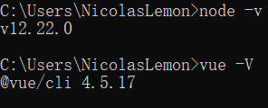

### 配置

#### Node地址

**安装目录：** `D:\Program Files (x86)\nodejs`

* 在安装目录下新建`node_cache`与`node_global`两个文件夹
  
  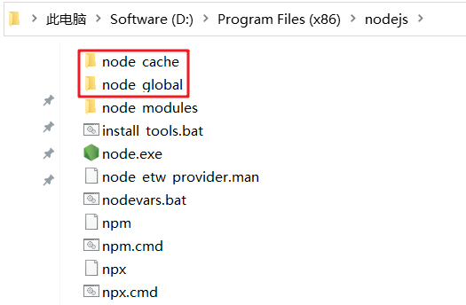

* 设置node地址
  
  ```bash
  # 设置相关
  npm config set prefix "D:\Program Files (x86)\nodejs\node_global"
  npm config set cache "D:\Program Files (x86)\nodejs\node_cache"
  
  # 查看相关
  npm root -g
  npm config get prefix
  npm config get cache
  ```
  
  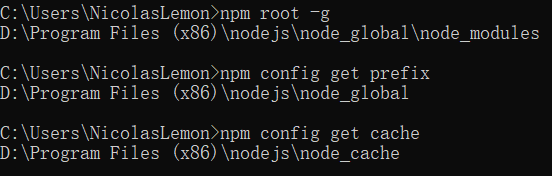

* 添加环境变量
  
  ```textile
  D:\Program Files (x86)\nodejs\
  
  D:\Program Files (x86)\nodejs\node_global
  ```
  
  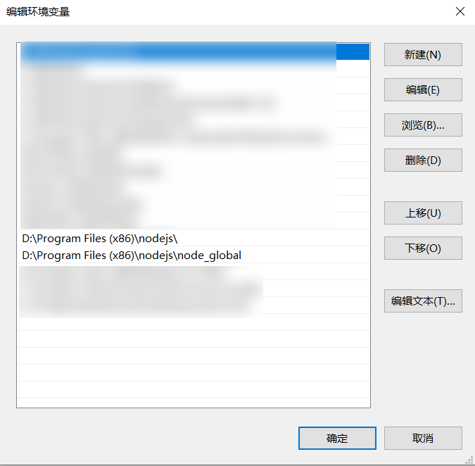

#### 淘宝镜像

```bash
# 查看当前npm仓库镜像地址
npm config get registry
# 设置当前npm仓库镜像地址为淘宝镜像
npm config set registry http://registry.npm.taobao.org/
```

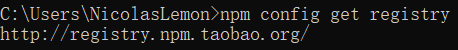

#### Vue脚手架

```bash
npm install -g @vue/cli@4.5.17
```

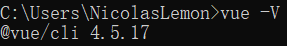

## 响应式布局

### 安装插件

- **flexible**
  
  阿里团队研发的自适应响应式布局插件
  
  ```bash
  npm install --save lib-flexible
  ```

- **postcss-plugin-px2rem**
  
  自动将代码中的`px`转换成`rem`，这样在写代码的时候，仍然可以写成`px`的单位
  
  ```bash
  npm install --save postcss-plugin-px2rem
  ```

- **cssrem** （可选）
  
  vs code插件，写代码时，可以提示将`px`转换成`rem`

### flexible

#### 引入

- 在`src/main.js`中import导入
  
  ```v
  // 引用 flexible 插件
  import "lib-flexible/flexible.js";
  ```
  
  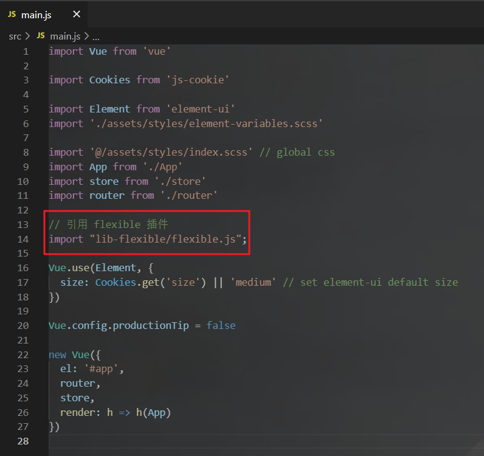

#### 配置

- 修改`flexible.js`
  
  找到`node_modules\lib-flexible\flexible.js`，修改`refreshRem()`函数
  
  ```js
  function refreshRem() {
      var width = docEl.getBoundingClientRect().width;
      // if (width / dpr > 540) {
      //     width = 540 * dpr;
      // }
  
      // 修改 最大值：2560   最小值：400
      if (width / dpr < 400) {
          width = 400 * dpr;
      } else if (width / dpr > 2560) {
          width = 2560 * dpr;
      }
      var rem = width / 10;
  
      docEl.style.fontSize = rem + 'px';
      flexible.rem = win.rem = rem;
  }
  ```
  
  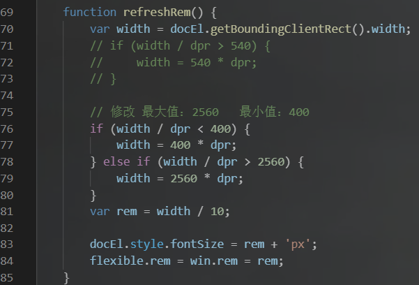

### postcss-plugin-px2rem

- 修改`vue.config.js`
  
  在`css.loaderOptions`选项后添加，其中根据自身项目去确定换算基数`rootValue`的值
  
  ```js
  css: {
      loaderOptions: {
          // ......
          postcss: {
              plugins: [
                  require("postcss-plugin-px2rem")({
                      // 换算基数， 默认100  ，这样的话把根标签的字体规定为1rem为50px,这样就可以从设计稿上量出多少个px直接在代码中写多上px了。
                      rootValue: 207,
                      // 默认false，可以（reg）利用正则表达式排除某些文件夹的方法，例如/(node_module)/ 。如果想把前端UI框架内的px也转换成rem，请把此属性设为默认值
                      exclude: /(node_module|other)/,
                      //（布尔值）允许在媒体查询中转换px。
                      mediaQuery: false,
                      // 设置要替换的最小像素值(3px会被转rem)。 默认 0
                      minPixelValue: 0,
                      /// 允许REM单位增长到的十进制数字。
                      // unitPrecision: 5, 
                      /// 默认值是一个空数组，这意味着禁用白名单并启用所有属性。
                      // propWhiteList: [],  
                      // 黑名单
                      // propBlackList: [], 
                      /// 要忽略并保留为px的选择器
                      // selectorBlackList: [], 
                      ///（boolean/string）忽略单个属性的方法，启用ignoreidentifier后，replace将自动设置为true。
                      // ignoreIdentifier: false,
                      /// （布尔值）替换包含REM的规则，而不是添加回退。
                      // replace: true
                  })
              ]
          }
      }
  }
  ```
  
  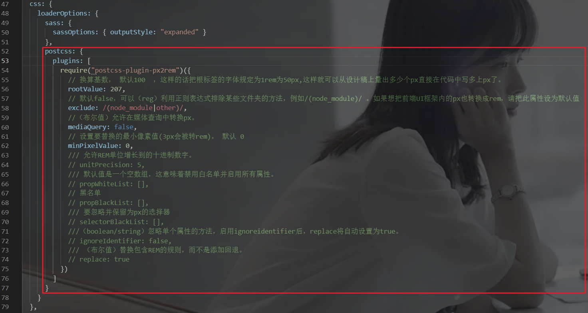

## 视频播放插件

**vue-video-player**

### 安装

如果需要播放m3u8等流媒体视频的话，那么也需要安装一下`videojs-contrib-hls`，不然不能播放m3u8格式的

```bash
npm install vue-video-player videojs-contrib-hls --save
```

### 引入

可以全局引入插件，也可以在需要用到该插件的组件内单独引入（二选一）

#### 全局引入

在`main.js`里导入并引用

```js
import VideoPlayer from 'vue-video-player'

// 播放m3u8格式流媒体视频所需
import "videojs-contrib-hls";

// 引入方式一
import 'vue-video-player/src/custom-theme.css'
import 'video.js/dist/video-js.css'

// 引入方式二
require('video.js/dist/video-js.css')
require('vue-video-player/src/custom-theme.css')

Vue.use(VideoPlayer)
```

#### 局部引用

```v
import { videoPlayer } from 'vue-video-player'
import 'video.js/dist/video-js.css
// 播放m3u8格式流媒体视频所需
import "videojs-contrib-hls";'

export default {
  components: {
    videoPlayer
  }
}
```

### 使用

##### html部分

```html
<template>
    <div class='demo'>
        <video-player class="video-player vjs-custom-skin" 
                      ref="videoPlayer" 
                      :playsinline="true" 
                      :options="playerOptions">
        </video-player>
    </div>
</template>
```

##### js部分

```v
export default {
  data() {
    return {
      playerOptions: {
        // 可选的播放速度
        playbackRates: [0.5, 1.0, 1.5, 2.0],
        // 如果为true,浏览器准备好时开始会放
        autoplay: false,
        // 默认情况下将会消除任何音频。
        muted: false,
        // 是否视频一结束就重新开始。
        loop: false,
        // 建议浏览器在<video>加载元素后是否应该开始下载视频数据。auto浏览器选择最佳行为,立即开始加载视频（如果浏览器支持）
        preload: "auto",
        language: "zh-CN",
        // 将播放器置于流畅模式，并在计算播放器的动态大小时使用该值。值应该代表一个比例 - 用冒号分隔的两个数字（例如"16:9"或"4:3"）
        aspectRatio: "16:9",
        // 当true时，Video.js player将拥有流体大小。换句话说，它将按比例缩放以适应其容器。
        fluid: true,
        sources: [
          {
            // 视频类型
            type: "video/mp4",
            // type: "application/x-mpegURL",
            // 视频url地址
            src: "",
          },
        ],
        // 视频封面地址
        poster: "",
        // 允许覆盖Video.js无法播放媒体源时显示的默认信息。
        notSupportedMessage: "此视频暂无法播放，请稍后再试",
        controlBar: {
          // 当前时间和持续时间的分隔符
          timeDivider: true,
          // 显示持续时间
          durationDisplay: true,
          // 是否显示剩余时间功能
          remainingTimeDisplay: false,
          // 是否显示全屏按钮
          fullscreenToggle: true,
        },
      },
    };
  },
}
```

### 注意

若使用了上面的flexible插件配置了响应式布局的话，而且播放器的大小又有控制在比较小的尺寸的话，有可能播放控制器的宽度会超过播放器的宽度，则需要在指定`style`中指定`font-size`

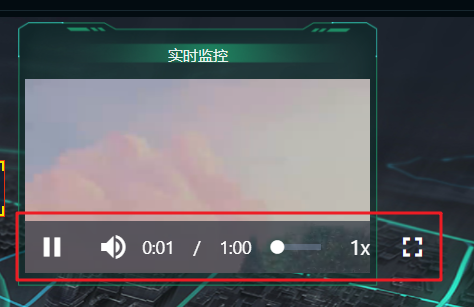

```v
<style lang="scss" scoped>
// 视频画面填充满播放器框架
::v-deep .video-js .vjs-tech {
  object-fit: fill;
  -o-object-fit: fill;
}
// 视频播放器中控制条的字号
::v-deep .video-js .vjs-control-bar {
  font-size: 14px;
}
</style>
```

### 参考

* [Vue-视频播放插件vue-video-player的配置及简单使用](https://blog.csdn.net/qq_31455841/article/details/112497239)

* [【视频组件】vue-video-player的使用](https://www.jianshu.com/p/ee92c9353124)

## 深度修改样式

如果在`style`中配置了`scoped`属性，那么**Vue**在渲染的时候就会自动加上一些id，会导致修改一些插件自带的`style`不起作用

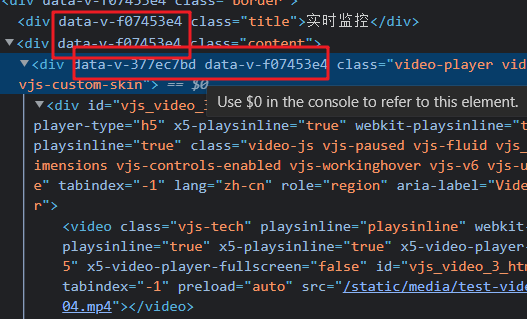

需要用到`/deep/`深度修改，如果`/deep/`在编译时报错，请使用`::v-deep`

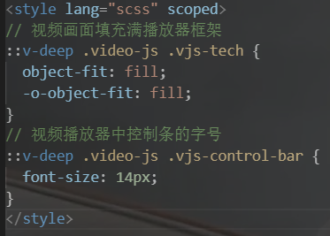

## 动态挂载组件

如果需要在代码中动态使用组件，例如在地图组件上需要动态展示不同的弹框内容：

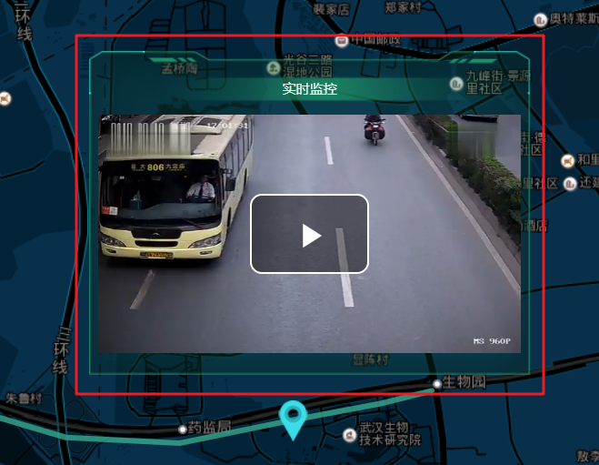

```v
<template>
  <div id="content"></div>
</template>
<script>
// 调用 Vue.extend() 所需
import Vue from "vue";
// 自定义需要调用的组件
import AlarmBorder from "@/components/gis/AlarmBorder";

export default {
  methods: {
    dynamicComponent() {
      // 注册组件实例对象，Vue.extend()只能调用上述引入的组件，而不能是字符串“AlarmBorder”
      let TheVueComponent = Vue.extend(AlarmBorder);
      // 实例化组件,propsData中传递props相关的数据
      let TheComponent = new TheVueComponent({
        propsData: {
          show: true,
          dataList: [1, 2, 3, 5],
        },
      });
      // 挂载到 <div id="content"></div> 中
      let theComponent = TheComponent.$mount("#content");
      // 获取挂载组件的元素dom
      let element = theComponent.$el;
    },
  },
};
</script>
```

## 组件通信

### 父子组件通信

父子组件之间的通信可以用`props`传递数据

#### 父传子

* 子组件（声明&接收）
  
  ```v
  <template></template>
  <script>
  export default {
    name: "Son",
    props: {
      title: { type: String, default: "title" },
      data: { type: Object, default: {} },
    },
  };
  </script>
  ```

* 父组件（传递）
  
  ```v
  <template>
    <Son :title="title" :data="data" />
  </template>
  <script>
  import Son from "./Son";
  export default {
    name: "Father",
    components: { Son },
    data() {
      return {
        title: "标题",
        data: { a: 1, b: 2 },
      };
    },
  };
  </script>
  ```

#### 子传父

* 父组件（声明&接收）
  
  ```v
  <template>
    <Son :receive="receive" />
  </template>
  <script>
  import Son from "./Son";
  export default {
    name: "Father",
    components: { Son },
    methods: {
      receive(x) {
        console.log("我收到了子组件传来的数据：", x);
      },
    },
  };
  </script>
  ```

* 子组件（传递）
  
  ```v
  <template></template>
  <script>
  export default {
    name: "Son",
    props: ["receive"],
    data() {
      return {
        title: "【我是子组件的标题】",
      };
    },
    created() {
      this.receive(this.title);
    },
  };
  </script>
  ```

### 任意组件通信

#### 全局事件总线

在`组件A`中传递数据给`组件B`

##### 安装

`main.js`中添加如下：

```v
beforeCreate() {
  // 安装全局事件总线
  Vue.prototype.$bus = this
}
```

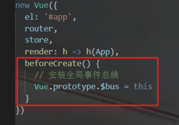

##### 触发

`A.vue`

```v
<script>
export default {
  methods: {
    test() {
      let data = [1, 2, 3, 5];
      this.$bus.$emit("busTest", data);
    },
  },
};
</script>
```

##### 响应

`B.vue`

```v
<script>
export default {
  mounted() {
    this.$bus.$on("busTest", (data) => {
      console.log("收到了A组件传递过来的数据：", data);
    });
  },
  beforeDestroy() {
    // 销毁相应的全局事件总线
    this.$bus.$off("busTest");
  },
};
</script>
```

#### Vuex

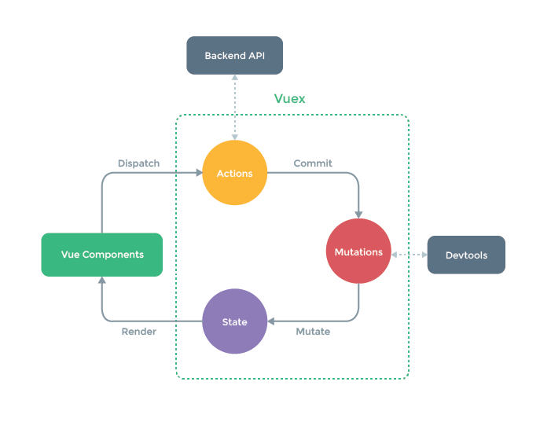

**注意：** 在代码中可以直接操作`mutations`，但是`mutations`中不写逻辑，逻辑写在`actions`中

##### 模块化

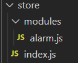

`index.js`

```v
import Vue from 'vue'
import Vuex from 'vuex'

// 引入自定义的模块
import alarm from './modules/alarm'

Vue.use(Vuex)

export default new Vuex.Store({
  modules: {
    alarm
  },
})
```

`modules/alarm.js`

```v
// 告警信息数据
const state = {
    alarmList: [],

}
// mutations中不写逻辑，逻辑写在actions里
const mutations = {
    ADD_ALARM_LIST(state, value) {
        state.alarmList.push(value)
    },
}

const actions = {
    addAlarmList(context, value) {
        value.forEach(v => {
            if (v.hasOwnProperty('mapData')) {
                context.commit('ADD_ALARM_LIST', v.mapData)
            }
        });
    },
}

export default {
    namespaced: true,
    actions,
    mutations,
    state
}
```

##### 使用

```v
<script>
import { mapState, mapActions } from "vuex";
export default {
  methods: {
    ...mapActions("alarm", ["addAlarmList"]),
  },
  computed: {
    ...mapState("alarm", ["alarmList"]),
  },
};
</script>
```

## 百度地图

### 在线地图

#### 引入

`public/index.html`

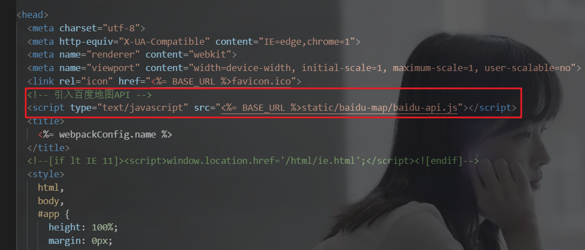

#### 使用

**隐藏百度地图logo**

`App.vue`

```v
<style lang="scss">
/*取消百度地图logo*/
.anchorBL {
  display: none;
}
</style>
```

**使用百度地图**

`GisMap.vue`

```v
<!-- GIS地图组件 -->
<template>
  <div class="gisMap">
    <!-- 百度地图 -->
    <div id="allmap"></div>
  </div>
</template>

<script>
import Vue from "vue";
import { mapState } from "vuex";

import AlertBorder from "@/components/gis/AlertBorder";
import AlarmBorder from "@/components/gis/AlarmBorder";

export default {
  name: "GisMap",
  data() {
    return {
      // 标记类型图标
      icons: [
        require("../../assets/icons/gis_map/type_1.png"),
        require("../../assets/icons/gis_map/type_2.png"),
        require("../../assets/icons/gis_map/type_3.png"),
        require("../../assets/icons/gis_map/type_4.png"),
      ],
      myMap: "",
      // 轨迹路线点位
      polylinePoints: [
        {
          lng: 114.429479,
          lat: 30.500157,
        },
        {
          lng: 114.440402,
          lat: 30.495925,
        },
        {
          lng: 114.443061,
          lat: 30.495365,
        },
        {
          lng: 114.445217,
          lat: 30.495054,
        },
        {
          lng: 114.448379,
          lat: 30.494867,
        },
        {
          lng: 114.451972,
          lat: 30.493871,
        },
        {
          lng: 114.457722,
          lat: 30.492502,
        },
        {
          lng: 114.461315,
          lat: 30.491568,
        },
        {
          lng: 114.46383,
          lat: 30.490946,
        },
        {
          lng: 114.470945,
          lat: 30.490635,
        },
        {
          lng: 114.478059,
          lat: 30.491879,
        },
        {
          lng: 114.483808,
          lat: 30.492813,
        },
        {
          lng: 114.48697,
          lat: 30.493498,
        },
      ],
      // 标记层
      markers: [],
      // 标记点位
      markerPoints: [
        {
          lng: 114.436162,
          lat: 30.497667,
          type: 1,
          data: {
            title: "热力图",
            componentView: "AlertBorderImg",
            componentData: {
              src: require("../../assets/images/heatmap.png"),
            },
          },
        },
        {
          lng: 114.478059,
          lat: 30.491879,
          type: 1,
          data: {
            title: "实时监控",
            componentView: "AlertBorderVideo",
            componentData: {
              // type: "application/x-mpegURL",
              // src: "http://114.115.179.29:7002/profile/upload/app-videos/production-security/production-security.m3u8",
              type: "video/mp4",
              src: require("../../assets/test_video/test-video.mp4"),
            },
          },
        },
      ],
    };
  },
  computed: {
    ...mapState("alarm", ["alarmList"]),
  },
  methods: {
    baiduMap() {
      var thisVue = this;
      // 百度地图API功能
      var bmap = document.getElementById("allmap");
      bmap.style.height = "100%";
      // 创建Map实例
      var map = new BMap.Map("allmap");
      // 开启鼠标滚轮缩放
      map.enableScrollWheelZoom(true);
      // 初始化地图,设置中心点坐标和地图级别
      map.centerAndZoom(new BMap.Point(114.462321, 30.496406), 15);

      // 运动轨迹
      var plPath = [];
      this.polylinePoints.forEach((e) =>
        plPath.push(new BMap.Point(e.lng, e.lat))
      );
      var polyline = new BMap.Polyline(plPath, {
        strokeColor: "#37a98e",
        strokeWeight: 5,
        strokeOpacity: 0.8,
      });
      map.addOverlay(polyline);

      map.setMapStyle({ style: "midnight" });
      thisVue.myMap = map;
      addMarker(this.markerPoints);

      function addMarker(points) {
        // 循环建立标注点
        for (var i = 0, pointsLen = points.length; i < pointsLen; i++) {
          // 将标注点转化成地图上的点
          var point = new BMap.Point(points[i].lng, points[i].lat);
          var myIcon = new BMap.Icon(
            thisVue.icons[points[i].type - 1],
            new BMap.Size(32, 36)
          );
          // 将点转化成标注点
          var marker = new BMap.Marker(point, { icon: myIcon });
          thisVue.markers.push(marker);
          // 将标注点添加到地图上
          map.addOverlay(marker);
          // 添加监听事件
          (function () {
            var thePoint = points[i];
            marker.addEventListener("mouseover", function () {
              thisVue.showInfo(this, thePoint);
            });
          })();
        }
      }

      thisVue.showInfo = function (thisMarker, point) {
        var theComponent = null;
        var opts = {};
        switch (point.type) {
          // 弹窗框架类
          case 1:
            theComponent = AlertBorder;
            opts = {
              width: 389,
              height: 285,
            };
            break;
          // 告警信息类
          case 2:
            theComponent = AlarmBorder;
            opts = {
              width: 250,
              height: 160,
            };
            break;
          default:
            break;
        }
        let ContentComponent = Vue.extend(theComponent);
        let el = new ContentComponent({
          propsData: { ...point.data },
        }).$mount().$el;
        thisMarker.openInfoWindow(new BMap.InfoWindow(el, opts));
      };
    },
  },
  mounted() {
    this.$nextTick(() => {
      this.markerPoints.push(...this.alarmList);
      this.baiduMap();
      // 监听事件总线，表格点击“危险”那行的操作，显示地图上对应的告警信息组件
      this.$bus.$on("showMapAlarmInfo", (data) => {
        for (let key in this.markers) {
          let markerPoint = this.markers[key].point;
          if (data.lng === markerPoint.lng && data.lat === markerPoint.lat) {
            this.showInfo(this.markers[key], data);
            break;
          }
        }
      });
    });
  },
  beforeDestroy() {
    this.$bus.$off("showMapAlarmInfo");
  },
};
</script>

<style lang="scss" scoped>
::v-deep .BMap_pop .BMap_top,
::v-deep .BMap_pop .BMap_bottom,
::v-deep .BMap_pop .BMap_center,
::v-deep .BMap_shadow,
::v-deep
  #allmap
  > div:nth-child(1)
  > div:nth-child(2)
  > div:nth-child(1)
  > div
  > div:nth-child(1)
  > div,
::v-deep
  #allmap
  > div:nth-child(1)
  > div:nth-child(2)
  > div:nth-child(1)
  > div
  > img:nth-child(10),
::v-deep
  #allmap
  > div:nth-child(1)
  > div:nth-child(2)
  > div:nth-child(1)
  > div
  > div:nth-child(7),
::v-deep
  #allmap
  > div:nth-child(1)
  > div:nth-child(2)
  > div:nth-child(1)
  > div
  > div:nth-child(8)
  > img,
::v-deep .BMap_pop div:nth-child(3),
::v-deep .BMap_pop div:nth-child(5),
::v-deep .BMap_pop div:nth-child(37) {
  display: none;
}

.gisMap {
  width: 1797px;
  height: 508px;
  display: flex;
  background-color: #26293077;
  margin: 0 auto;
  border-radius: 3px;
}

#allmap {
  width: 100%;
  overflow: hidden;
  margin: 0;
  font-family: "微软雅黑";
}
</style>
```

#### 参考

* [项目(燃气大屏)](https://github.com/NicolasLemon/gas-large-screen)

* [百度地图JSAPI 3.0类参考](https://lbsyun.baidu.com/cms/jsapi/reference/jsapi_reference_3_0.html)

* [地图JS API示例 | 百度地图开放平台](https://lbsyun.baidu.com/jsdemo.htm#a1_2)

### 离线地图

#### 引入

同**在线地图**

#### 参考

* [vue集合离线百度地图-2020.01.09](https://segmentfault.com/a/1190000021538475)

* [vue--百度地图之离线地图-2020.08.03](https://blog.csdn.net/sinat_36359516/article/details/107761067)

* [Vue使用百度离线地图v3.0-2020.04.28](https://blog.csdn.net/bienaohaoma/article/details/105806932)

* [vue整合百度离线地图api3.0-2020.12.08](https://blog.csdn.net/qq_39139923/article/details/110875789)

* [vue项目中使用百度离线地图（最新全面爬坑版）-2022.04.27](https://blog.csdn.net/p_5050/article/details/123261394)
