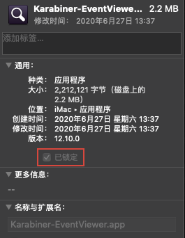
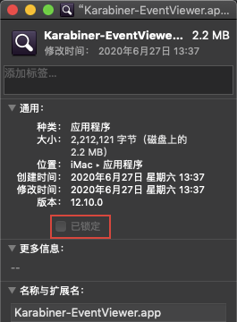

# macOS随笔

* **作者：** Nicolas·Lemon
* **修改：** Nicolas·Lemon
* **创建日期：** 2022.01.14
* **修改日期：** 2022.01.18


## 涉及到的系统版本

### macOS 10.14.3


## 烦人的.DS_Store

`DS_Store`，英文全称是 Desktop Services Store（桌面服务存储），开头的 DS 是 Desktop Services（桌面服务） 的缩写。它是一种由macOS系统自动创建的隐藏文件，存在于每一个用「访达」打开过的文件夹下面。

虽然不能在「访达」中直接看到它，但是通过「终端」App，可以输入`ls -la`命令列出。同时，通过`file`命令，可以显示出其文件类型，即”Desktop Services Store“。


`DS_Store`文件的主要作用，是存储当前文件夹在桌面显示相关方面的一些自定义属性，包括文件图标的位置、文件夹上次打开时窗口的大小、展现形式和位置等。这有助于保留为特定文件夹配置的设置，例如，将桌面文件夹设置为查看按名称排序的图标，同时将下载文件夹配置为将文件显示为列表并按日期排序，最近修改的先显示，又或者是例如文件的图标位置或者是背景色的选择。

简而言之，就是macOS下的系统文件，相当于Windows下的`Desktop.ini`。

但是，再上传某些文件夹的时候，或者打压缩包的时候，并不希望这东西出现在里面，例如`git`与`zip压缩`。

### 一劳永逸

* 涉及到的系统版本：`10.14.3`

如果不需要自定义文件的一些熟悉，比如说图标位置背景颜色等，可以一劳永逸，让系统不再创建`.DS_Store`文件

```shell
# 找到且删除当前磁盘里所有的 .DS_Store 文件
sudo find / -name ".DS_Store" -depth -exec rm {} \;
# 设置macOS系统配置
defaults write com.apple.desktopservices DSDontWriteNetworkStores true
```

### 全局.gitignore

* 涉及到的系统版本：`10.14.3`

如果是需要这些`.DS_Store`文件，但是又想在用git时不去上传这些烦人的文件，就可以建立一个全局的`.gitignore`文件忽略它们

```shell
# 配置全局.gitignore文件
echo "*.DS_Store" >> ~/.gitignore
git config --global core.excludesfile ~/.gitignore
```


## 其他用户登录选项

* 涉及到的系统版本：`10.14.3`

如果有开启`root`账户，则在系统登录界面，会有个`其他用户`的选项卡，下面是关闭或者开启这选项卡的命令

```shell
# 关闭 其他用户登录 选项
sudo defaults write /Library/Preferences/com.apple.loginwindow SHOWOTHERUSERS_MANAGED -bool FALSE
# 开启 其他用户登录 选项
sudo defaults write /Library/Preferences/com.apple.loginwindow SHOWOTHERUSERS_MANAGED -bool TRUE
```


## 解除文件或APP锁定

* 涉及到的系统版本：`10.14.3`

有些文件或APP或有`已锁定`字样，这就会导致卸载或者移除不了，而且哪怕是利用`root`账户登录后，都没办法解除锁定。



1. 列出已锁定文件或APP的权限信息

   ```shell
   ls -dleO@ /Applications/Karabiner-EventViewer.app
   ```

   

   可以发现其中是有`schg`和`uchg`权限设置的

2. 移除找到的权限

   ```shell
   # 移除 schg 权限
   sudo chflags -R noschg /Applications/Karabiner-EventViewer.app
   # 移除 uchg 权限
   
   ```

   

   接下来就可以看到锁定已被解除了

   

3. 然后就可以干它了

   


## 安装MySQL 5.7.29

* 涉及到的系统版本：`10.14.3`

### 下载安装

* 下载地址：https://downloads.mysql.com/archives/community/
* 版本：`v5.7.29`

进入下载页面，选择好相应的版本与系统，下载`.dmg`文件


然后运行`.dmg`，一路安装就行

安装完成后，会在`系统偏好设置`里有`MySQL`的设置


### 环境配置

MySQL的安装位置： **/usr/local/mysql** 

1. 打开`.bash_profile`文件（没有就新建）

   ```shell
   vim ~/.bash_profile
   # 或者
   open ~/.bash_profile
   ```

2. 添加环境变量

   ```shell
   # Setting PATH for MySQL 5.7.29
   export PATH=$PATH:/usr/local/mysql/bin
   ```

   

3. 生效配置文件

   ```shell
   source ~/.bash_profile
   ```

### 设置密码

1. 输入指令

   ```shell
   cd /usr/local/mysql/bin/
   sudo ./mysqld_safe --skip-grant-tables
   ```

2. 打开`MySQL服务`

   

3. 进入MySQL界面

   ```shell
   # 操作过第1步后，就可以不用输入密码直接进入MySQL界面了
   mysql -uroot
   ```

   

4. 设置`root`账户的密码

   MySQL界面下：

   ```mysql
   FLUSH PRIVILEGES;
   SET PASSWORD FOR root@'localhost' = PASSWORD('${your_password}');
   ```

然后就可以用设置好的密码登录`root`账户了

### 字符集编码

MySQL的字符集编码是一大坑

1. 登录MySQL查看其字符集编码

   ```shell
   mysql -uroot -p
   ```

   MySQL界面：

   ```mysql
   # 查看字符集编码
   show variables like 'character_set_%';
   ```

   

   果然并不是所有的编码都是`utf-8`

2. `系统偏好设置` -> `MySQL` -> 关闭`MySQL服务`

   

3. 在 **/etc** 下新建`my.cnf`文件

   ```shell
   sudo touch /etc/my.cnf
   ```

4. 编辑`my.cnf`配置文件

   ```shell
   sudo vim /etc/my.cnf
   ```

   `my.cnf`中粘贴如下：

   ```config
   # Example MySQL config file for medium systems. 
   # 
   # This is for a system with little memory (32M - 64M) where MySQL plays 
   # an important part, or systems up to 128M where MySQL is used together with 
   # other programs (such as a web server) 
   # 
   # MySQL programs look for option files in a set of 
   # locations which depend on the deployment platform. 
   # You can copy this option file to one of those 
   # locations. For information about these locations, see: 
   # http://dev.mysql.com/doc/mysql/en/option-files.html 
   # 
   # In this file, you can use all long options that a program supports. 
   # If you want to know which options a program supports, run the program 
   # with the "--help" option. 
   # The following options will be passed to all MySQL clients 
   [client]
   default-character-set=utf8
   #password = your_password 
   port = 3306 
   socket = /tmp/mysql.sock 
   # Here follows entries for some specific programs 
   # The MySQL server 
   [mysqld]
   character-set-server=utf8
   init_connect='SET NAMES utf8
   port = 3306 
   socket = /tmp/mysql.sock 
   skip-external-locking 
   key_buffer_size = 16M 
   max_allowed_packet = 1M 
   table_open_cache = 64 
   sort_buffer_size = 512K 
   net_buffer_length = 8K 
   read_buffer_size = 256K 
   read_rnd_buffer_size = 512K 
   myisam_sort_buffer_size = 8M 
   character-set-server=utf8 
   init_connect='SET NAMES utf8' 
   # Don't listen on a TCP/IP port at all. This can be a security enhancement, 
   # if all processes that need to connect to mysqld run on the same host. 
   # All interaction with mysqld must be made via Unix sockets or named pipes. 
   # Note that using this option without enabling named pipes on Windows 
   # (via the "enable-named-pipe" option) will render mysqld useless! 
   # 
   #skip-networking
   
   # Replication Master Server (default) 
   # binary logging is required for replication 
   log-bin=mysql-bin
   
   # binary logging format - mixed recommended 
   binlog_format=mixed
   
   # required unique id between 1 and 2^32 - 1 
   # defaults to 1 if master-host is not set 
   # but will not function as a master if omitted 
   server-id = 1
   
   # Replication Slave (comment out master section to use this) 
   # 
   # To configure this host as a replication slave, you can choose between 
   # two methods : 
   # 
   # 1) Use the CHANGE MASTER TO command (fully described in our manual) - 
   # the syntax is: 
   # 
   # CHANGE MASTER TO MASTER_HOST=<host>, MASTER_PORT=<port>, 
   # MASTER_USER=<user>, MASTER_PASSWORD=<password> ; 
   # 
   # where you replace <host>, <user>, <password> by quoted strings and 
   # <port> by the master's port number (3306 by default). 
   # 
   # Example: 
   # 
   # CHANGE MASTER TO MASTER_HOST='125.564.12.1', MASTER_PORT=3306, 
   # MASTER_USER='joe', MASTER_PASSWORD='secret'; 
   # 
   # OR 
   # 
   # 2) Set the variables below. However, in case you choose this method, then 
   # start replication for the first time (even unsuccessfully, for example 
   # if you mistyped the password in master-password and the slave fails to 
   # connect), the slave will create a master.info file, and any later 
   # change in this file to the variables' values below will be ignored and 
   # overridden by the content of the master.info file, unless you shutdown 
   # the slave server, delete master.info and restart the slaver server. 
   # For that reason, you may want to leave the lines below untouched 
   # (commented) and instead use CHANGE MASTER TO (see above) 
   # 
   # required unique id between 2 and 2^32 - 1 
   # (and different from the master) 
   # defaults to 2 if master-host is set 
   # but will not function as a slave if omitted 
   #server-id = 2 
   # 
   # The replication master for this slave - required 
   #master-host = <hostname> 
   # 
   # The username the slave will use for authentication when connecting 
   # to the master - required 
   #master-user = <username> 
   # 
   # The password the slave will authenticate with when connecting to 
   # the master - required 
   #master-password = <password> 
   # 
   # The port the master is listening on. 
   # optional - defaults to 3306 
   #master-port = <port> 
   # 
   # binary logging - not required for slaves, but recommended 
   #log-bin=mysql-bin
   
   # Uncomment the following if you are using InnoDB tables 
   #innodb_data_home_dir = /usr/local/mysql/data 
   #innodb_data_file_path = ibdata1:10M:autoextend 
   #innodb_log_group_home_dir = /usr/local/mysql/data 
   # You can set .._buffer_pool_size up to 50 - 80 % 
   # of RAM but beware of setting memory usage too high 
   #innodb_buffer_pool_size = 16M 
   #innodb_additional_mem_pool_size = 2M 
   # Set .._log_file_size to 25 % of buffer pool size 
   #innodb_log_file_size = 5M 
   #innodb_log_buffer_size = 8M 
   #innodb_flush_log_at_trx_commit = 1 
   #innodb_lock_wait_timeout = 50
   
   [mysqldump] 
   quick 
   max_allowed_packet = 16M
   
   [mysql] 
   no-auto-rehash 
   # Remove the next comment character if you are not familiar with SQL 
   #safe-updates 
   default-character-set=utf8
   
   [myisamchk] 
   key_buffer_size = 20M 
   sort_buffer_size = 20M 
   read_buffer = 2M 
   write_buffer = 2M
   
   [mysqlhotcopy] 
   interactive-timeout
   ```

   

5. 保存`my.cnf`配置文件，并重新启动`MySQL服务`

   再次在MySQL界面下查看其字符集编码

   ```mysql
   # 查看字符集编码
   show variables like 'character_set_%';
   ```

   

可以发现，字符集编码已改为`utf-8`的了


## 安装Navicat 15

* 涉及到的系统版本：`10.14.3`

### 下载安装

* 安装文件下载地址：https://pan.baidu.com/s/1XPAJBtGdZ1lgNGha-gblbg 密码：`j8m0`
* 版本：`v15.0.15`

拖拽安装`Navicat Premium`


### 工具激活

* 激活工具下载地址： **./resource/navicat15-keygen-mac.zip**

1. 打开终端，进入激活工具目录，使用`navicat-patcher`来替换掉公钥

   ```shell
   cd ${your_path/navicat15-keygen-mac}
   ```

   

   ```shell
   sudo chmod 777 ./navicat-patcher
   sudo ./navicat-patcher /Applications/Navicat\ Premium.app
   ```

   

2. 生成证书并信任证书

   * 打开`钥匙串访问`

     

   * 生成证书

     左上角的 `钥匙串访问` -> `证书助理` -> `创建证书颁发机构`

     

     

   * 信任证书

     

3. 用`codesign`对`libcc-premium.dylib` 和`Navicat Premium.app`进行重签名

   ```shell
   codesign -f -s Navicat /Applications/Navicat\ Premium.app/Contents/Frameworks/libcc-premium.dylib
   codesign -f -s Navicat /Applications/Navicat\ Premium.app/
   ```

   

4. 使用`navicat-keygen`来生成`序列号`和`激活码`

   ```shell
   sudo ./navicat-keygen ./RegPrivateKey.pem
   ```

   

5. **断网激活** 

   * 先 **断开网络连接** ，然后打开安装好的`Navicat Premium`，选择`注册`

     

   * 输入第4步生成的`序列号`

     

   * 选择`手动激活`

     

   * 将`请求码`粘贴到终端，再将生成的`激活码`复制回面板

     

激活成功


## 实用工具APP大赏

* 涉及到的系统版本：`10.14.3`

### 键盘键位映射

#### Karabiner-Elements

##### 基本信息

* 涉及到的系统版本：`10.14.3`
* APP名称：`Karabiner-Elements`
* 版本：`10.14+`的系统最高支持到`v12.10.0`
* 性质：免费/开源
* 下载地址：https://github.com/pqrs-org/Karabiner-Elements/releases


##### 键位映射


##### 开机自启

如果只是单纯的在 `系统偏好设置` -> `用户与群组` -> `指定账户` -> `登录项` 里添加`Karabiner-Elements.app`的话，系统开机后，会弹出`Karabiner-Elements`的界面。


取消`Karabiner-Elements`在开机自启时弹出窗口界面：

1. 编写启动脚本

   在 `启动台` -> `其他` -> `脚本编辑器` 中新建脚本，粘贴如下代码：

   ```shell
   do shell script "launchctl load -w /Library/LaunchAgents/org.pqrs.karabiner.karabiner_console_user_server.plist"
   ```

   

2. 保存脚本，取名为`Karabiner-Loader`，同时选择文件格式为`应用程序`，保存在任意目录均可

   

3. 设置启动脚本为登录启动项

   在 `系统偏好设置` -> `用户与群组` -> `指定账户` -> `登录项` 里添加`Karabiner-Loader.app`

   

### 解压缩工具

#### BetterZip

##### 基本信息

* 涉及到的系统版本：`10.14.3`
* APP名称：`BetterZip`
* 版本：`v4.2.4`
* 性质：收费/破解
* 下载地址： **./resource/BetterZip-4.2.4.zip**

##### 注册激活

* 注册码/激活码

  ```
  nHYGNLkAvi8uwX4KzanQJyEk1FTSWDQQnmKj3f0V0gozGaGGh8g9TOI2+Uq+PcGLrjYszPVXquCmiOHDgikBwj+FWswHdSj8FJc8zhyURzf4s6h0zSdyx5qNCTDjOzoo9vbgrPLGIiUS7Hexc183LEoQe4tZx83Ii43p0muRfzg=
  ```

  

### 软件卸载工具

#### AppCleaner

基本信息

* 涉及到的系统版本：`10.14.3`
* APP名称：`AppCleaner`
* 版本：`v3.6.0`
* 性质：免费
* 下载地址： **./resource/AppCleaner-3.6.0.zip**


### Markdown笔记

#### Typora

##### 基本信息

* 涉及到的系统版本：`10.14.3`
* APP名称：`Typora`
* 版本：`v0.11.18`
* 性质：最后一个免费版
* 下载地址： **./resource/Typora-0.11.8.dmg**


##### 使用配置

* 编辑器

  

* 图像

  

* Markdown

  

  

### 截屏工具

#### Snipaste

基本信息

* 涉及到的系统版本：`10.14.3`
* APP名称：`Snipaste`
* 版本：`latest`
* 性质：免费
* 下载地址：https://www.snipaste.com/download.html


### 视频播放器

#### Movist Pro

基本信息

* 涉及到的系统版本：`10.14.3`
* APP名称：`Movist Pro`
* 版本：`v2.8.1`
* 性质：收费/破解
* 下载地址：https://macwk.com/soft/movist


### 下载工具

#### Aria2

##### 基本信息

* 涉及到的系统版本：`10.14.3`
* 工具名称：`Aria2`
* 版本：`v1.35.0`
* 性质：免费/开源
* 下载地址：https://github.com/aria2/aria2/releases/tag/release-1.35.0

命令行工具

##### 使用配置

1. 下载配置文件

   ```shell
   git clone https://github.com/P3TERX/aria2.conf.git
   ```

   

2. 新建`.aria2`配置仓库，并把刚才下载的配置文件放进来

   ```shell
   # 在用户根目录下新建文件夹
   mkdir ~/.aria2
   # 新建一个.session会话文件
   touch ~/.aria2/aria2.session
   ```

   把刚才下载的配置文件放进来

   

3. 修改配置文件`aria2.conf`

   把`dir`、`input-file`和`save-session`的地址改成自己的地址

   ```shell
   # 下载目录。可使用绝对路径或相对路径, 默认: 当前启动位置
   dir=~/Datum/DocumentDatum/download/aria2
   
   # 从会话文件中读取下载任务
   input-file=./aria2.session
   
   # 会话文件保存路径
   # Aria2 退出时或指定的时间间隔会保存`错误/未完成`的下载任务到会话文件
   save-session=./aria2.session
   ```

   

   

4. 下载安装`aria2c`

   下载地址： **./resource/aria2c.zip**

   下载好了以后，将解压后的文件夹整个拖入到`/Applications`应用程序下

   

5. 打开终端，运行`Aria2`

   ```shell
   # 运行
   aria2c
   # 查看运行是否成功
   ps aux|grep aria2c
   ```

   

   运行`aria2c`时，若提示`command not found`：

   ```shell
   cd /usr/local/bin
   sudo ln -s ../aria2/bin/aria2c
   ```

通过`webui-aria2`控制`aria2`:

引用：https://blog.csdn.net/sage_wang/article/details/86497837

aria2是基于命令行的下载工具，不过还好大神们早已开发了各种易用的UI方便我们小白们使用

- 最常用的webui-aria2: http://ziahamza.github.io/webui-aria2/
- 也可以用binux大神的YAAW：http://binux.github.io/yaaw/demo/
- 最简便的方法是直接用以上连接使用aria2c，（爱折腾的可以到 https://github.com/ziahamza/webui-aria2 或 https://github.com/binux/yaaw 下载所需文件自己搭建server）
